# [A Simple Button](https://demo.10xCSS.com/preset#ASimpleButton)

> __`CID `__  ASimpleButton  
> __`DESC`__  A simple [button](https://developer.mozilla.org/en-US/docs/Web/HTML/Element/button), because if you can make a button, you can make it on the [WWW](https://wikipedia.org/wiki/World_Wide_Web).  
> __`LINK`__  [demo.10xCSS.com/preset#ASimpleButton](https://demo.10xCSS.com/preset#ASimpleButton)  
> __`NOTE`__  none  
> __`VERS`__  2  

|Table                                        |of                                           |Contents                                     |                                             |
|:--------------------------------------------|:--------------------------------------------|:--------------------------------------------|:--------------------------------------------|
|[Default](#default)                          |[Classic](#classic)                          |[On Hover/Active/Focus](#on-hoveractivefocus)|[UniGlyph Cycle](#uniglyph-cycle)            |
|[Default Empty](#default-empty)              |[Create It](#create-it)                      |[On Hover/Active](#on-hoveractive)           |[UniGlyph Emergency](#uniglyph-emergency)    |
|[Abstracted](#abstracted)                    |[CSS IS AWESOME](#css-is-awesome)            |[On Hover](#on-hover)                        |[UniGlyph Spin](#uniglyph-spin)              |
|[Border](#border)                            |[Empty Button](#empty-button)                |[outline-ed](#outline-ed)                    |[Utterly Pointless](#utterly-pointless)      |
|[Circle Cycle](#circle-cycle)                |[Field Goal](#field-goal)                    |[Picture This](#picture-this)                |[Validate It](#validate-it)                  |
|[Circle Maths](#circle-maths)                |[Hamburger Flipping](#hamburger-flipping)    |[Ridge Border](#ridge-border)                |[You Can Emoji](#you-can-emoji)              |
|[Circle Ritzy](#circle-ritzy)                |[Iterate It](#iterate-it)                    |[Ship It](#ship-it)                          |[Zero Style](#zero-style)                    |
|[Circle](#circle)                            |[Jolly Brutalist](#jolly-brutalist)          |[Stop Drop Roll](#stop-drop-roll)            |                                             |
|[Classic Alt](#classic-alt)                  |[On Active](#on-active)                      |[Three Dee](#three-dee)                      |                                             |
---

### _All-in-One_
https://github.com/10xCSS/CHANGELOG/assets/9544140/60d2e634-35e0-46c5-9461-036372d18006

### Default
> `desc`: Default [ASimpleButton](https://10xCSS.com/dashboard/presets?cid=ASimpleButton&uid=ASimpleButton__default) style; aka the [button](https://developer.mozilla.org/en-US/docs/Web/HTML/Element/button)  
> `link`: [demo.10xCSS.com/preset#ASimpleButton__default](https://demo.10xCSS.com/dashboard/presets?cid=ASimpleButton&uid=ASimpleButton__default)  
> `time`: 2022-10-30 ⇒ 2024-04-08  
> `vers`: 1  

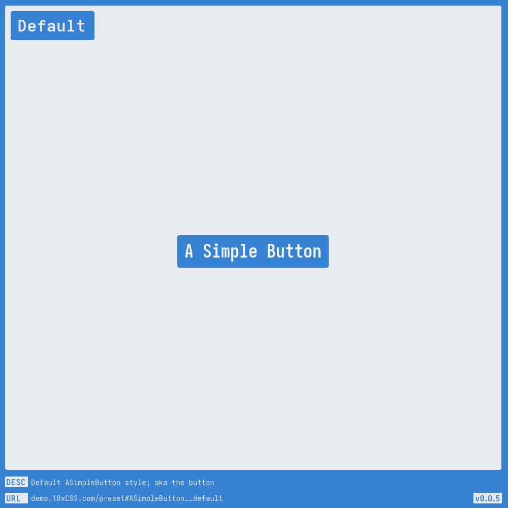

 <b>GIF</b> <i>(click to reveal)</i> 

### Default Empty
> `desc`: Default style, but empty with no text  
> `link`: [demo.10xCSS.com/preset#ASimpleButton__default_empty](https://demo.10xCSS.com/dashboard/presets?cid=ASimpleButton&uid=ASimpleButton__default_empty)  
> `time`: 2024-04-08  
> `vers`: 1  

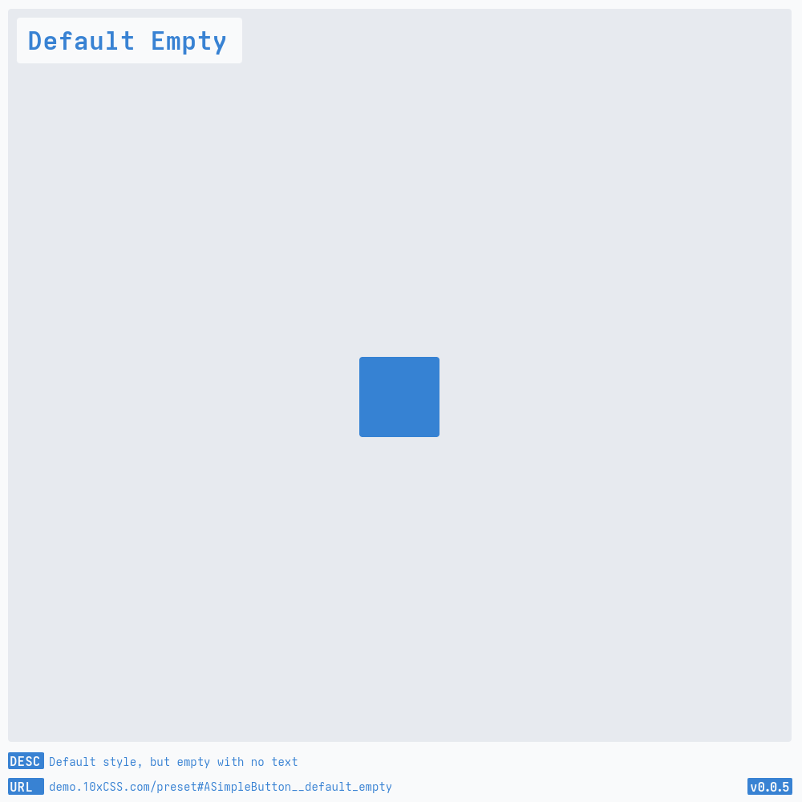

 <b>GIF</b> <i>(click to reveal)</i> 

### Abstracted
> `desc`: A button style for next year’s Easter art gala  
> `link`: [demo.10xCSS.com/preset#ASimpleButton__abstracted](https://demo.10xCSS.com/dashboard/presets?cid=ASimpleButton&uid=ASimpleButton__abstracted)  
> `time`: 2024-03-12 ⇒ 2024-04-08  
> `vers`: 1  

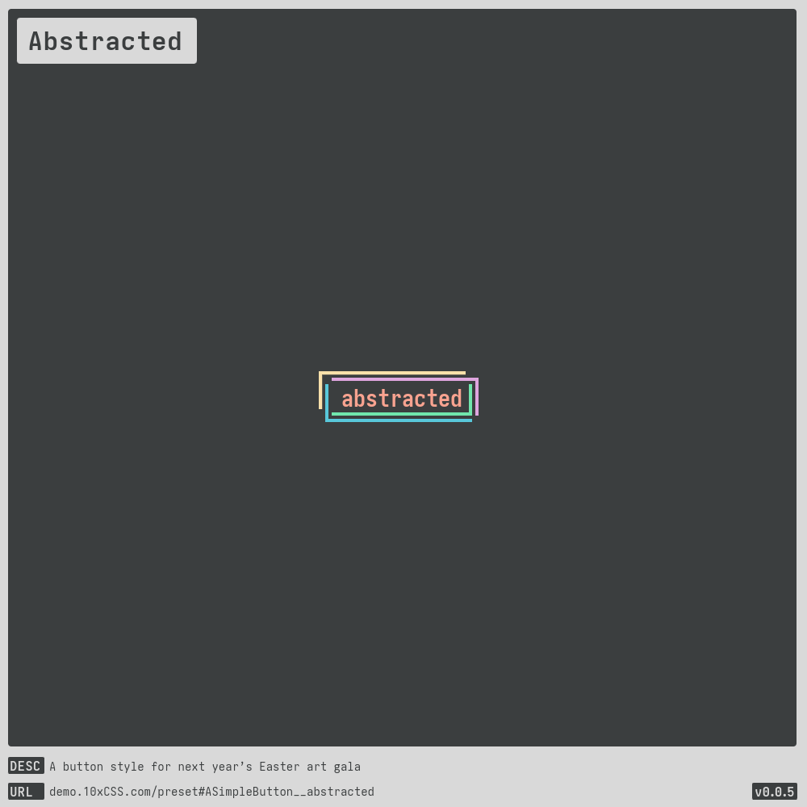

 <b>GIF</b> <i>(click to reveal)</i> 

### Border
> `desc`: A button with a border  
> `link`: [demo.10xCSS.com/preset#ASimpleButton__border](https://demo.10xCSS.com/dashboard/presets?cid=ASimpleButton&uid=ASimpleButton__border)  
> `time`: 2024-04-08  
> `vers`: 1  

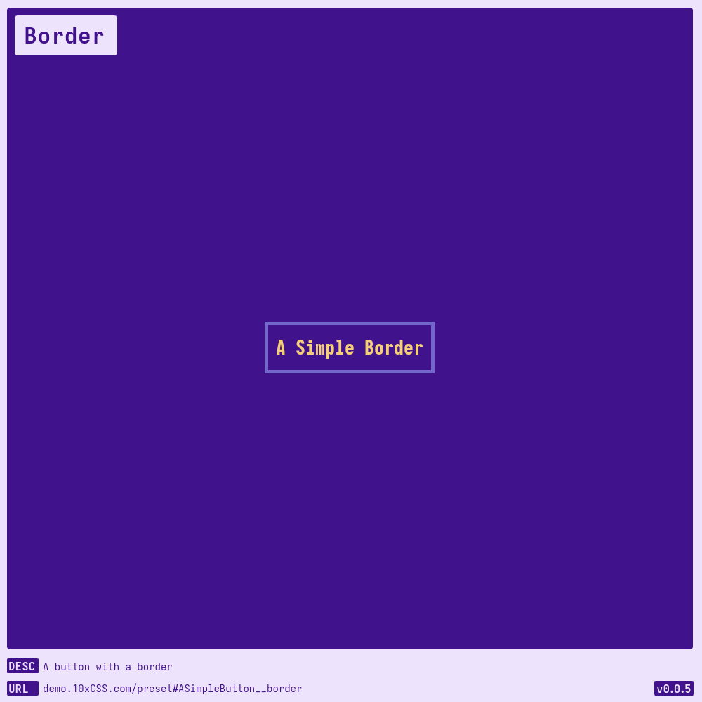

 <b>GIF</b> <i>(click to reveal)</i> 

### Circle Cycle
> `desc`: A circle that enjoys cycling  
> `link`: [demo.10xCSS.com/preset#ASimpleButton__circle_cycle](https://demo.10xCSS.com/dashboard/presets?cid=ASimpleButton&uid=ASimpleButton__circle_cycle)  
> `time`: 2024-04-08  
> `vers`: 1  

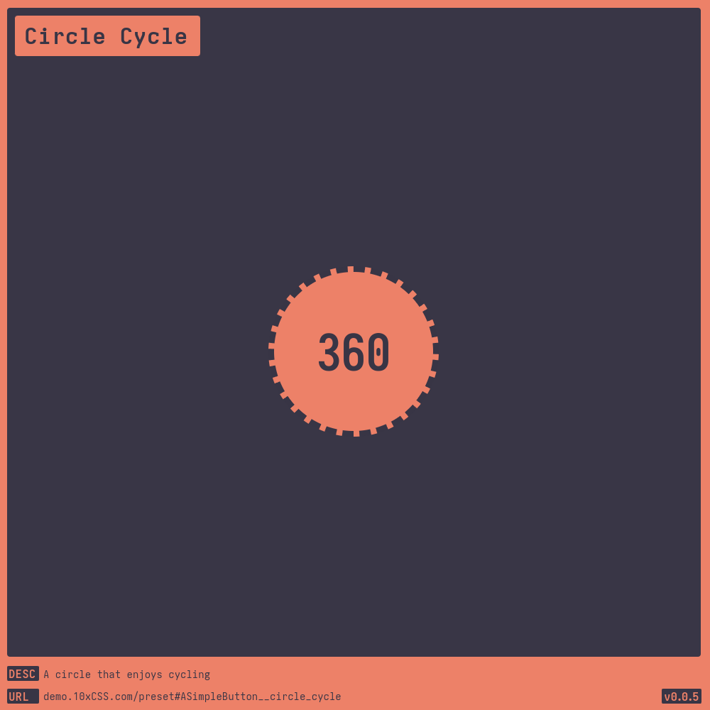

 <b>GIF</b> <i>(click to reveal)</i> 

### Circle Maths
> `desc`: The maths of a circle  
> `link`: [demo.10xCSS.com/preset#ASimpleButton__circle_maths](https://demo.10xCSS.com/dashboard/presets?cid=ASimpleButton&uid=ASimpleButton__circle_maths)  
> `time`: 2024-04-08 ⇒ 2024-04-29  
> `vers`: 1  

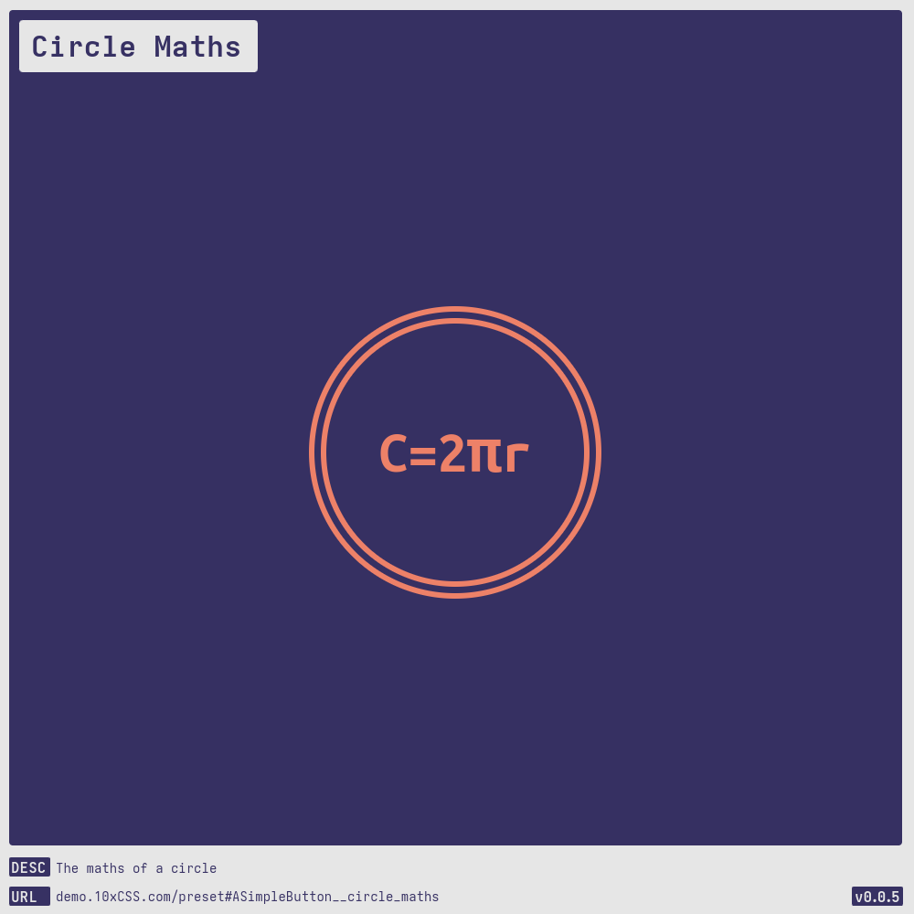

 <b>GIF</b> <i>(click to reveal)</i> 

### Circle Ritzy
> `desc`: The circle of ritzy  
> `link`: [demo.10xCSS.com/preset#ASimpleButton__circle_ritzy](https://demo.10xCSS.com/dashboard/presets?cid=ASimpleButton&uid=ASimpleButton__circle_ritzy)  
> `time`: 2024-04-08  
> `vers`: 1  

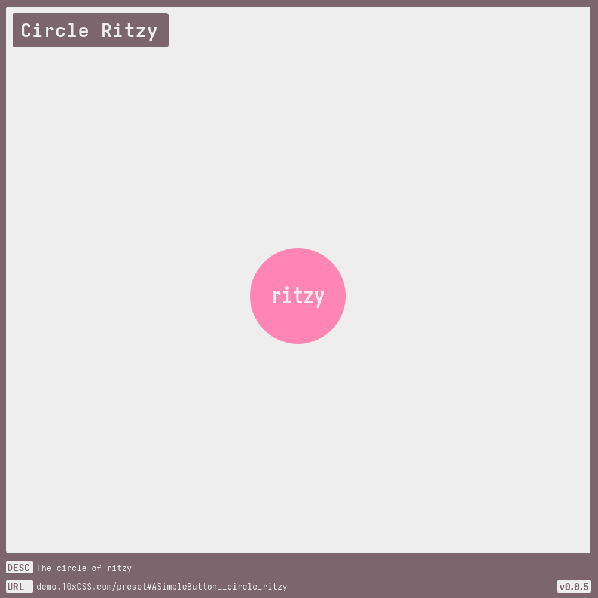

 <b>GIF</b> <i>(click to reveal)</i> 

### Circle
> `desc`: In the Circle, The Circle of Life  
> `link`: [demo.10xCSS.com/preset#ASimpleButton__circle](https://demo.10xCSS.com/dashboard/presets?cid=ASimpleButton&uid=ASimpleButton__circle)  
> `time`: 2023-11-13 ⇒ 2024-06-06  
> `vers`: 1  

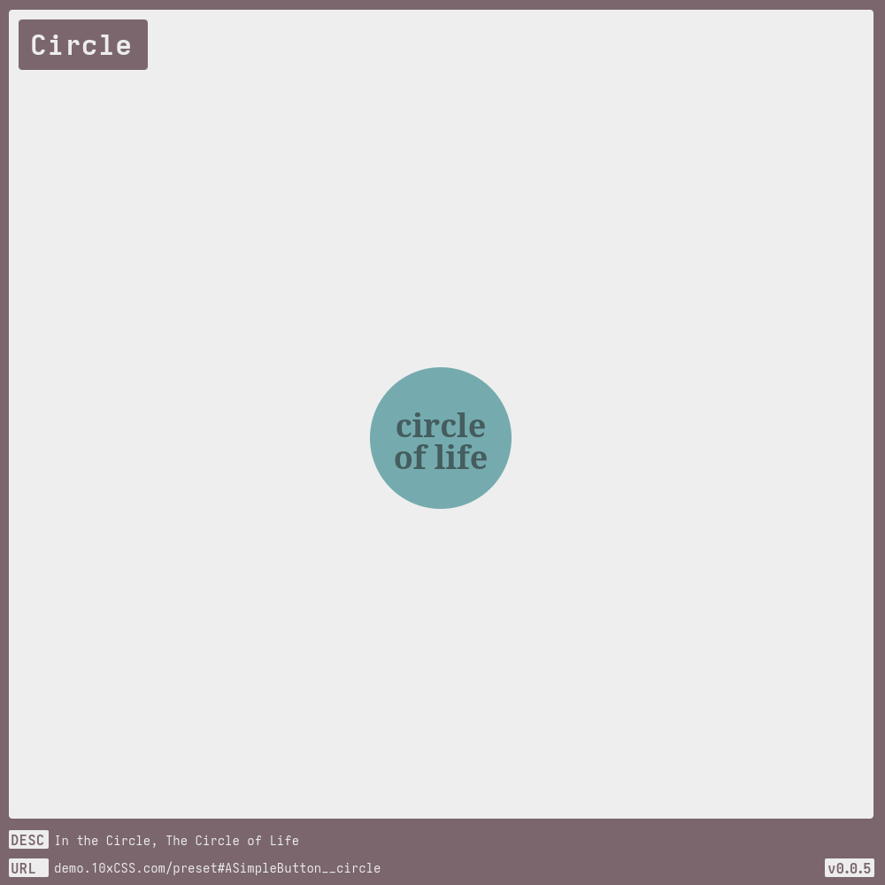

 <b>GIF</b> <i>(click to reveal)</i> 

### Classic Alt
> `desc`: The classic Cadillac of buttons: the drop-shadow with eXtra depth  
> `link`: [demo.10xCSS.com/preset#ASimpleButton__classic_alt](https://demo.10xCSS.com/dashboard/presets?cid=ASimpleButton&uid=ASimpleButton__classic_alt)  
> `time`: 2024-03-12 ⇒ 2024-04-08  
> `vers`: 1  

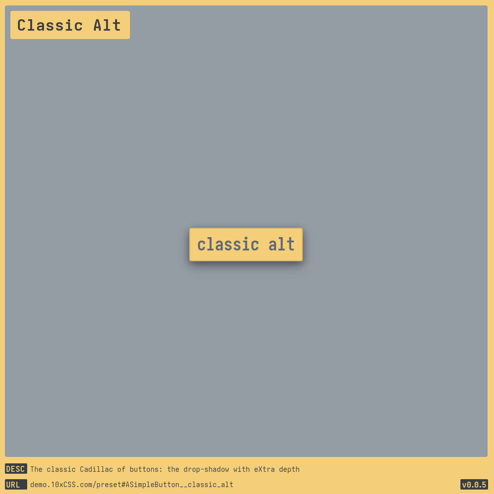

 <b>GIF</b> <i>(click to reveal)</i> 

### Classic
> `desc`: The classic Cadillac of buttons: the drop-shadow, it’s about depth  
> `link`: [demo.10xCSS.com/preset#ASimpleButton__classic](https://demo.10xCSS.com/dashboard/presets?cid=ASimpleButton&uid=ASimpleButton__classic)  
> `time`: 2024-03-04 ⇒ 2024-04-08  
> `vers`: 1  

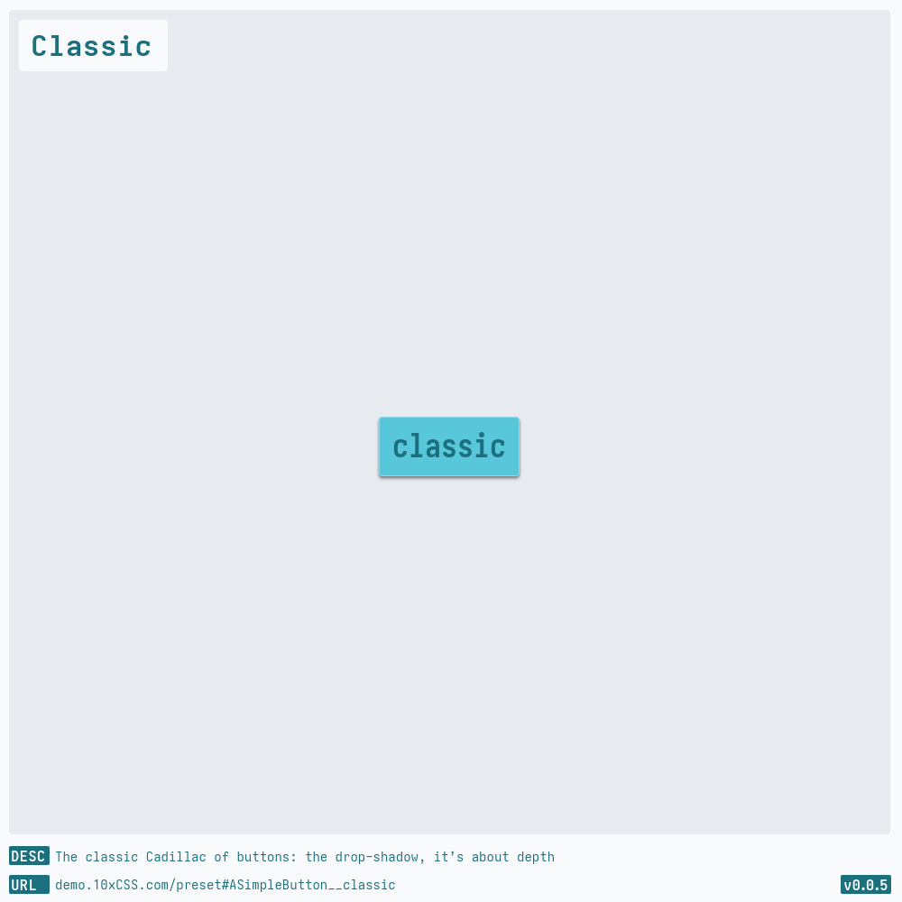

 <b>GIF</b> <i>(click to reveal)</i> 

### Create It
> `desc`: The “Create It” button style featured on [10xCSS.com](https://10xCSS.com)  
> `link`: [demo.10xCSS.com/preset#ASimpleButton__create_it](https://demo.10xCSS.com/dashboard/presets?cid=ASimpleButton&uid=ASimpleButton__create_it)  
> `time`: 2022-10-30 ⇒ 2024-06-17  
> `vers`: 1  

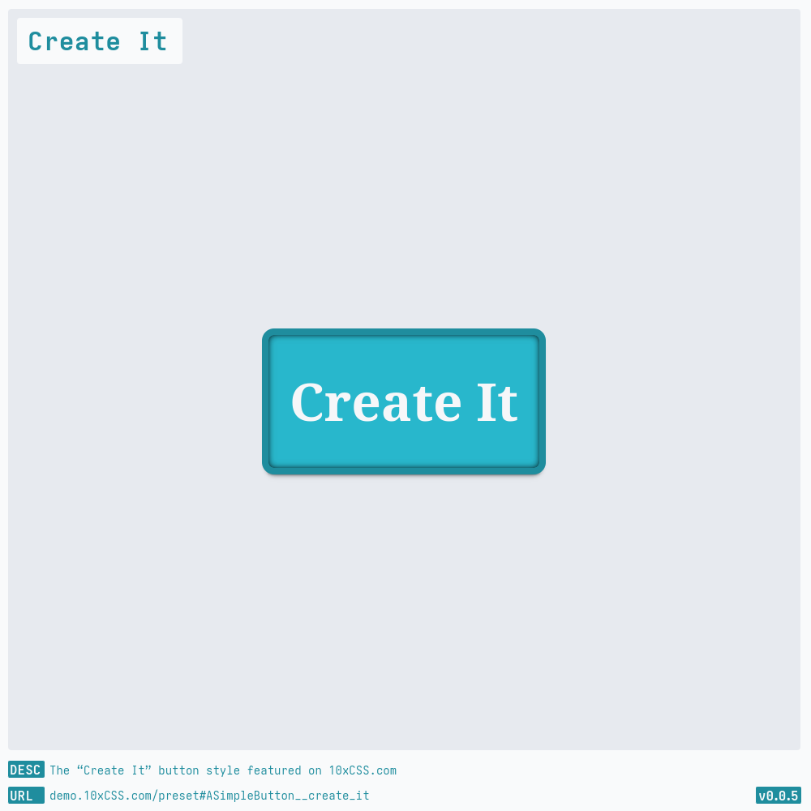

 <b>GIF</b> <i>(click to reveal)</i> 

### CSS IS AWESOME
> `desc`: self-titled  
> `link`: [demo.10xCSS.com/preset#ASimpleButton__css_is_awesome](https://demo.10xCSS.com/dashboard/presets?cid=ASimpleButton&uid=ASimpleButton__css_is_awesome)  
> `time`: 2024-03-04 ⇒ 2024-04-08  
> `vers`: 1  

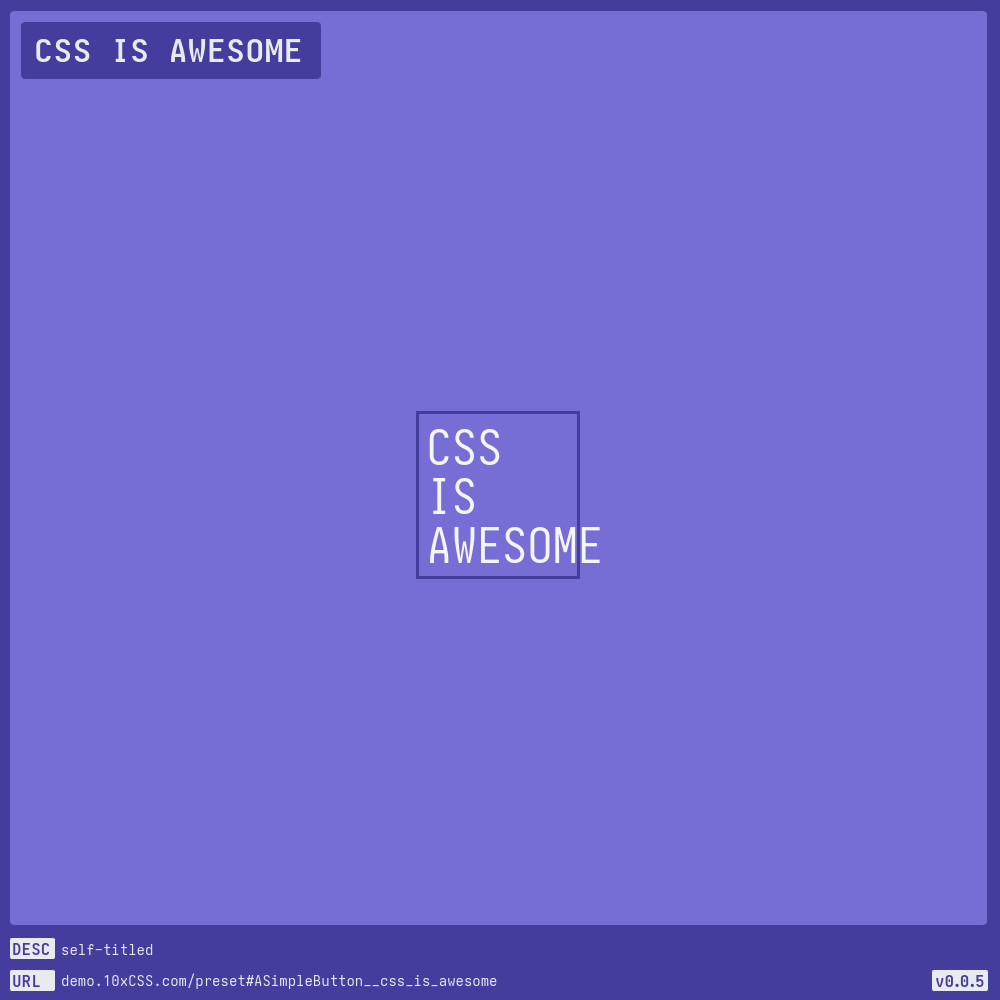

 <b>GIF</b> <i>(click to reveal)</i> 

### Empty Button
> `desc`: The button is empty... the button is not empty  
> `link`: [demo.10xCSS.com/preset#ASimpleButton__empty_button](https://demo.10xCSS.com/dashboard/presets?cid=ASimpleButton&uid=ASimpleButton__empty_button)  
> `time`: 2024-04-08  
> `vers`: 1  

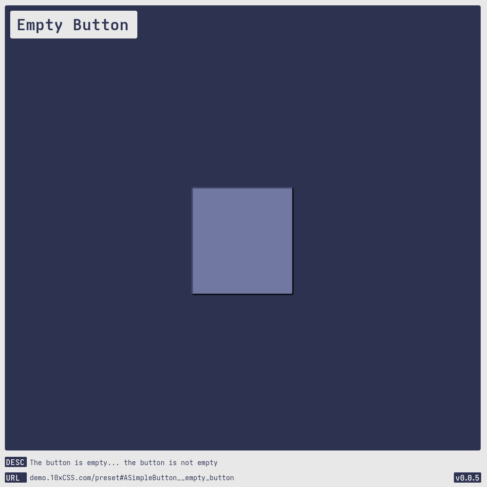

 <b>GIF</b> <i>(click to reveal)</i> 

### Field Goal
> `desc`: Play it safe with a Field Goal button  
> `link`: [demo.10xCSS.com/preset#ASimpleButton__field_goal](https://demo.10xCSS.com/dashboard/presets?cid=ASimpleButton&uid=ASimpleButton__field_goal)  
> `time`: 2024-03-12 ⇒ 2024-04-08  
> `vers`: 1  

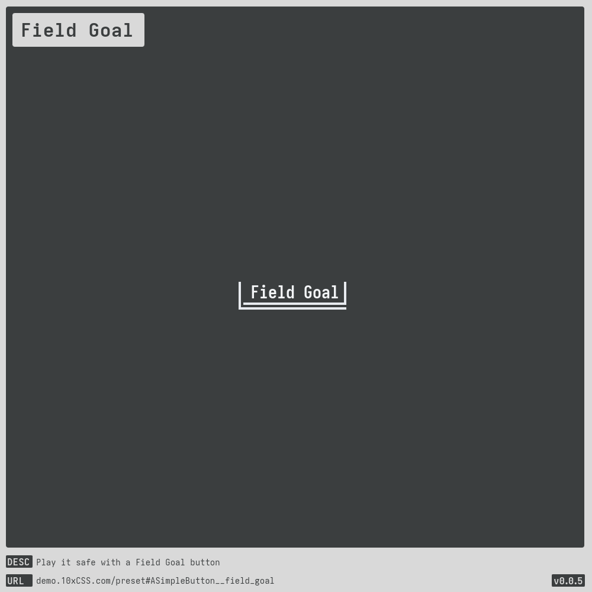

 <b>GIF</b> <i>(click to reveal)</i> 

### Hamburger Flipping
> `desc`: All the flavor, none of the carbs  
> `link`: [demo.10xCSS.com/preset#ASimpleButton__hamburger_flipping](https://demo.10xCSS.com/dashboard/presets?cid=ASimpleButton&uid=ASimpleButton__hamburger_flipping)  
> `time`: 2024-04-08  
> `vers`: 1  

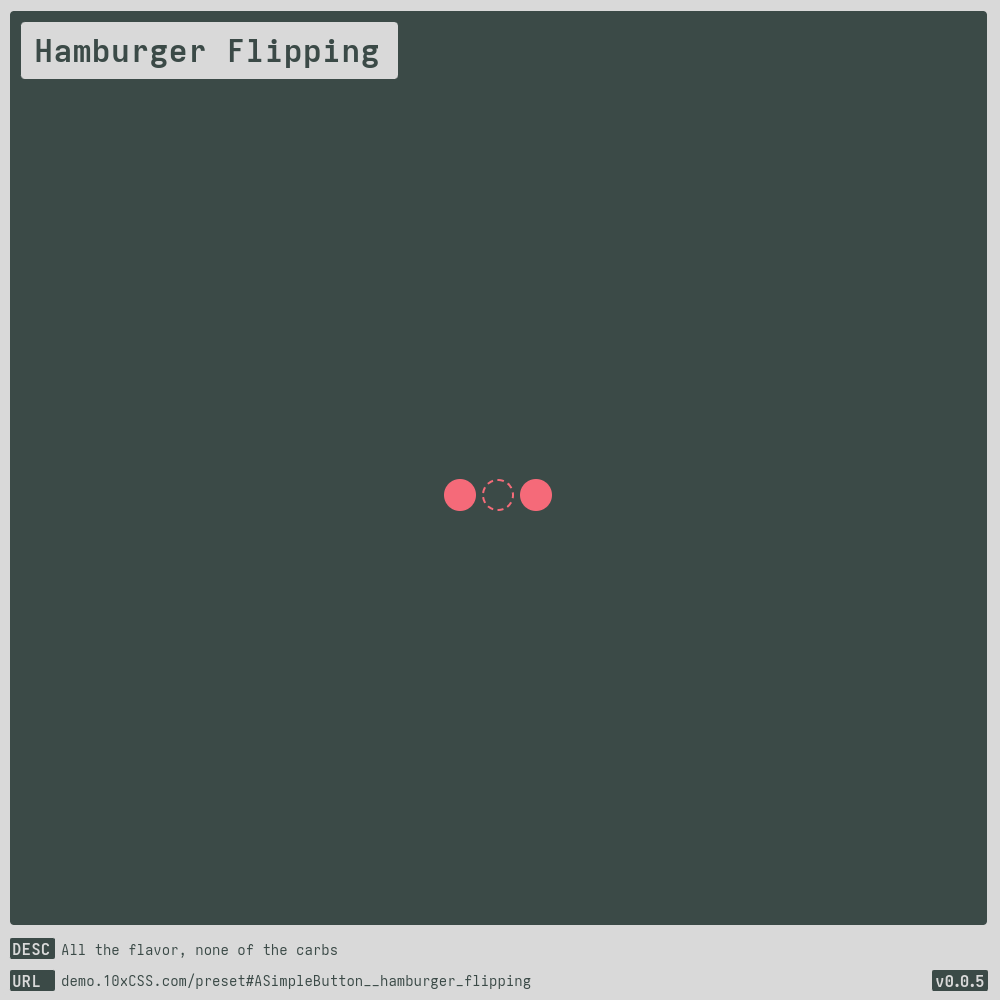

 <b>GIF</b> <i>(click to reveal)</i> 

### Iterate It
> `desc`: The “Iterate It” button style featured on [10xCSS.com](https://10xCSS.com)  
> `link`: [demo.10xCSS.com/preset#ASimpleButton__iterate_it](https://demo.10xCSS.com/dashboard/presets?cid=ASimpleButton&uid=ASimpleButton__iterate_it)  
> `time`: 2022-10-30 ⇒ 2024-06-17  
> `vers`: 1  

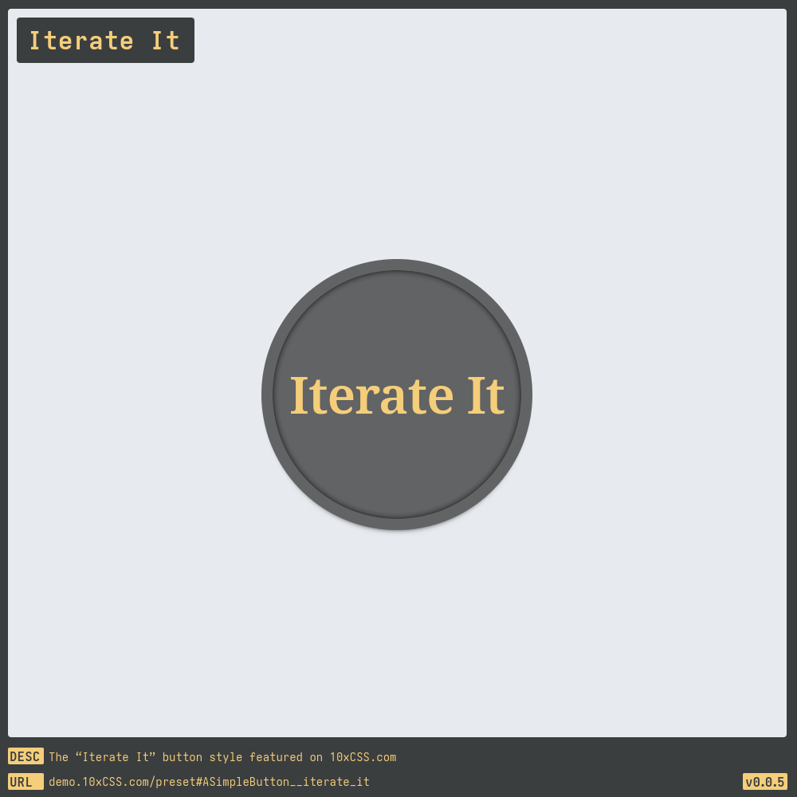

 <b>GIF</b> <i>(click to reveal)</i> 

### Jolly Brutalist
> `desc`:  According to the IUCN Red List, this button style is endangered  
> `link`: [demo.10xCSS.com/preset#ASimpleButton__jolly_brutalist](https://demo.10xCSS.com/dashboard/presets?cid=ASimpleButton&uid=ASimpleButton__jolly_brutalist)  
> `time`: 2024-03-12 ⇒ 2024-04-08  
> `vers`: 1  

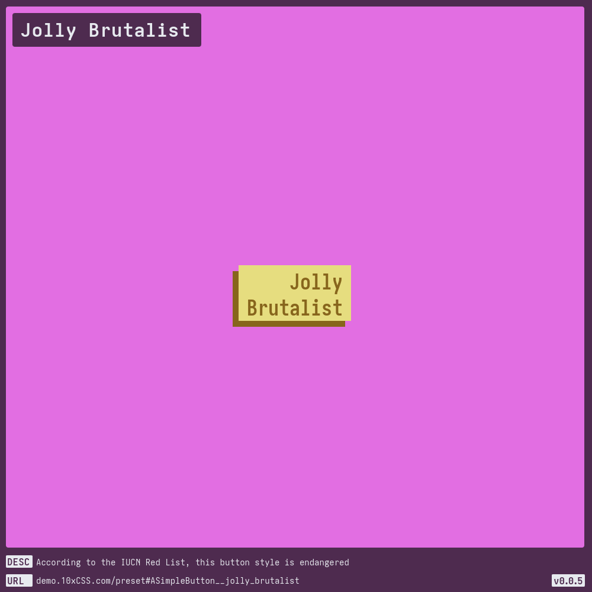

 <b>GIF</b> <i>(click to reveal)</i> 

### On Active
> `desc`: On active (click-down) button  
> `link`: [demo.10xCSS.com/preset#ASimpleButton__on_active](https://demo.10xCSS.com/dashboard/presets?cid=ASimpleButton&uid=ASimpleButton__on_active)  
> `time`: 2024-01-27 ⇒ 2024-06-06  
> `vers`: 1  

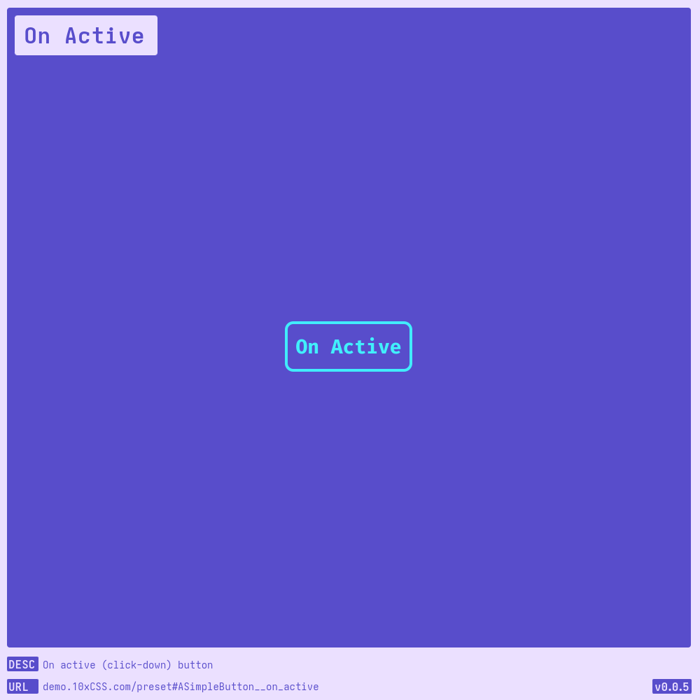

 <b>GIF</b> <i>(click to reveal)</i> 

### On Hover/Active/Focus
> `desc`: On hover (white), active (chartreuse), focus (canary yellow)  
> `link`: [demo.10xCSS.com/preset#ASimpleButton__on_hover_active_focus](https://demo.10xCSS.com/dashboard/presets?cid=ASimpleButton&uid=ASimpleButton__on_hover_active_focus)  
> `time`: 2024-01-27 ⇒ 2024-06-06  
> `vers`: 1  

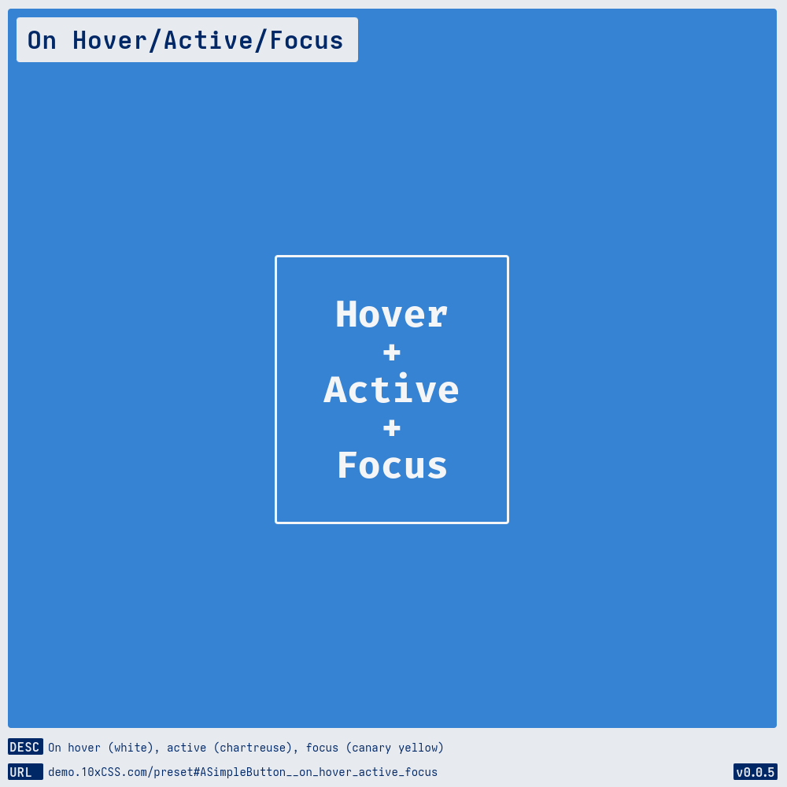

 <b>GIF</b> <i>(click to reveal)</i> 

### On Hover/Active
> `desc`: Button with on hover + active states  
> `link`: [demo.10xCSS.com/preset#ASimpleButton__on_hover_active](https://demo.10xCSS.com/dashboard/presets?cid=ASimpleButton&uid=ASimpleButton__on_hover_active)  
> `time`: 2024-01-27 ⇒ 2024-06-06  
> `vers`: 1  

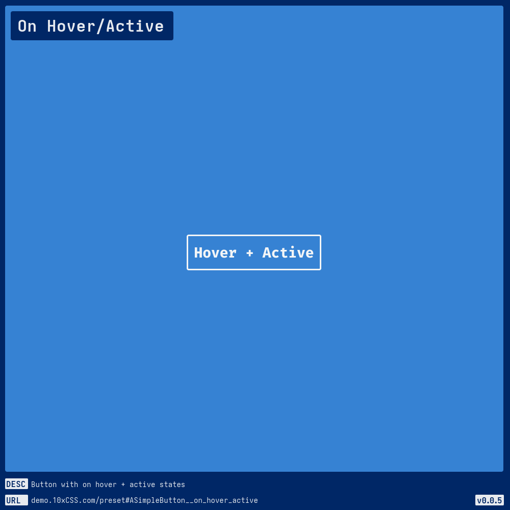

 <b>GIF</b> <i>(click to reveal)</i> 

### On Hover
> `desc`: On hover button  
> `link`: [demo.10xCSS.com/preset#ASimpleButton__on_hover](https://demo.10xCSS.com/dashboard/presets?cid=ASimpleButton&uid=ASimpleButton__on_hover)  
> `time`: 2024-01-27 ⇒ 2024-06-06  
> `vers`: 1  

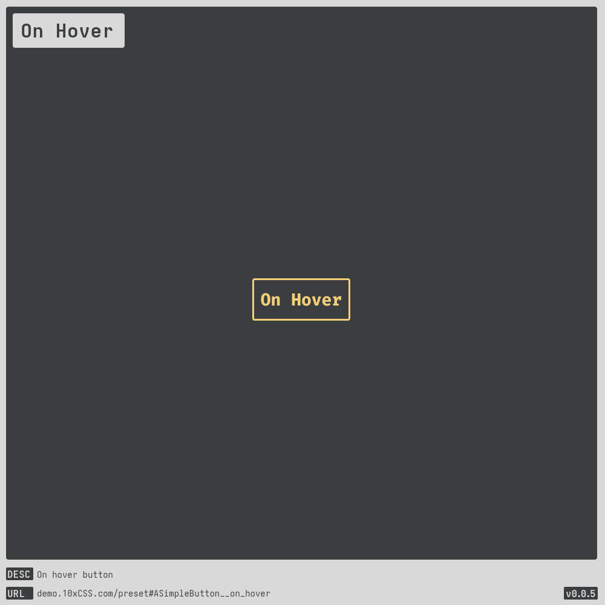

 <b>GIF</b> <i>(click to reveal)</i> 

### outline-ed
> `desc`: An example of a button with a native outline style enabled  
> `link`: [demo.10xCSS.com/preset#ASimpleButton__outlined](https://demo.10xCSS.com/dashboard/presets?cid=ASimpleButton&uid=ASimpleButton__outlined)  
> `time`: 2024-03-04 ⇒ 2024-06-06  
> `vers`: 1  

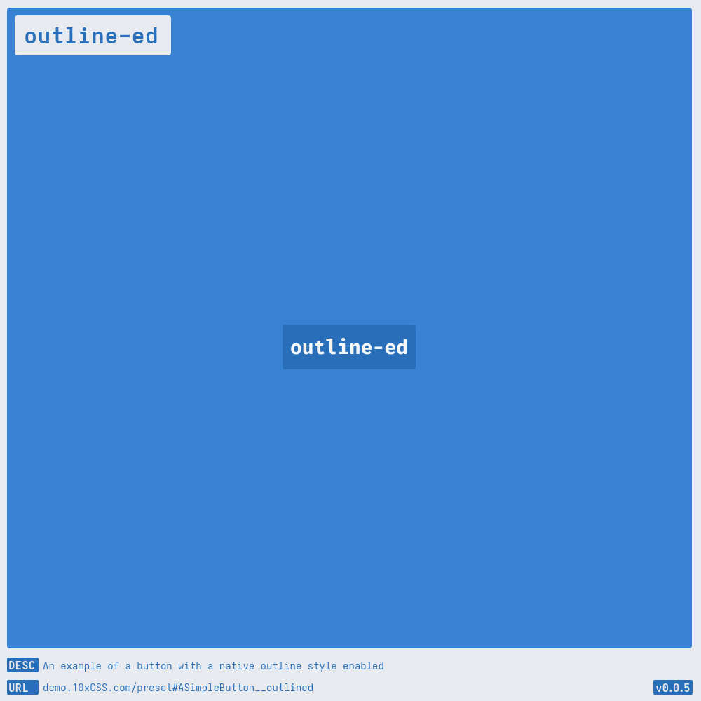

 <b>GIF</b> <i>(click to reveal)</i> 

### Picture This
> `desc`: A style similar to the classic picture frame gesture used by directors  
> `link`: [demo.10xCSS.com/preset#ASimpleButton__picture_this](https://demo.10xCSS.com/dashboard/presets?cid=ASimpleButton&uid=ASimpleButton__picture_this)  
> `time`: 2024-03-12 ⇒ 2024-04-08  
> `vers`: 1  

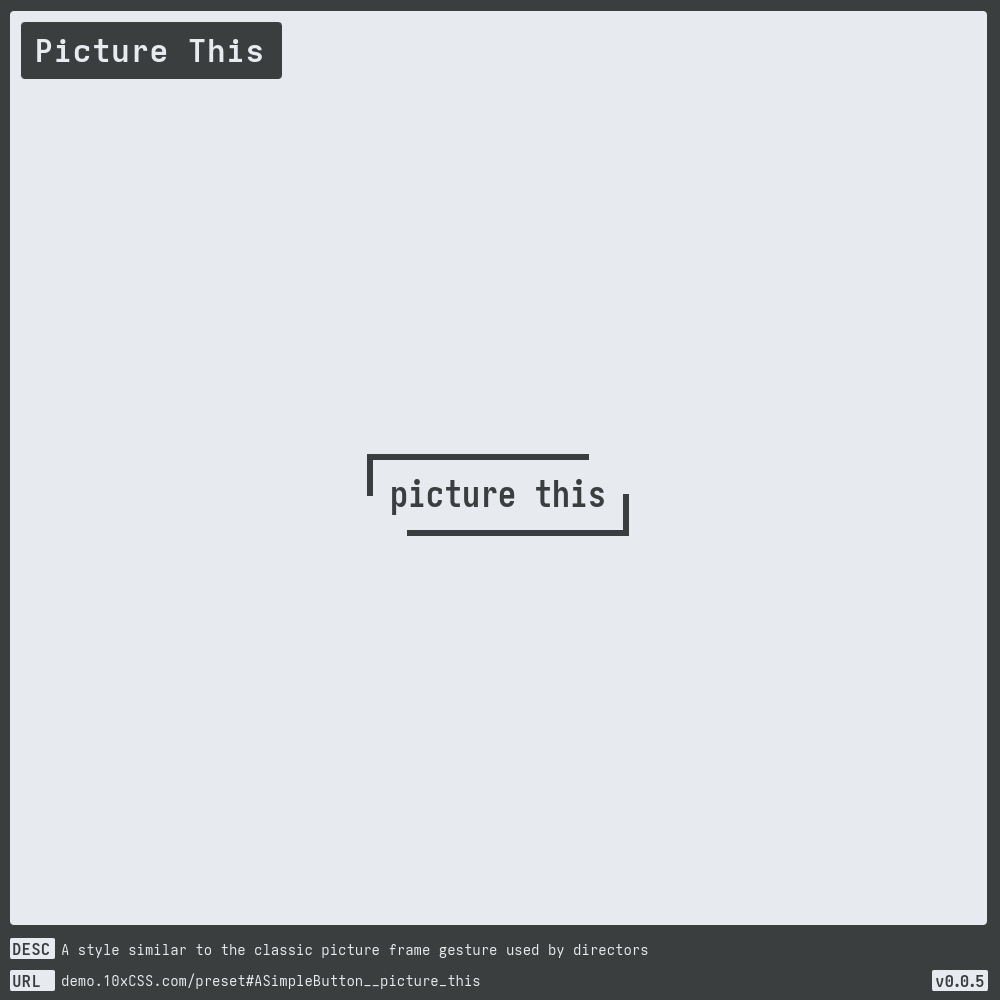

 <b>GIF</b> <i>(click to reveal)</i> 

### Ridge Border
> `desc`: The “I don’t get the ridge border-style” button  
> `link`: [demo.10xCSS.com/preset#ASimpleButton__ridge_border](https://demo.10xCSS.com/dashboard/presets?cid=ASimpleButton&uid=ASimpleButton__ridge_border)  
> `time`: 2024-03-12 ⇒ 2024-06-07  
> `vers`: 1  

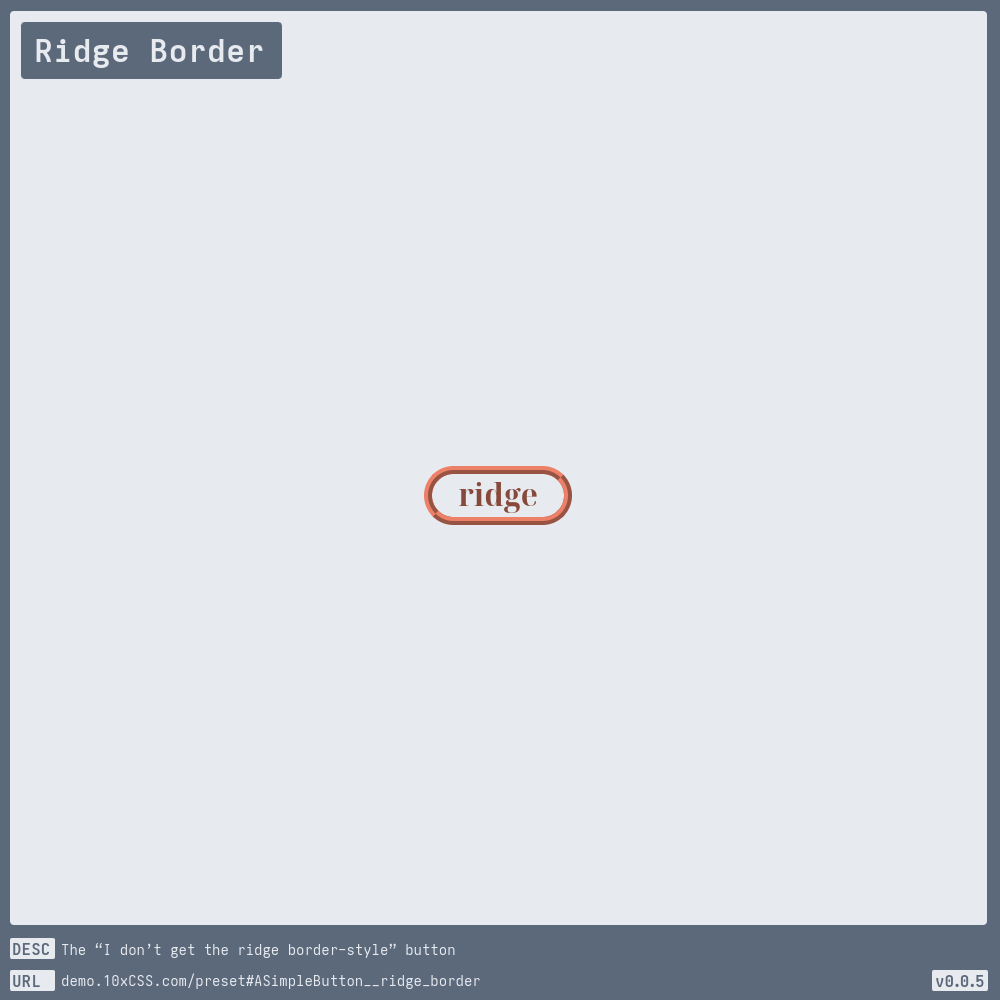

 <b>GIF</b> <i>(click to reveal)</i> 

### Ship It
> `desc`: The “Ship It” button style featured on [10xCSS.com](https://10xCSS.com)  
> `link`: [demo.10xCSS.com/preset#ASimpleButton__ship_it](https://demo.10xCSS.com/dashboard/presets?cid=ASimpleButton&uid=ASimpleButton__ship_it)  
> `time`: 2022-10-30 ⇒ 2024-06-17  
> `vers`: 1  

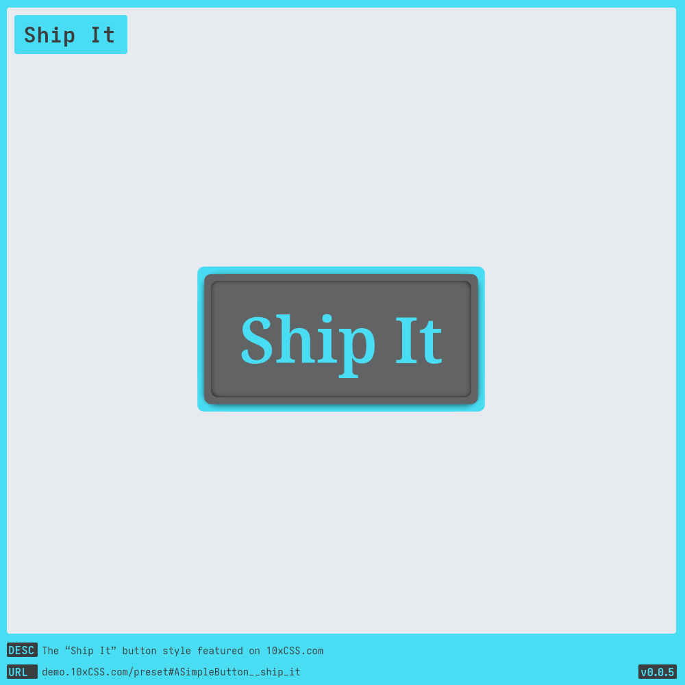

 <b>GIF</b> <i>(click to reveal)</i> 

### Stop Drop Roll
> `desc`: When in doubt; stop, drop, and roll  
> `link`: [demo.10xCSS.com/preset#ASimpleButton__stop_drop_roll](https://demo.10xCSS.com/dashboard/presets?cid=ASimpleButton&uid=ASimpleButton__stop_drop_roll)  
> `time`: 2024-04-08  
> `vers`: 1  

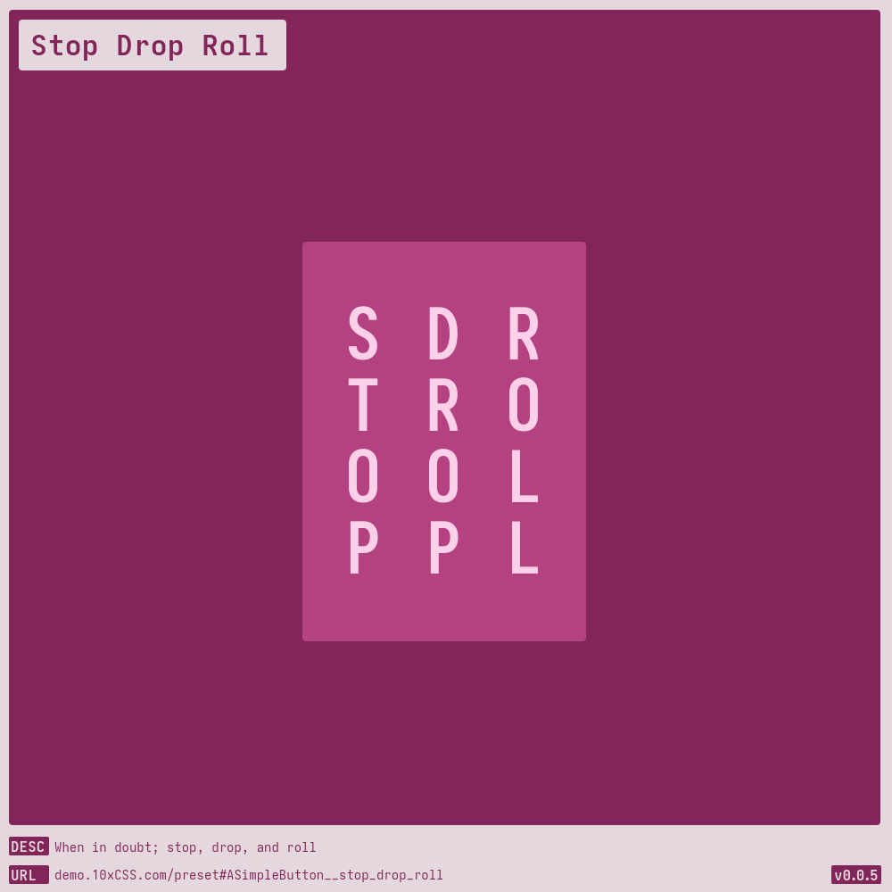

 <b>GIF</b> <i>(click to reveal)</i> 

### Three Dee
> `desc`: They say a 3D button is all about perspective  
> `link`: [demo.10xCSS.com/preset#ASimpleButton__three_d](https://demo.10xCSS.com/dashboard/presets?cid=ASimpleButton&uid=ASimpleButton__three_d)  
> `time`: 2024-03-04 ⇒ 2024-04-08  
> `vers`: 1  

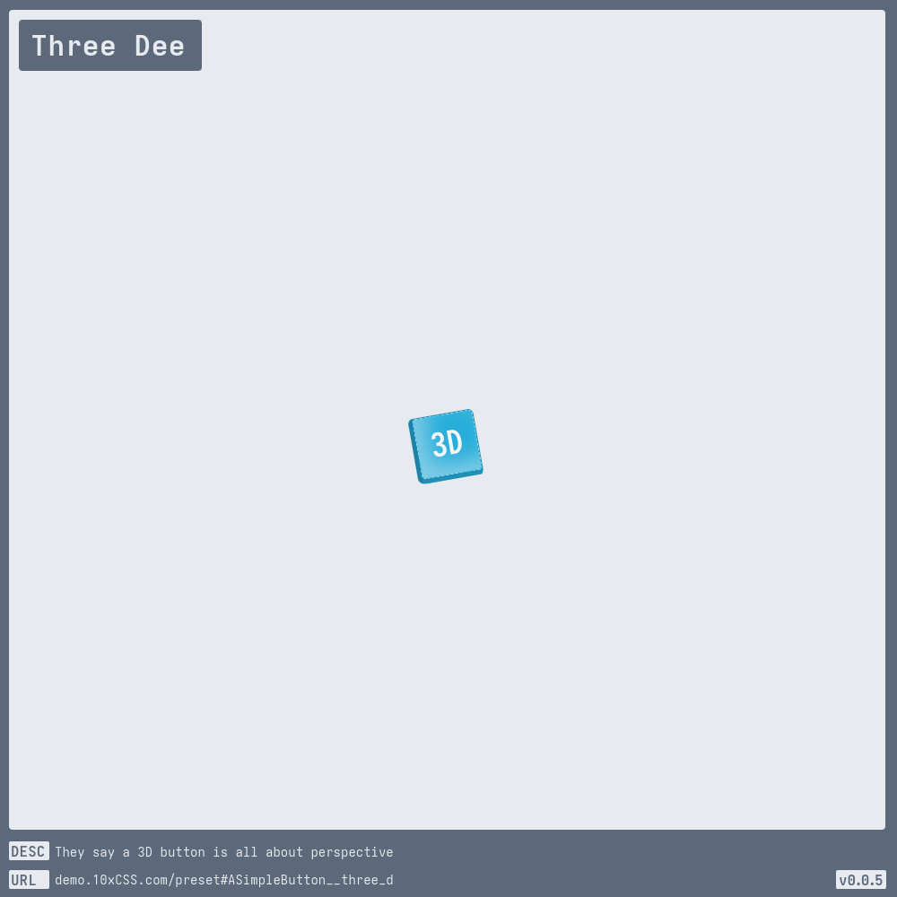

 <b>GIF</b> <i>(click to reveal)</i> 

### UniGlyph Cycle
> `desc`: The interconnected, self-perpetuating Unicode glyph cycle  
> `link`: [demo.10xCSS.com/preset#ASimpleButton__uniglyph_cycle](https://demo.10xCSS.com/dashboard/presets?cid=ASimpleButton&uid=ASimpleButton__uniglyph_cycle)  
> `time`: 2024-04-08  
> `vers`: 1  

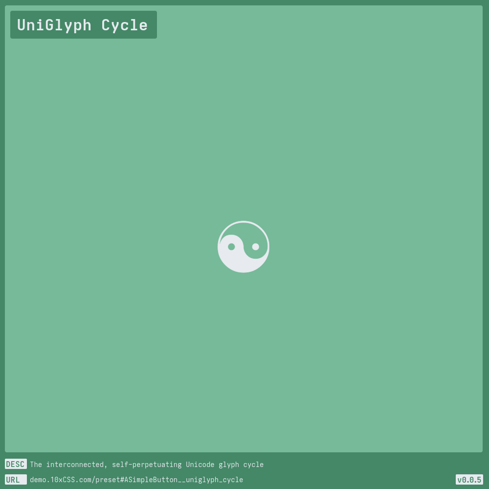

 <b>GIF</b> <i>(click to reveal)</i> 

### UniGlyph Emergency
> `desc`: Call the Unicode Consortium, it’s a dingbats emergency!  
> `link`: [demo.10xCSS.com/preset#ASimpleButton__uniglyph_emergency](https://demo.10xCSS.com/dashboard/presets?cid=ASimpleButton&uid=ASimpleButton__uniglyph_emergency)  
> `time`: 2024-04-08  
> `vers`: 1  

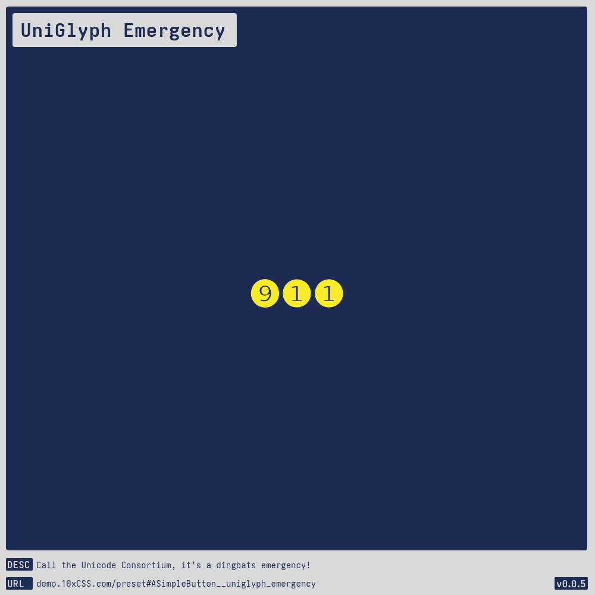

 <b>GIF</b> <i>(click to reveal)</i> 

### UniGlyph Spin
> `desc`: You spin me right ‘round, glyph, right ‘round like a Unicode  
> `link`: [demo.10xCSS.com/preset#ASimpleButton__uniglyph_spin](https://demo.10xCSS.com/dashboard/presets?cid=ASimpleButton&uid=ASimpleButton__uniglyph_spin)  
> `time`: 2024-04-08  
> `vers`: 1  

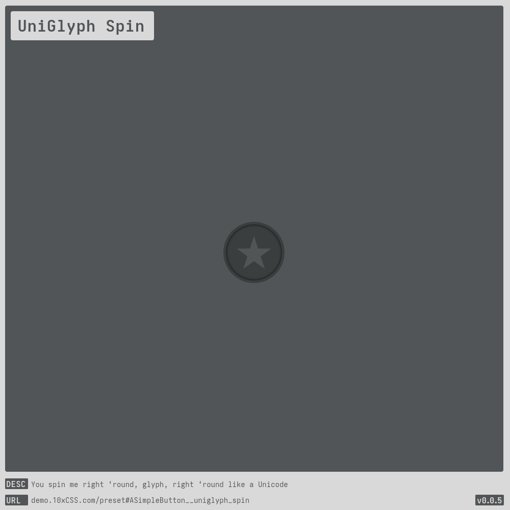

 <b>GIF</b> <i>(click to reveal)</i> 

### Utterly Pointless
> `desc`: Not everything needs a point to exist  
> `link`: [demo.10xCSS.com/preset#ASimpleButton__utterly_pointless](https://demo.10xCSS.com/dashboard/presets?cid=ASimpleButton&uid=ASimpleButton__utterly_pointless)  
> `time`: 2024-04-08 ⇒ 2024-04-29  
> `vers`: 1  

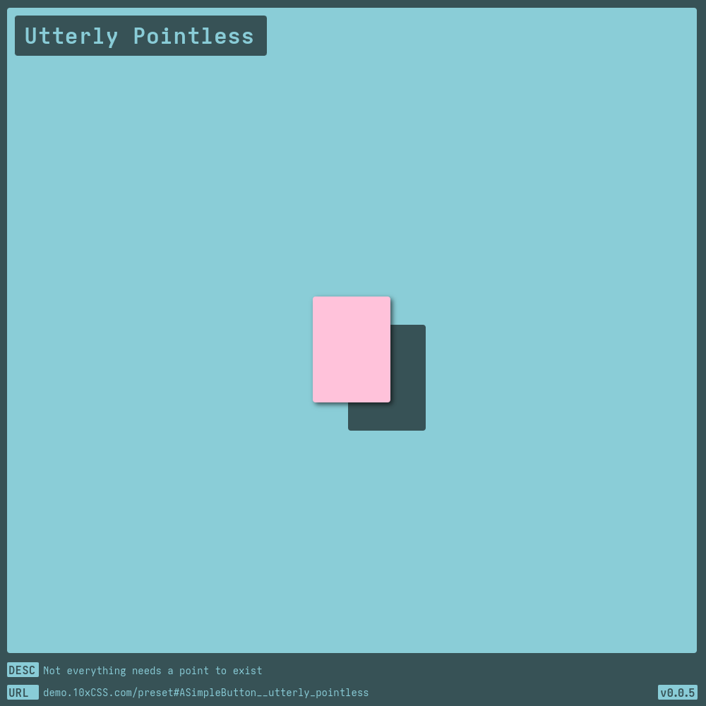

 <b>GIF</b> <i>(click to reveal)</i> 

### Validate It
> `desc`: The “Validate It” button style featured on [10xCSS.com](https://10xCSS.com)  
> `link`: [demo.10xCSS.com/preset#ASimpleButton__validate_it](https://demo.10xCSS.com/dashboard/presets?cid=ASimpleButton&uid=ASimpleButton__validate_it)  
> `time`: 2022-10-30 ⇒ 2024-06-17  
> `vers`: 1  

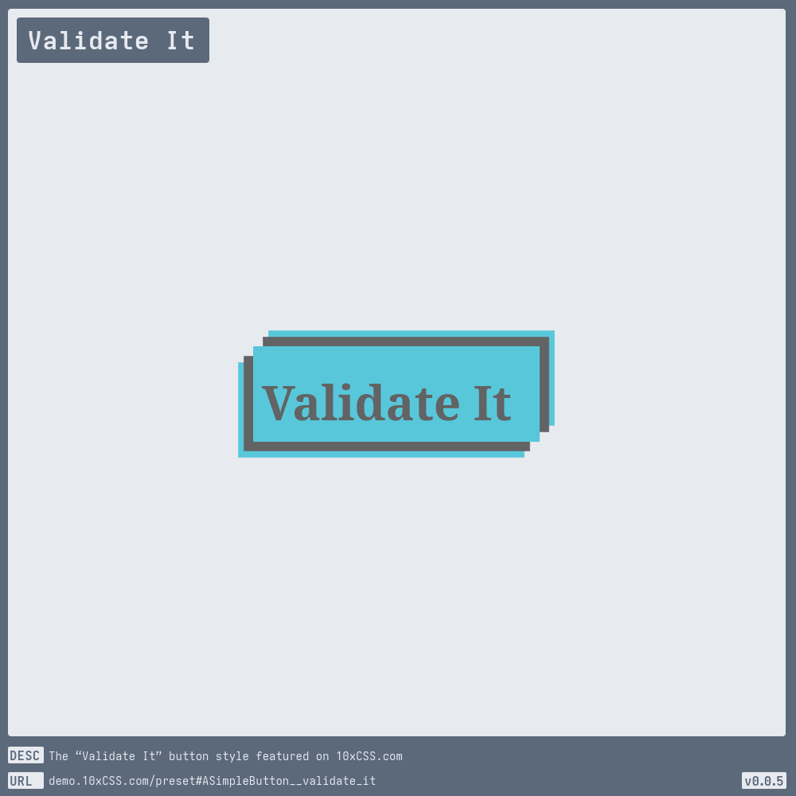

 <b>GIF</b> <i>(click to reveal)</i> 

### You Can Emoji
> `desc`: If you want  
> `link`: [demo.10xCSS.com/preset#ASimpleButton__you_can_emoji](https://demo.10xCSS.com/dashboard/presets?cid=ASimpleButton&uid=ASimpleButton__you_can_emoji)  
> `time`: 2024-01-27 ⇒ 2024-04-08  
> `vers`: 1  

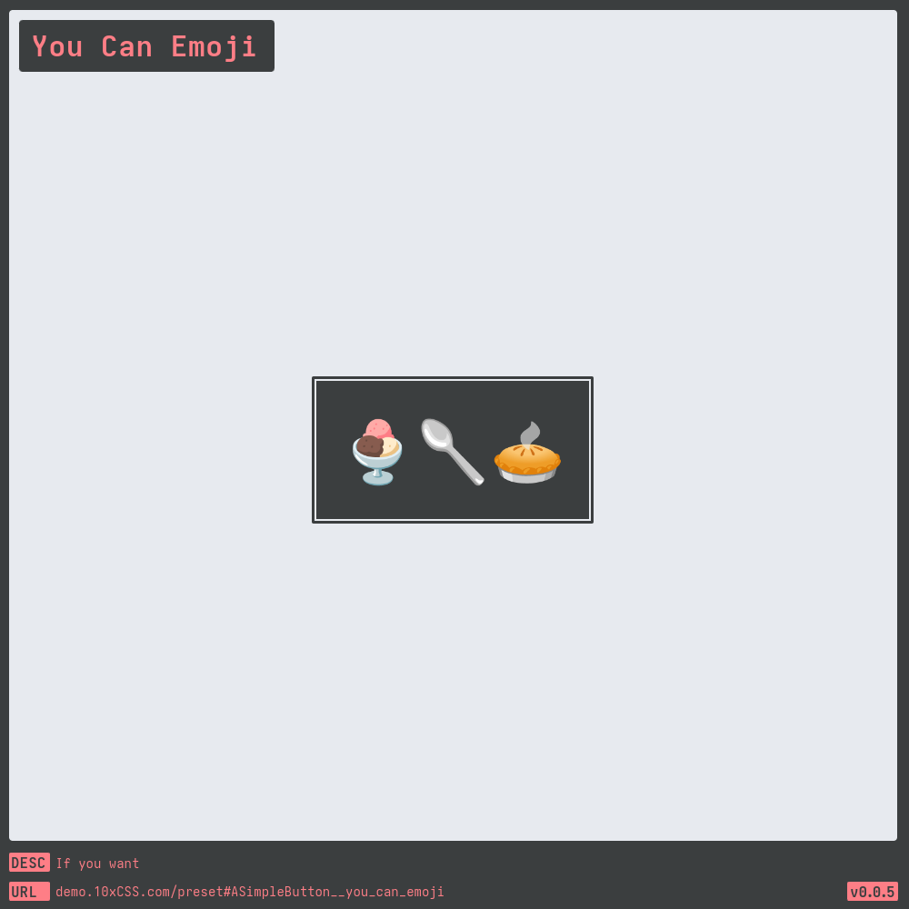

 <b>GIF</b> <i>(click to reveal)</i> 

### Zero Style
> `desc`: A baseline zero/blank style for the [#cssexp](https://www.youtube.com/playlist?list=PLjzn_iVJxcJgGSQSA5uhD3PCHObCQLOpG) video series  
> `link`: [demo.10xCSS.com/preset#ASimpleButton__zero_style](https://demo.10xCSS.com/dashboard/presets?cid=ASimpleButton&uid=ASimpleButton__zero_style)  
> `time`: 2024-01-27 ⇒ 2024-04-08  
> `vers`: 1  

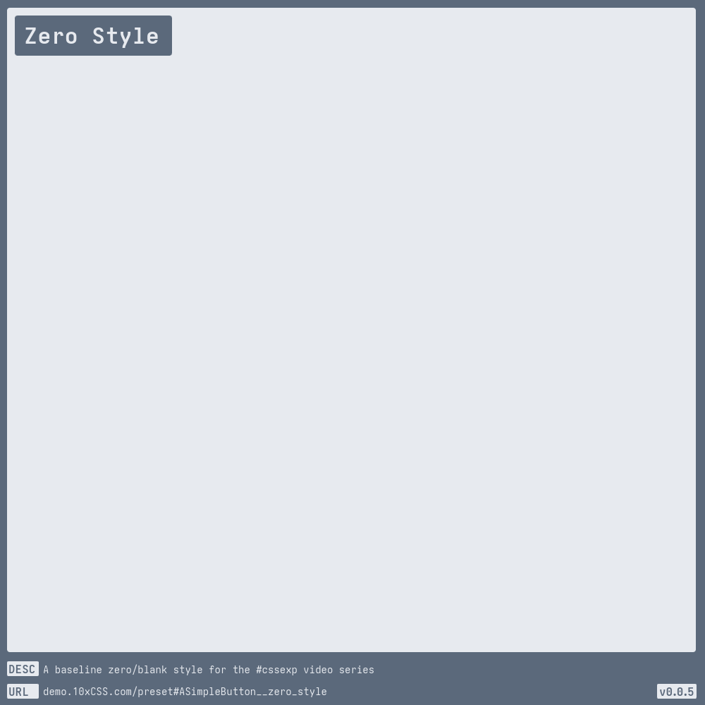

 <b>GIF</b> <i>(click to reveal)</i> 

