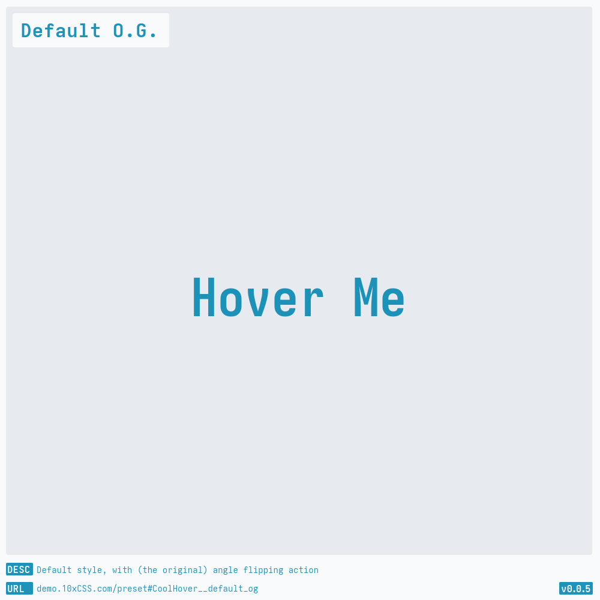
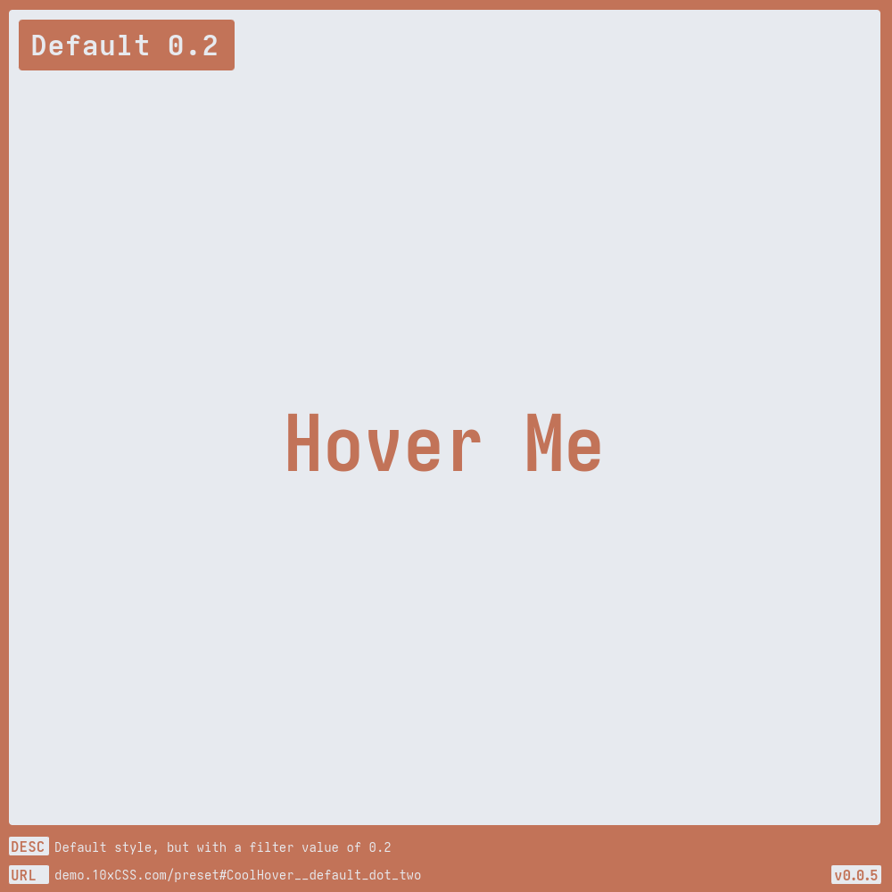
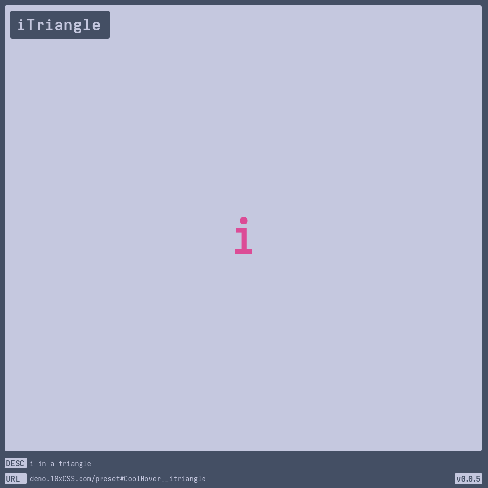
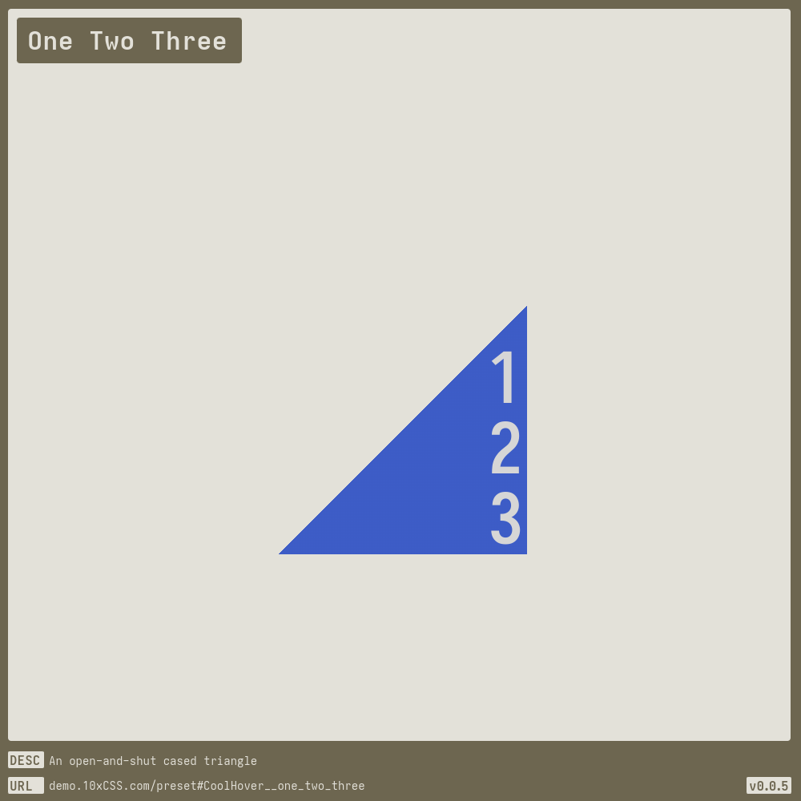
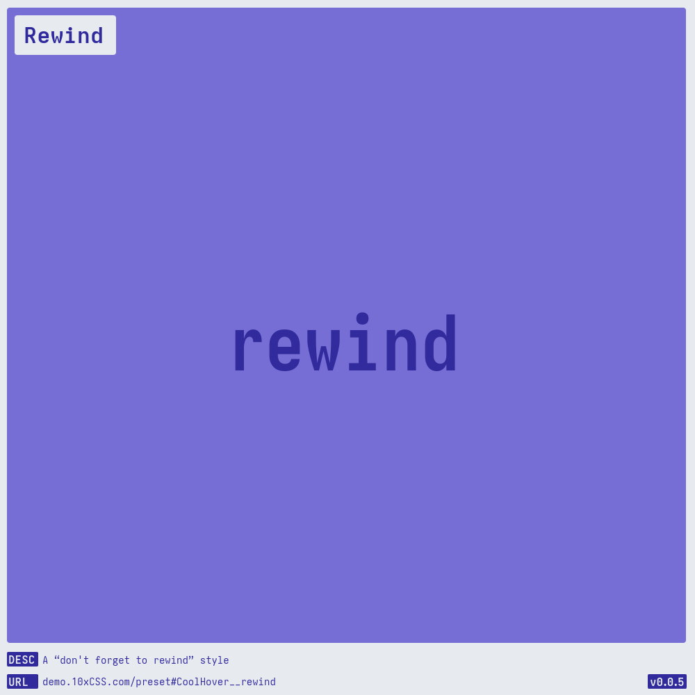
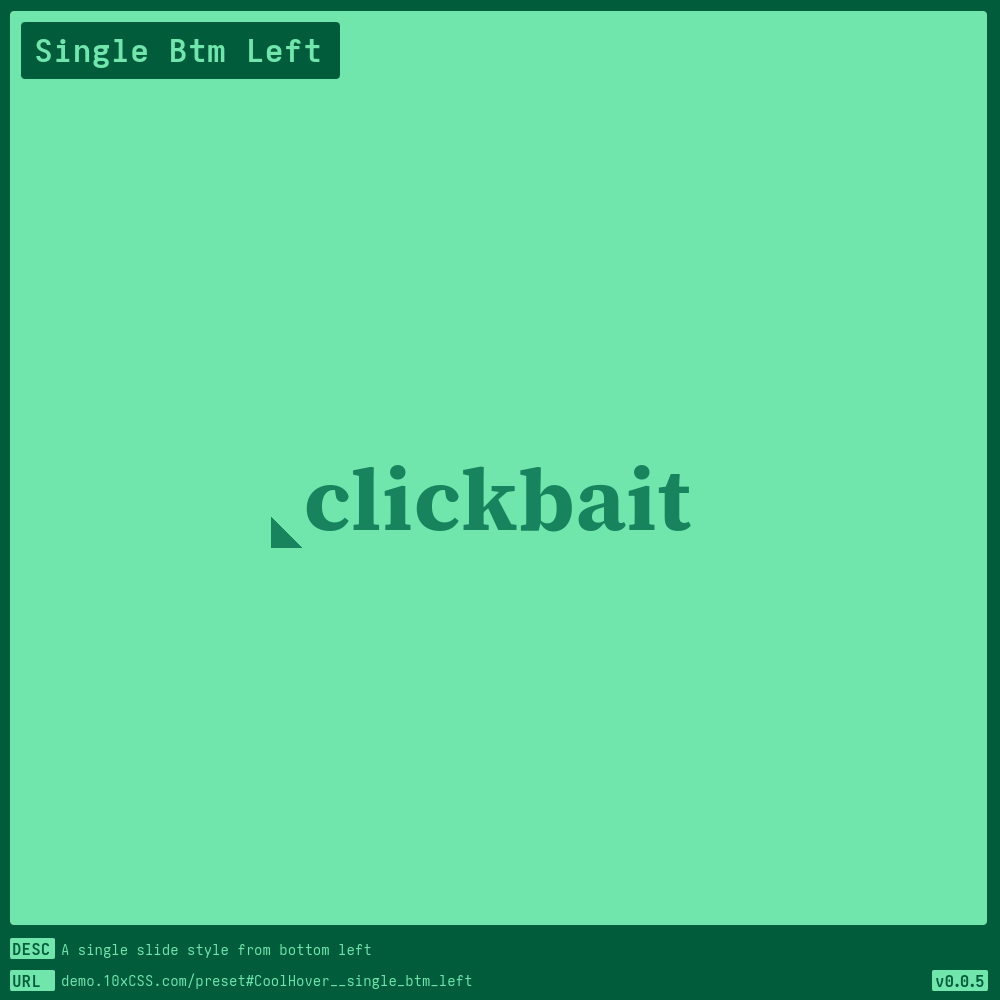
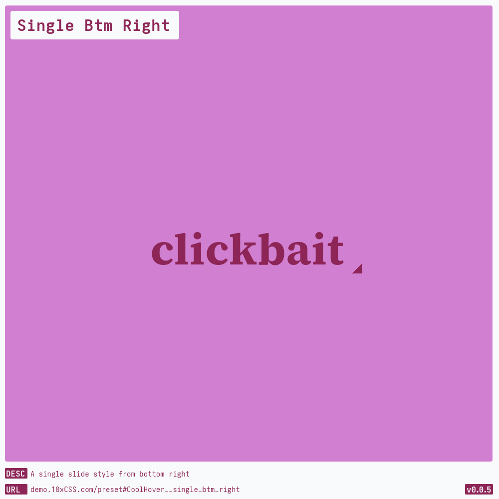

# [Cool Hover](https://demo.10xCSS.com/preset#CoolHover)

> __`CID `__  CoolHover  
> __`DESC`__  A cool hover effect, sourced from one of my favorite CSS deities, [@anatudor](https://twitter.com/anatudor).  
> __`LINK`__  [demo.10xCSS.com/preset#CoolHover](https://demo.10xCSS.com/preset#CoolHover)  
> __`NOTE`__  Currently, does not work in Firefox: check the bug [id=1481498](https://bugzilla.mozilla.org/show_bug.cgi?id=1481498). Fallback, via `background-clip:text;` is an possible, but it’s lackluster at best. Future Firefox fix; decent.  
> __`VERS`__  2  

|Table                                    |of                                       |Contents                                 |                                         |                                         |                                         |
|:----------------------------------------|:----------------------------------------|:----------------------------------------|:----------------------------------------|:----------------------------------------|:----------------------------------------|
|[Default](#default)                      |[Default Inverted](#default-inverted)    |[Fill Up](#fill-up)                      |[One Way](#one-way)                      |[Scanner](#scanner)                      |[Single Top Left](#single-top-left)      |
|[Default O.G.](#default-og)              |[Default Inverted C](#default-inverted-c)|[iTriangle](#itriangle)                  |[Rewind](#rewind)                        |[Single Btm Left](#single-btm-left)      |[Single Top Right](#single-top-right)    |
|[Default 0.2](#default-02)               |[Dusky Dark](#dusky-dark)                |[One Two Three](#one-two-three)          |[Rewind Alt](#rewind-alt)                |[Single Btm Right](#single-btm-right)    |[Thirty Percent](#thirty-percent)        |
---

### _All-in-One_
https://github.com/10xCSS/CHANGELOG/assets/9544140/1e390756-ab35-4b85-a596-1836f1ed9382

### Default
> `desc`: Default [CoolHover](https://10xCSS.com/dashboard/presets?cid=CoolHover&uid=CoolHover__default) style; it’s [background-clip](https://developer.mozilla.org/en-US/docs/Web/CSS/background-clip) magic  
> `link`: [demo.10xCSS.com/preset#CoolHover__default](https://demo.10xCSS.com/dashboard/presets?cid=CoolHover&uid=CoolHover__default)  
> `time`: 2023-10-22 ⇒ 2024-04-08  
> `vers`: 1  

 <b>GIF</b> <i>(click to reveal)</i> 

### Default O.G.
> `desc`: Default style, with (the original) angle flipping action  
> `link`: [demo.10xCSS.com/preset#CoolHover__default_og](https://demo.10xCSS.com/dashboard/presets?cid=CoolHover&uid=CoolHover__default_og)  
> `time`: 2024-04-05 ⇒ 2024-04-08  
> `vers`: 1  

 <b>GIF</b> <i>(click to reveal)</i> 

### Default 0.2
> `desc`: Default style, but with a filter value of `0.2`  
> `link`: [demo.10xCSS.com/preset#CoolHover__default_dot_two](https://demo.10xCSS.com/dashboard/presets?cid=CoolHover&uid=CoolHover__default_dot_two)  
> `time`: 2024-04-05 ⇒ 2024-04-08  
> `vers`: 1  

 <b>GIF</b> <i>(click to reveal)</i> 

### Default Inverted
> `desc`: Default style, but with the transition inverted  
> `link`: [demo.10xCSS.com/preset#CoolHover__default_inverted](https://demo.10xCSS.com/dashboard/presets?cid=CoolHover&uid=CoolHover__default_inverted)  
> `time`: 2024-04-05 ⇒ 2024-04-08  
> `vers`: 1  

 <b>GIF</b> <i>(click to reveal)</i> 

### Default Inverted C
> `desc`: Default style, but with the background and color inverted  
> `link`: [demo.10xCSS.com/preset#CoolHover__default_inverted_c](https://demo.10xCSS.com/dashboard/presets?cid=CoolHover&uid=CoolHover__default_inverted_c)  
> `time`: 2024-04-05 ⇒ 2024-04-08  
> `vers`: 1  

 <b>GIF</b> <i>(click to reveal)</i> 

### Dusky Dark
> `desc`: A dark style with corner accents  
> `link`: [demo.10xCSS.com/preset#CoolHover__dusky_dark](https://demo.10xCSS.com/dashboard/presets?cid=CoolHover&uid=CoolHover__dusky_dark)  
> `time`: 2024-04-05 ⇒ 2024-04-08  
> `vers`: 1  

 <b>GIF</b> <i>(click to reveal)</i> 

### Fill Up
> `desc`: A style that fills from bottom-to-top  
> `link`: [demo.10xCSS.com/preset#CoolHover__fillup](https://demo.10xCSS.com/dashboard/presets?cid=CoolHover&uid=CoolHover__fillup)  
> `time`: 2023-10-22 ⇒ 2024-04-08  
> `vers`: 1  

 <b>GIF</b> <i>(click to reveal)</i> 

### iTriangle
> `desc`: i in a triangle  
> `link`: [demo.10xCSS.com/preset#CoolHover__itriangle](https://demo.10xCSS.com/dashboard/presets?cid=CoolHover&uid=CoolHover__itriangle)  
> `time`: 2024-04-05 ⇒ 2024-04-08  
> `vers`: 1  

 <b>GIF</b> <i>(click to reveal)</i> 

### One Two Three
> `desc`: An open-and-shut cased triangle  
> `link`: [demo.10xCSS.com/preset#CoolHover__one_two_three](https://demo.10xCSS.com/dashboard/presets?cid=CoolHover&uid=CoolHover__one_two_three)  
> `time`: 2024-04-05 ⇒ 2024-04-08  
> `vers`: 1  

 <b>GIF</b> <i>(click to reveal)</i> 

### One Way
> `desc`: It’s a one-way style with zero-angle  
> `link`: [demo.10xCSS.com/preset#CoolHover__oneway](https://demo.10xCSS.com/dashboard/presets?cid=CoolHover&uid=CoolHover__oneway)  
> `time`: 2023-10-22 ⇒ 2024-04-08  
> `vers`: 1  

 <b>GIF</b> <i>(click to reveal)</i> 

### Rewind
> `desc`: A “don't forget to rewind” style  
> `link`: [demo.10xCSS.com/preset#CoolHover__rewind](https://demo.10xCSS.com/dashboard/presets?cid=CoolHover&uid=CoolHover__rewind)  
> `time`: 2023-10-22 ⇒ 2024-04-08  
> `vers`: 1  

 <b>GIF</b> <i>(click to reveal)</i> 

### Rewind Alt
> `desc`: An alternative “couldn’t decide which looked better” rewind style  
> `link`: [demo.10xCSS.com/preset#CoolHover__rewindalt](https://demo.10xCSS.com/dashboard/presets?cid=CoolHover&uid=CoolHover__rewindalt)  
> `time`: 2023-10-22 ⇒ 2024-04-08  
> `vers`: 1  

 <b>GIF</b> <i>(click to reveal)</i> 

### Scanner
> `desc`: A scanner style suitable for office work  
> `link`: [demo.10xCSS.com/preset#CoolHover__scanner](https://demo.10xCSS.com/dashboard/presets?cid=CoolHover&uid=CoolHover__scanner)  
> `time`: 2023-10-22 ⇒ 2024-04-08  
> `vers`: 1  

 <b>GIF</b> <i>(click to reveal)</i> 

### Single Btm Left
> `desc`: A single slide style from bottom left  
> `link`: [demo.10xCSS.com/preset#CoolHover__single_btm_left](https://demo.10xCSS.com/dashboard/presets?cid=CoolHover&uid=CoolHover__single_btm_left)  
> `time`: 2024-04-05 ⇒ 2024-06-07  
> `vers`: 1  

 <b>GIF</b> <i>(click to reveal)</i> 

### Single Btm Right
> `desc`: A single slide style from bottom right  
> `link`: [demo.10xCSS.com/preset#CoolHover__single_btm_right](https://demo.10xCSS.com/dashboard/presets?cid=CoolHover&uid=CoolHover__single_btm_right)  
> `time`: 2024-04-05 ⇒ 2024-06-07  
> `vers`: 1  

 <b>GIF</b> <i>(click to reveal)</i> 

### Single Top Left
> `desc`: A single slide style from top left  
> `link`: [demo.10xCSS.com/preset#CoolHover__single_top_left](https://demo.10xCSS.com/dashboard/presets?cid=CoolHover&uid=CoolHover__single_top_left)  
> `time`: 2024-04-05 ⇒ 2024-06-07  
> `vers`: 1  

 <b>GIF</b> <i>(click to reveal)</i> 

### Single Top Right
> `desc`: A single slide style from top right  
> `link`: [demo.10xCSS.com/preset#CoolHover__single_top_right](https://demo.10xCSS.com/dashboard/presets?cid=CoolHover&uid=CoolHover__single_top_right)  
> `time`: 2024-04-05 ⇒ 2024-06-07  
> `vers`: 1  

 <b>GIF</b> <i>(click to reveal)</i> 

### Thirty Percent
> `desc`: A style that only puts in 30% of the effort  
> `link`: [demo.10xCSS.com/preset#CoolHover__thirty_percent](https://demo.10xCSS.com/dashboard/presets?cid=CoolHover&uid=CoolHover__thirty_percent)  
> `time`: 2024-04-05 ⇒ 2024-04-08  
> `vers`: 1  

 <b>GIF</b> <i>(click to reveal)</i> 

