# [DaisyUi Toggle](https://demo.10xCSS.com/preset#DaisyUiToggle)

> __`CID `__  DaisyUiToggle  
> __`DESC`__  A set of toggle-able [checkbox](https://developer.mozilla.org/en-US/docs/Web/HTML/Element/input/checkbox) [input](https://developer.mozilla.org/en-US/docs/Web/HTML/Element/input) values with distinct theme classes, sourced from [@saadeghi’s](https://twitter.com/saadeghi) box-office hit [daisyui.com](https://daisyui.com) — an open-source Tailwind component library.  
> __`LINK`__  [demo.10xCSS.com/preset#DaisyUiToggle](https://demo.10xCSS.com/preset#DaisyUiToggle)  
> __`NOTE`__  This toggle style does not offer exact parity, as the [box-shadow](https://developer.mozilla.org/en-US/docs/Web/CSS/box-shadow) logic differs and it does not use Color Level 4 delimiter notation; however, the concept remains nearly identical. The goal moving forward is to enhance framework interoperability, making customization of components from DaisyUI and similar frameworks seamless.  
> __`VERS`__  1  

|Table                                      |of                                         |Contents                                   |                                           |                                           |
|:------------------------------------------|:------------------------------------------|:------------------------------------------|:------------------------------------------|:------------------------------------------|
|[Default](#default)                        |[Carbon Copy](#carbon-copy)                |[Large and In Charge](#large-and-in-charge)|[Pills](#pills)                            |[Teeny Tiny Row](#teeny-tiny-row)          |
|[Default Row](#default-row)                |[Dark Lumens](#dark-lumens)                |[Lemon](#lemon)                            |[Pocket Billiards](#pocket-billiards)      |[Teeny Tiny](#teeny-tiny)                  |
|[Default Single](#default-single)          |[Dovetail](#dovetail)                      |[Lights Off](#lights-off)                  |[QuadOggle](#quadoggle)                    |[The Battery](#the-battery)                |
|[Default Enabled](#default-enabled)        |[Empty Night](#empty-night)                |[NeoLite](#neolite)                        |[Quarter Circle](#quarter-circle)          |[Top Up](#top-up)                          |
|[Default Inverted](#default-inverted)      |[Hot N Cold](#hot-n-cold)                  |[Oh My Cornea](#oh-my-cornea)              |[Red Wire Blue Wire](#red-wire-blue-wire)  |[Traffic Light](#traffic-light)            |
|[AnimationLess](#animationless)            |[I Want Height](#i-want-height)            |[On State](#on-state)                      |[Right on Track](#right-on-track)          |[Wax On, Wane Off](#wax-on-wane-off)       |
|[Borderless](#borderless)                  |[I Want Width](#i-want-width)              |[Perforated](#perforated)                  |[Stitched](#stitched)                      |[Zero Style](#zero-style)                  |
---

### _All-in-One_
https://github.com/10xCSS/CHANGELOG/assets/9544140/68fc9947-666e-4442-b4d6-c6e68141a4ea

### Default
> `desc`: Default [DaisyUiToggle](https://10xCSS.com/dashboard/presets?cid=DaisyUiToggle&uid=DaisyUiToggle__default); an [input](https://developer.mozilla.org/en-US/docs/Web/HTML/Element/input) [checkbox](https://developer.mozilla.org/en-US/docs/Web/HTML/Element/input/checkbox) style  
> `link`: [demo.10xCSS.com/preset#DaisyUiToggle__default](https://demo.10xCSS.com/dashboard/presets?cid=DaisyUiToggle&uid=DaisyUiToggle__default)  
> `time`: 2023-10-22 ⇒ 2024-04-08  
> `vers`: 1  

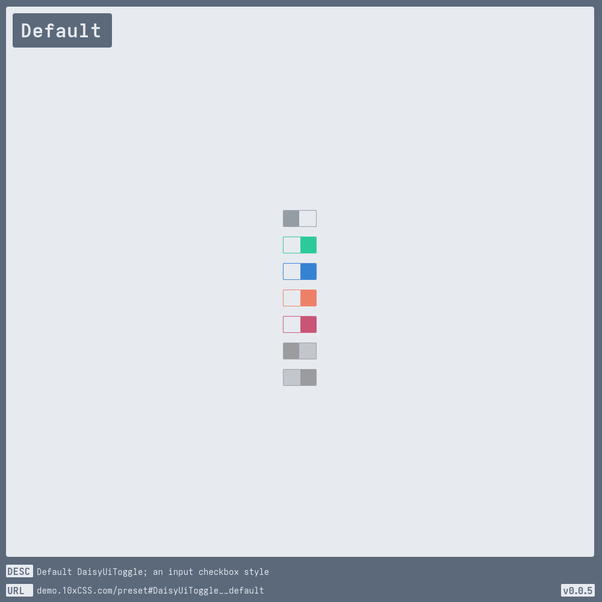

 <b>GIF</b> <i>(click to reveal)</i> 

### Default Row
> `desc`: Default style, with a row layout  
> `link`: [demo.10xCSS.com/preset#DaisyUiToggle__default_row](https://demo.10xCSS.com/dashboard/presets?cid=DaisyUiToggle&uid=DaisyUiToggle__default_row)  
> `time`: 2024-03-22 ⇒ 2024-04-08  
> `vers`: 1  

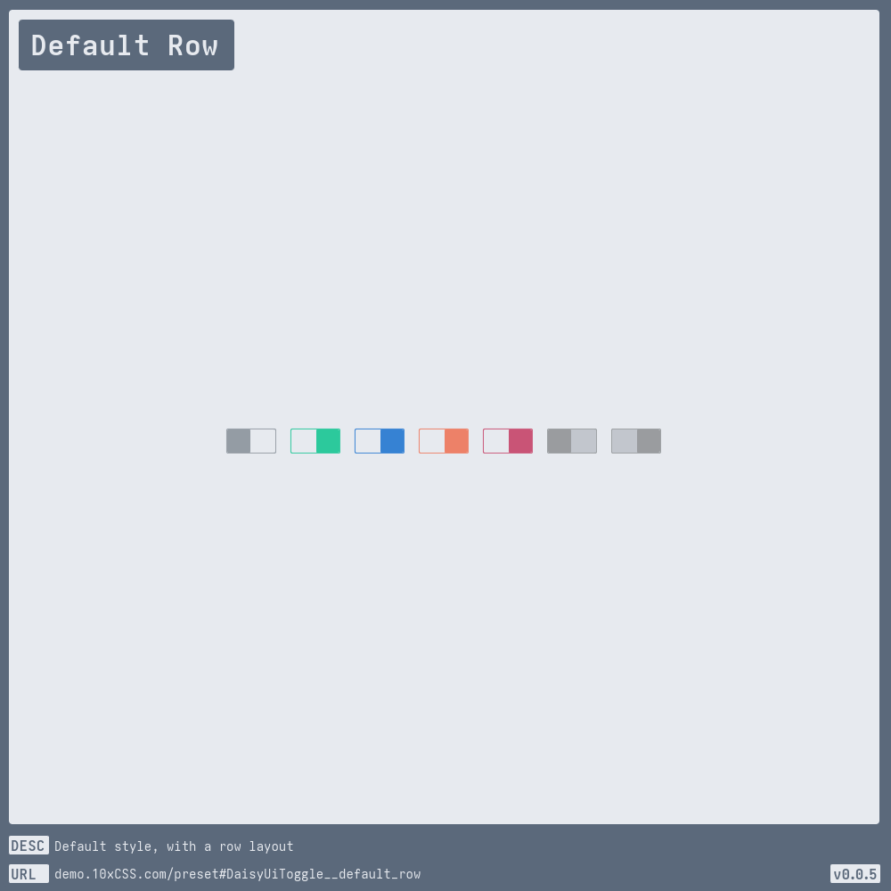

 <b>GIF</b> <i>(click to reveal)</i> 

### Default Single
> `desc`: Default style, with only a single toggle  
> `link`: [demo.10xCSS.com/preset#DaisyUiToggle__default_single](https://demo.10xCSS.com/dashboard/presets?cid=DaisyUiToggle&uid=DaisyUiToggle__default_single)  
> `time`: 2024-03-22 ⇒ 2024-04-08  
> `vers`: 1  

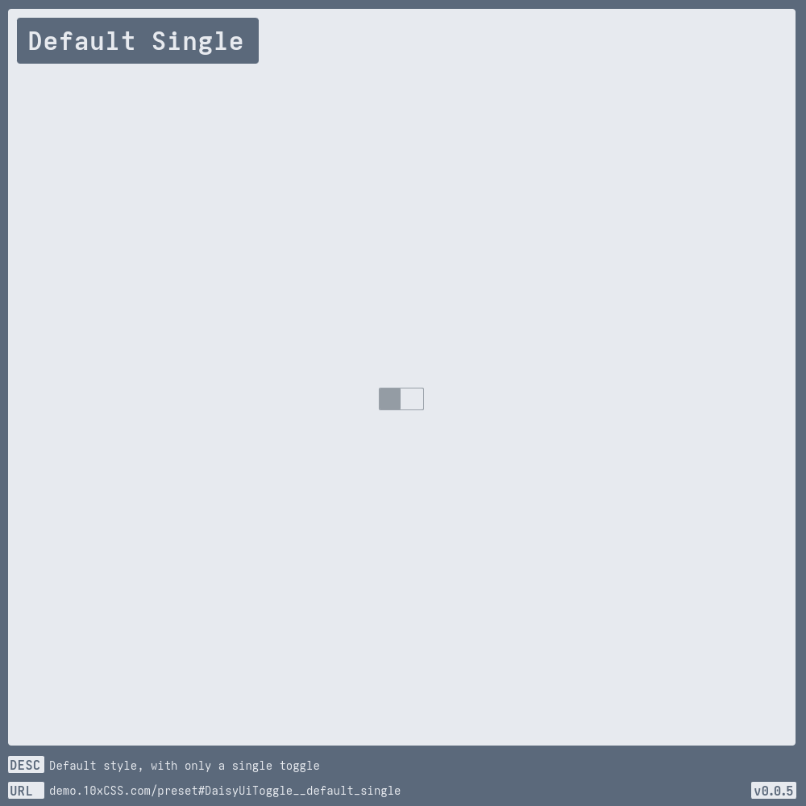

 <b>GIF</b> <i>(click to reveal)</i> 

### Default Enabled
> `desc`: Default style, without disabled styles  
> `link`: [demo.10xCSS.com/preset#DaisyUiToggle__default_enabled](https://demo.10xCSS.com/dashboard/presets?cid=DaisyUiToggle&uid=DaisyUiToggle__default_enabled)  
> `time`: 2024-03-22 ⇒ 2024-04-08  
> `vers`: 1  

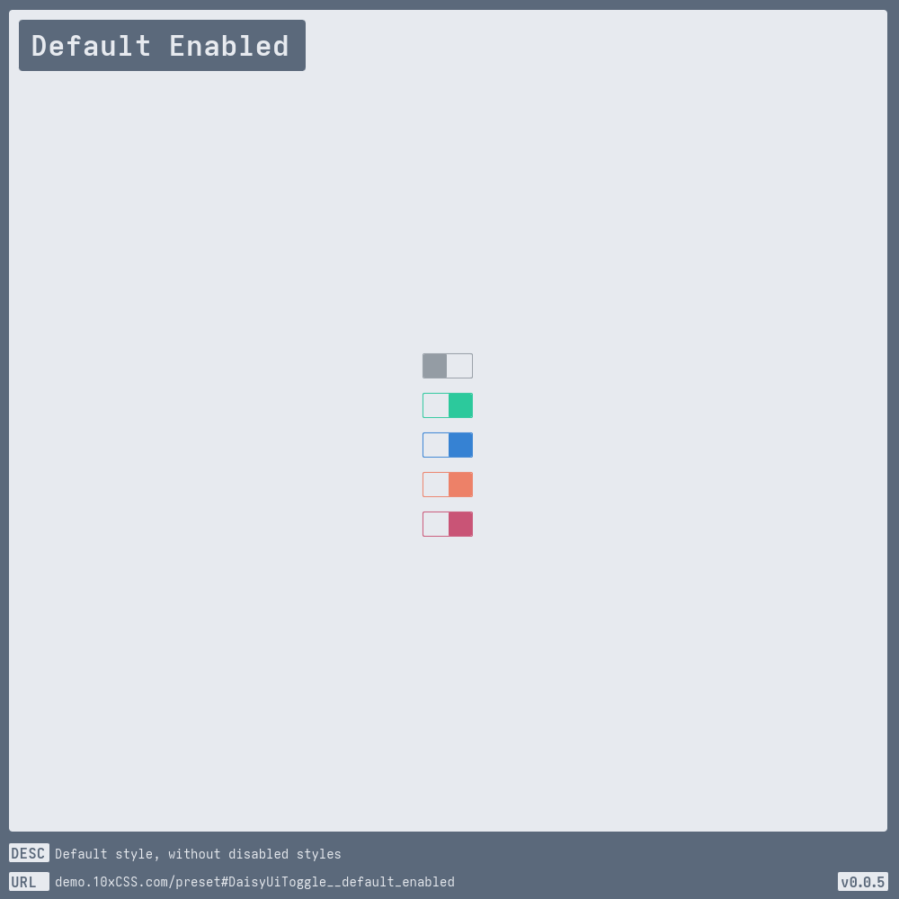

 <b>GIF</b> <i>(click to reveal)</i> 

### Default Inverted
> `desc`: Default style, with inverted checked colors  
> `link`: [demo.10xCSS.com/preset#DaisyUiToggle__default_inverted](https://demo.10xCSS.com/dashboard/presets?cid=DaisyUiToggle&uid=DaisyUiToggle__default_inverted)  
> `time`: 2024-03-23 ⇒ 2024-04-08  
> `vers`: 1  

 <b>GIF</b> <i>(click to reveal)</i> 

### AnimationLess
> `desc`: A toggle style without an animation transition  
> `link`: [demo.10xCSS.com/preset#DaisyUiToggle__animationless](https://demo.10xCSS.com/dashboard/presets?cid=DaisyUiToggle&uid=DaisyUiToggle__animationless)  
> `time`: 2024-03-23 ⇒ 2024-04-08  
> `vers`: 1  

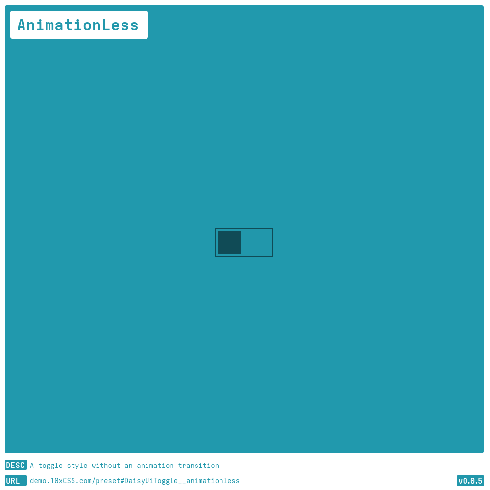

 <b>GIF</b> <i>(click to reveal)</i> 

### Borderless
> `desc`: A toggle style that transcends borders  
> `link`: [demo.10xCSS.com/preset#DaisyUiToggle__borderless](https://demo.10xCSS.com/dashboard/presets?cid=DaisyUiToggle&uid=DaisyUiToggle__borderless)  
> `time`: 2023-10-22 ⇒ 2024-04-08  
> `vers`: 1  

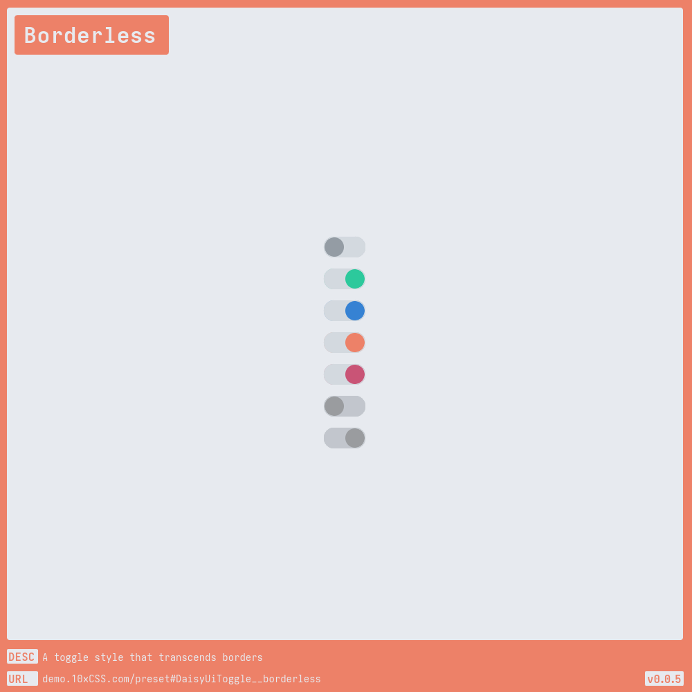

 <b>GIF</b> <i>(click to reveal)</i> 

### Carbon Copy
> `desc`: A carbon-copy of the daisyui.com toggle style  
> `link`: [demo.10xCSS.com/preset#DaisyUiToggle__carbon_copy](https://demo.10xCSS.com/dashboard/presets?cid=DaisyUiToggle&uid=DaisyUiToggle__carbon_copy)  
> `time`: 2024-03-21 ⇒ 2024-04-08  
> `vers`: 1  

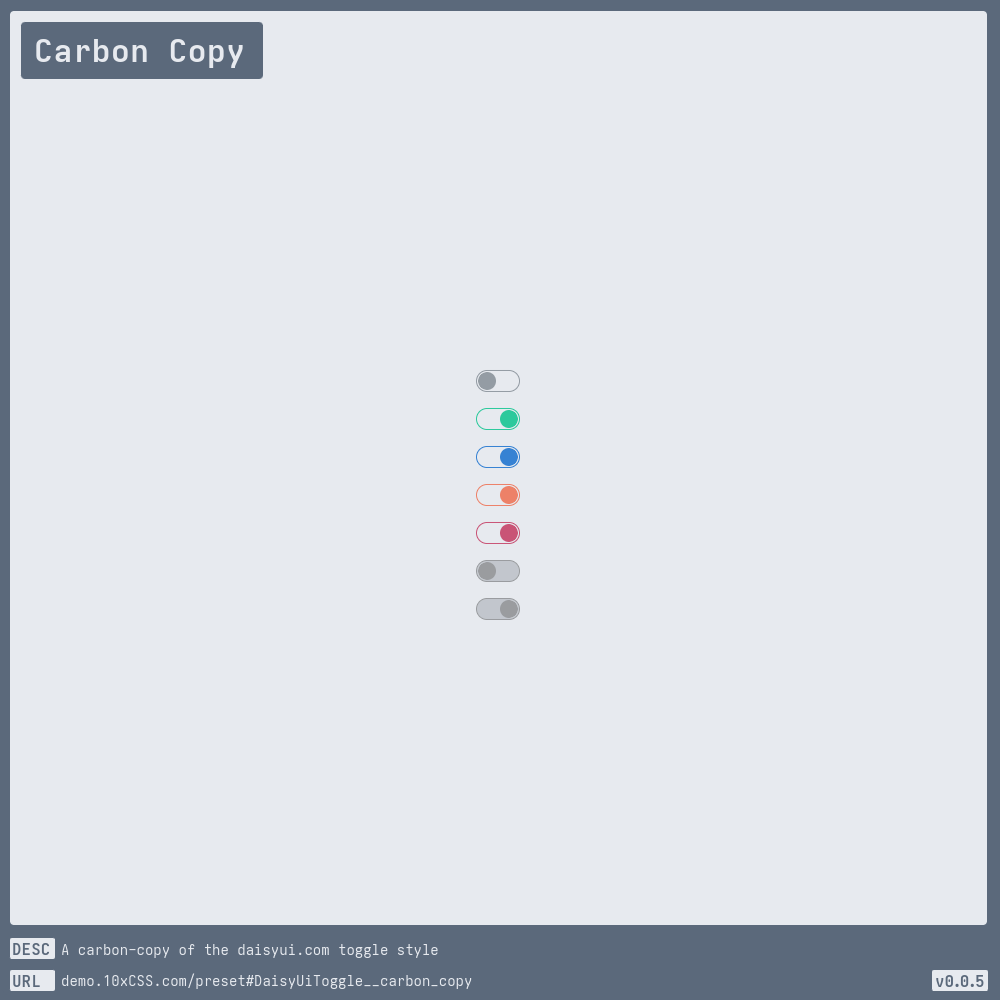

 <b>GIF</b> <i>(click to reveal)</i> 

### Dark Lumens
> `desc`: A toggle style that toggles the lumens for a luminous flux spectacle  
> `link`: [demo.10xCSS.com/preset#DaisyUiToggle__dark_lumens](https://demo.10xCSS.com/dashboard/presets?cid=DaisyUiToggle&uid=DaisyUiToggle__dark_lumens)  
> `time`: 2024-03-26 ⇒ 2024-04-08  
> `vers`: 1  

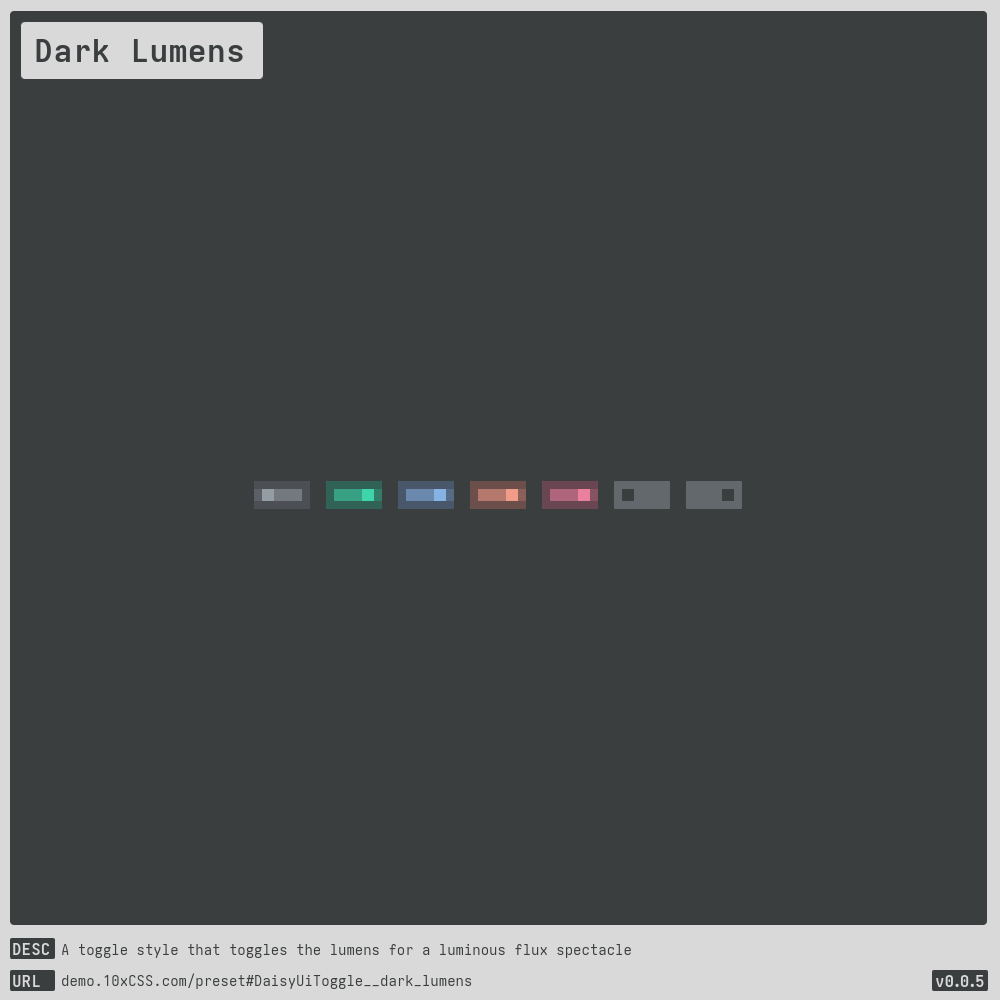

 <b>GIF</b> <i>(click to reveal)</i> 

### Dovetail
> `desc`: A dovetail joint-like toggle style  
> `link`: [demo.10xCSS.com/preset#DaisyUiToggle__dovetail](https://demo.10xCSS.com/dashboard/presets?cid=DaisyUiToggle&uid=DaisyUiToggle__dovetail)  
> `time`: 2024-03-22 ⇒ 2024-04-08  
> `vers`: 1  

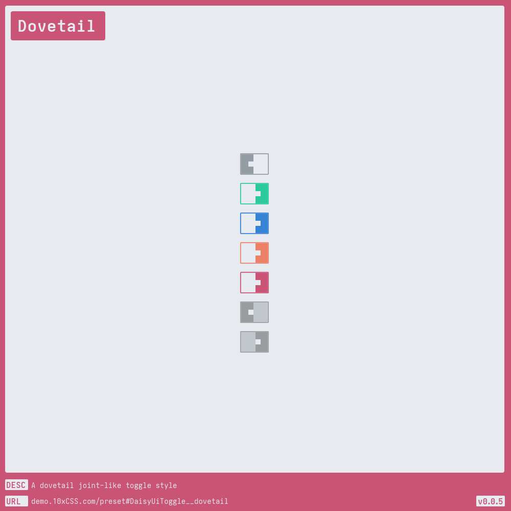

 <b>GIF</b> <i>(click to reveal)</i> 

### Empty Night
> `desc`: A unique toggle style that eliminates state ambiguity  
> `link`: [demo.10xCSS.com/preset#DaisyUiToggle__empty_night](https://demo.10xCSS.com/dashboard/presets?cid=DaisyUiToggle&uid=DaisyUiToggle__empty_night)  
> `time`: 2024-03-21 ⇒ 2024-04-08  
> `vers`: 1  

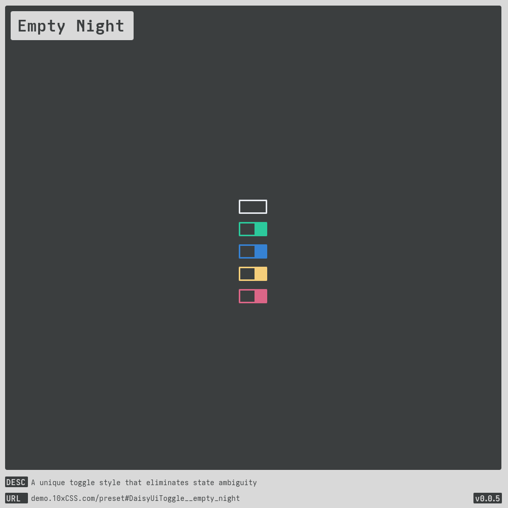

 <b>GIF</b> <i>(click to reveal)</i> 

### Hot N Cold
> `desc`: Cause you’re hot, then you're cold; at least that was the case back in 08’  
> `link`: [demo.10xCSS.com/preset#DaisyUiToggle__hot_n_cold](https://demo.10xCSS.com/dashboard/presets?cid=DaisyUiToggle&uid=DaisyUiToggle__hot_n_cold)  
> `time`: 2024-03-23 ⇒ 2024-04-08  
> `vers`: 1  

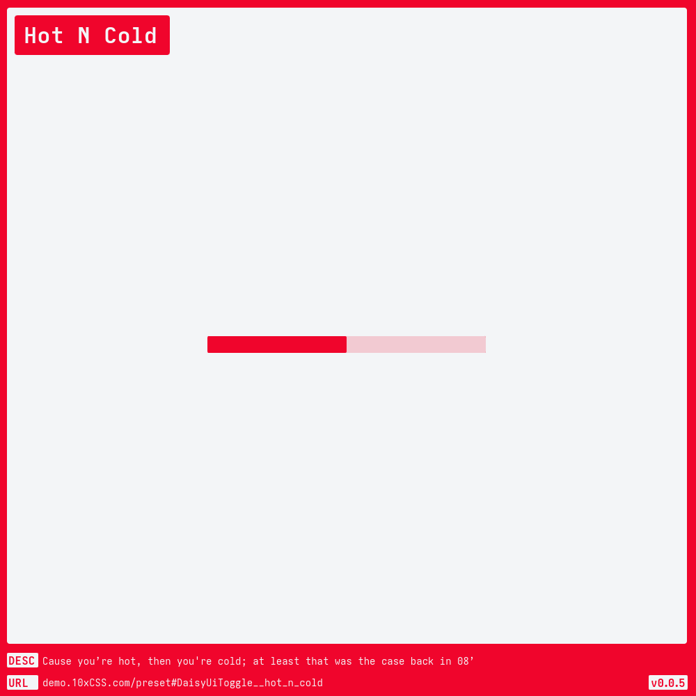

 <b>GIF</b> <i>(click to reveal)</i> 

### I Want Height
> `desc`: A toggle style with a bit of extra height  
> `link`: [demo.10xCSS.com/preset#DaisyUiToggle__iwant_height](https://demo.10xCSS.com/dashboard/presets?cid=DaisyUiToggle&uid=DaisyUiToggle__iwant_height)  
> `time`: 2024-03-21 ⇒ 2024-04-08  
> `vers`: 1  

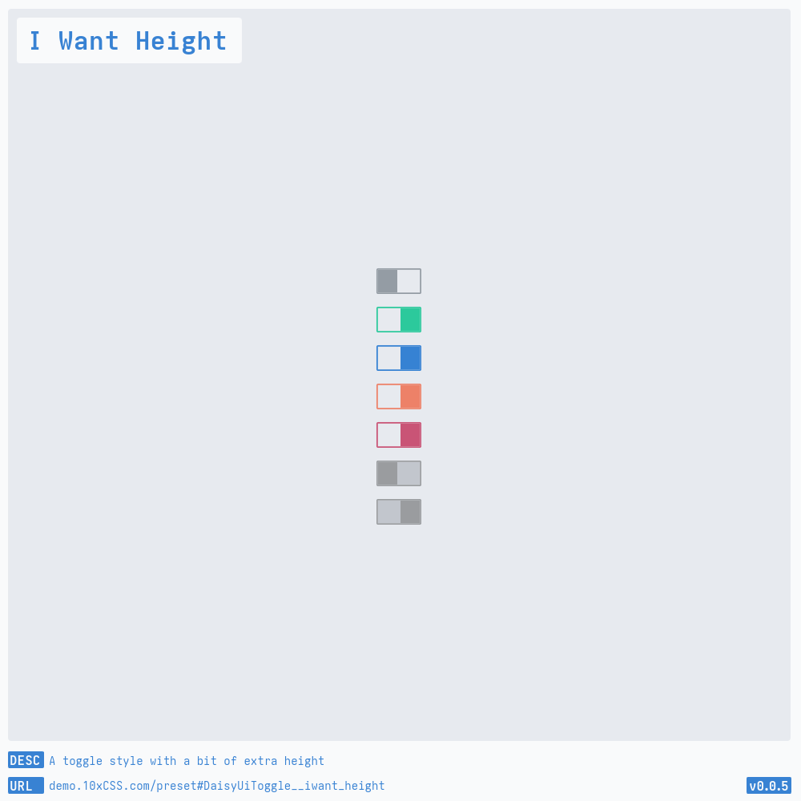

 <b>GIF</b> <i>(click to reveal)</i> 

### I Want Width
> `desc`: An elongated style for more width with your toggle  
> `link`: [demo.10xCSS.com/preset#DaisyUiToggle__iwant_width](https://demo.10xCSS.com/dashboard/presets?cid=DaisyUiToggle&uid=DaisyUiToggle__iwant_width)  
> `time`: 2024-03-21 ⇒ 2024-04-08  
> `vers`: 1  

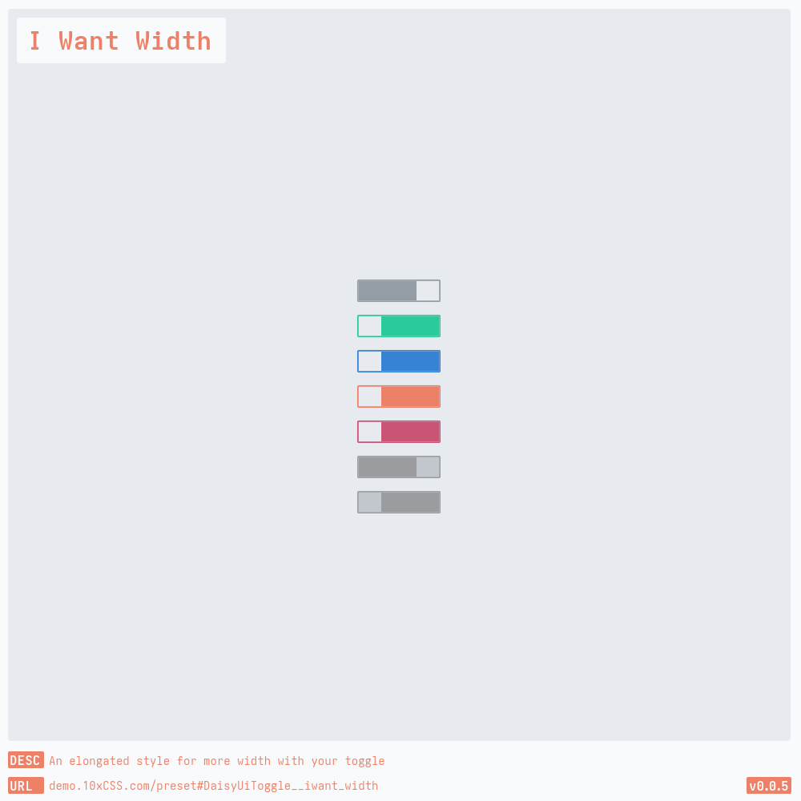

 <b>GIF</b> <i>(click to reveal)</i> 

### Large and In Charge
> `desc`: A single toggle style whose size speaks for itself  
> `link`: [demo.10xCSS.com/preset#DaisyUiToggle__large_in_charge](https://demo.10xCSS.com/dashboard/presets?cid=DaisyUiToggle&uid=DaisyUiToggle__large_in_charge)  
> `time`: 2024-03-22 ⇒ 2024-04-08  
> `vers`: 1  

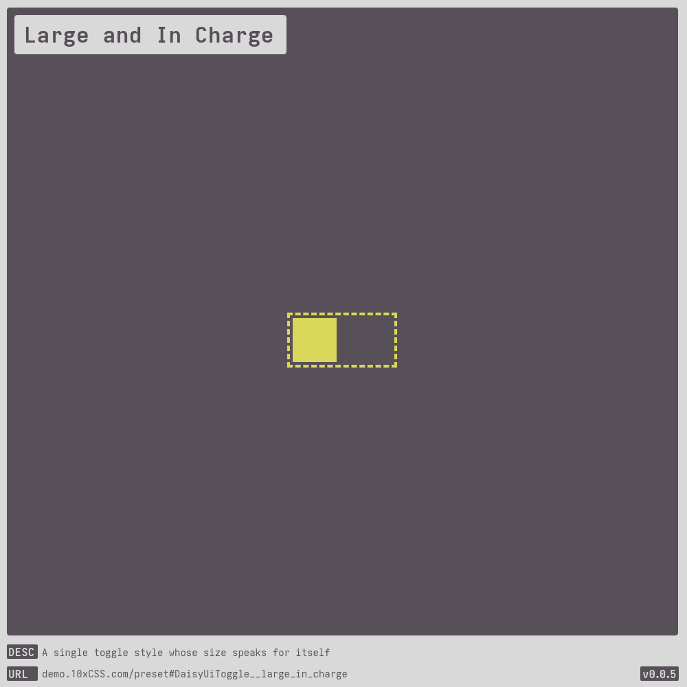

 <b>GIF</b> <i>(click to reveal)</i> 

### Lemon
> `desc`: When life gives you lemons, simply toggle their state  
> `link`: [demo.10xCSS.com/preset#DaisyUiToggle__lemon](https://demo.10xCSS.com/dashboard/presets?cid=DaisyUiToggle&uid=DaisyUiToggle__lemon)  
> `time`: 2023-10-22 ⇒ 2024-04-08  
> `vers`: 1  

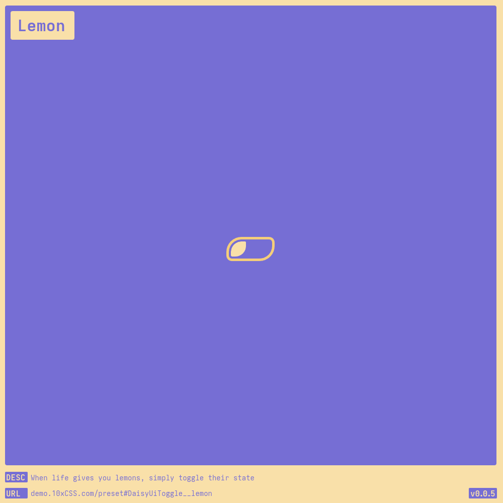

 <b>GIF</b> <i>(click to reveal)</i> 

### Lights Off
> `desc`: A dark toggle style with ridged flavor  
> `link`: [demo.10xCSS.com/preset#DaisyUiToggle__lights_off](https://demo.10xCSS.com/dashboard/presets?cid=DaisyUiToggle&uid=DaisyUiToggle__lights_off)  
> `time`: 2024-03-22 ⇒ 2024-04-08  
> `vers`: 1  

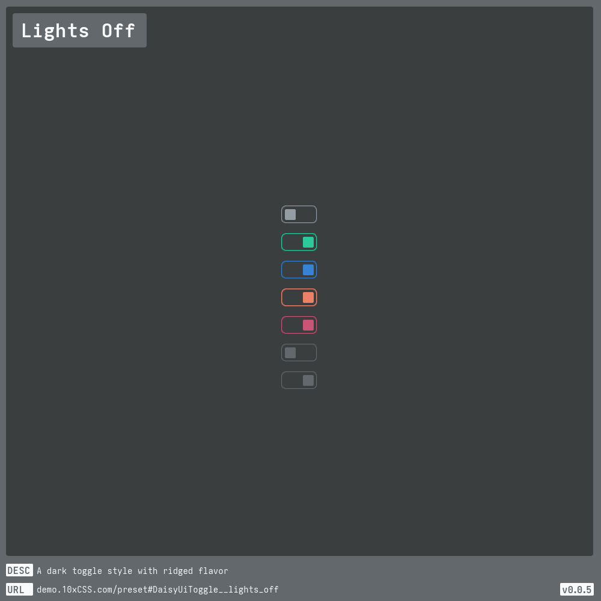

 <b>GIF</b> <i>(click to reveal)</i> 

### NeoLite
> `desc`: The zero-calorie neumorphic option  
> `link`: [demo.10xCSS.com/preset#DaisyUiToggle__neolite](https://demo.10xCSS.com/dashboard/presets?cid=DaisyUiToggle&uid=DaisyUiToggle__neolite)  
> `time`: 2023-10-22 ⇒ 2024-04-08  
> `vers`: 1  

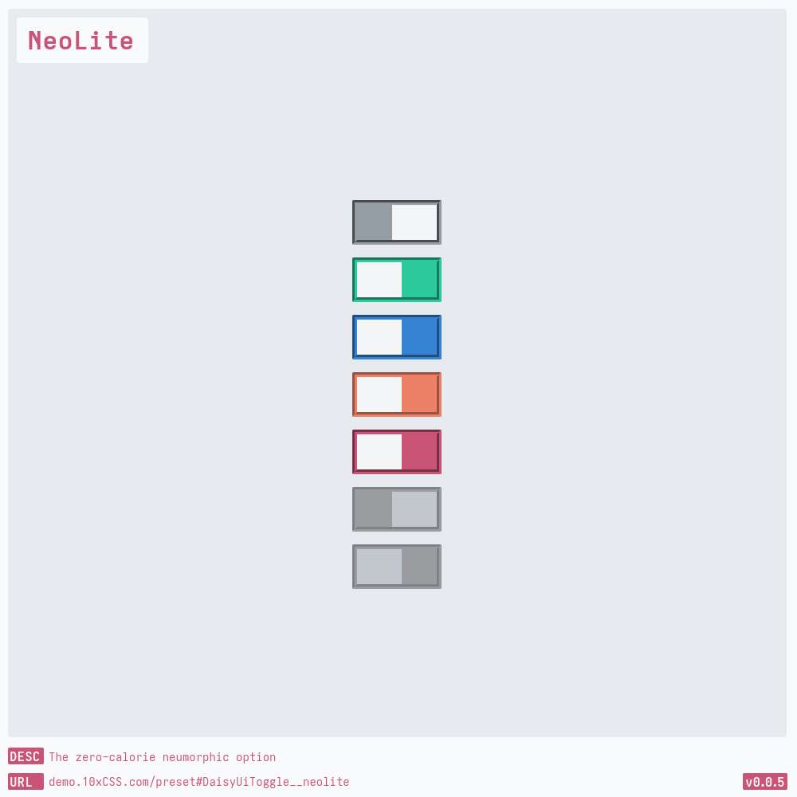

 <b>GIF</b> <i>(click to reveal)</i> 

### Oh My Cornea
> `desc`: Don’t let your eyes deceive you with this cornea shaped style  
> `link`: [demo.10xCSS.com/preset#DaisyUiToggle__oh_my_cornea](https://demo.10xCSS.com/dashboard/presets?cid=DaisyUiToggle&uid=DaisyUiToggle__oh_my_cornea)  
> `time`: 2024-03-22 ⇒ 2024-04-08  
> `vers`: 1  

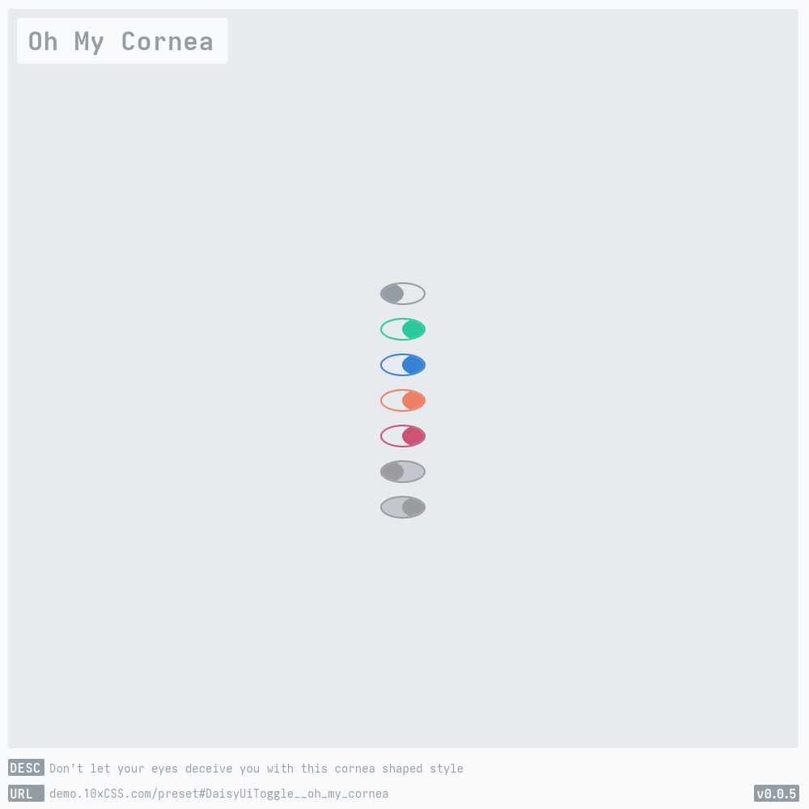

 <b>GIF</b> <i>(click to reveal)</i> 

### On State
> `desc`: On:state style that uses opacity; regrettably overwrites other transitions  
> `link`: [demo.10xCSS.com/preset#DaisyUiToggle__on_state](https://demo.10xCSS.com/dashboard/presets?cid=DaisyUiToggle&uid=DaisyUiToggle__on_state)  
> `time`: 2024-03-23 ⇒ 2024-04-08  
> `vers`: 1  

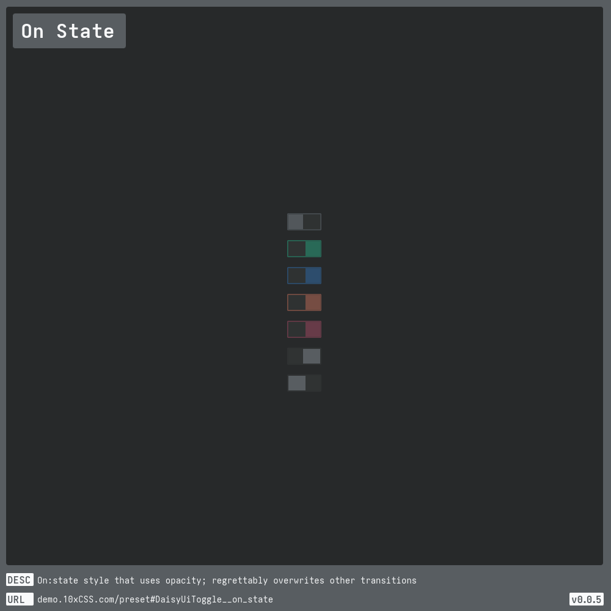

 <b>GIF</b> <i>(click to reveal)</i> 

### Perforated
> `desc`: A toggle style that’s like tearing freshly minted perforated stamps  
> `link`: [demo.10xCSS.com/preset#DaisyUiToggle__perforated](https://demo.10xCSS.com/dashboard/presets?cid=DaisyUiToggle&uid=DaisyUiToggle__perforated)  
> `time`: 2024-03-23 ⇒ 2024-04-08  
> `vers`: 1  

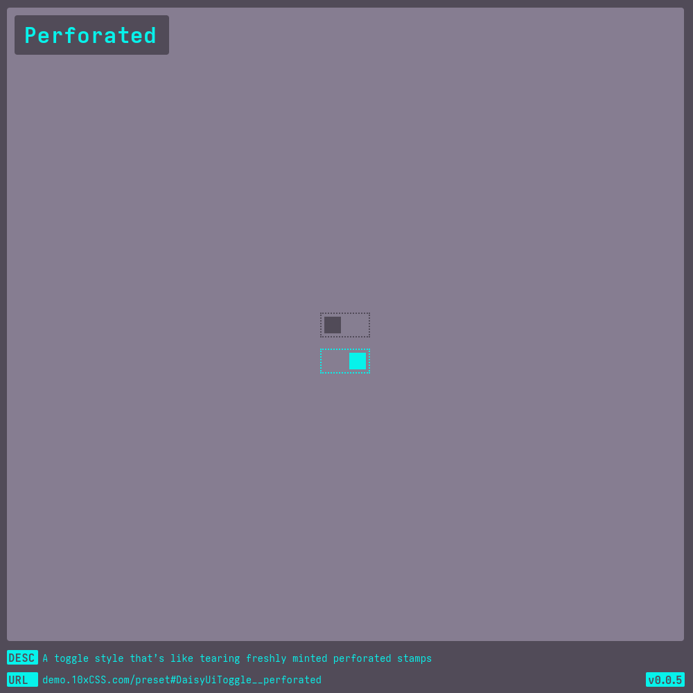

 <b>GIF</b> <i>(click to reveal)</i> 

### Pills
> `desc`: Nothin’ compares to these blue and yellow purple pills  
> `link`: [demo.10xCSS.com/preset#DaisyUiToggle__pills](https://demo.10xCSS.com/dashboard/presets?cid=DaisyUiToggle&uid=DaisyUiToggle__pills)  
> `time`: 2024-03-24 ⇒ 2024-04-08  
> `vers`: 1  

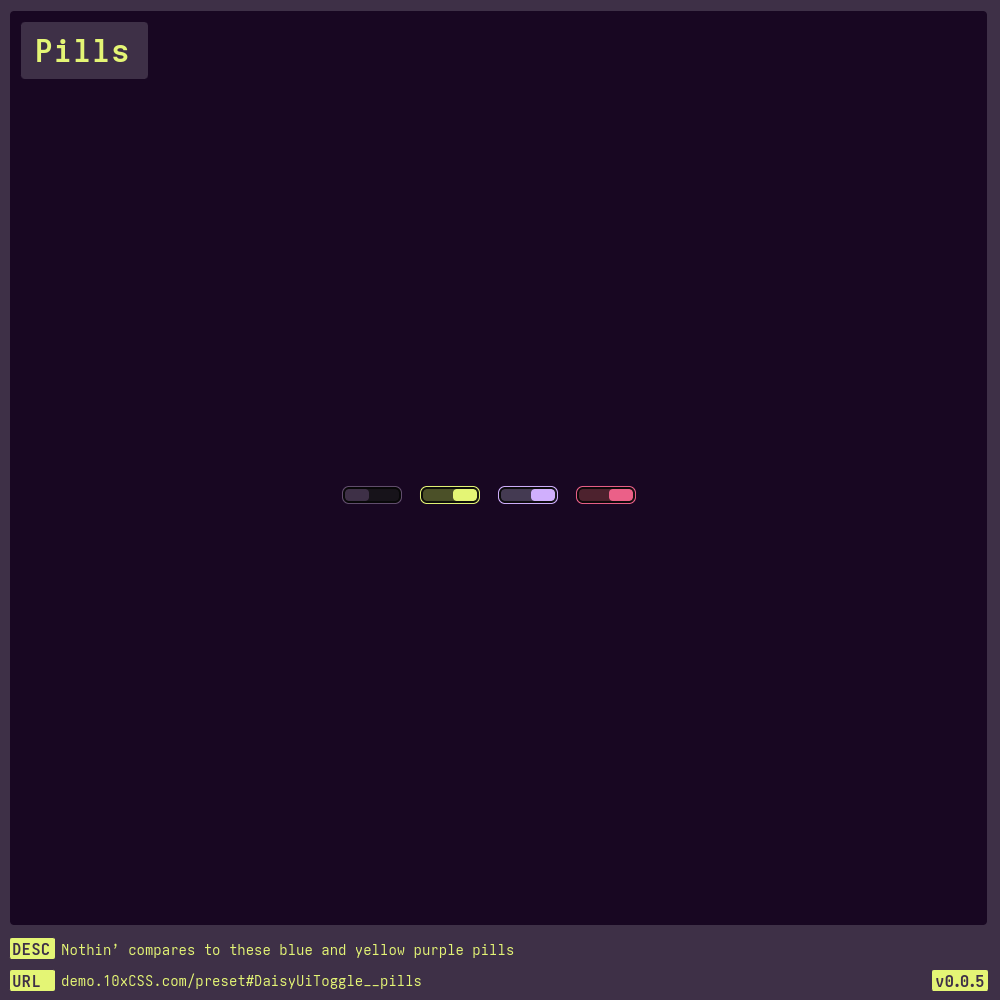

 <b>GIF</b> <i>(click to reveal)</i> 

### Pocket Billiards
> `desc`: Never scratch another break shot again with this snazzy toggle style  
> `link`: [demo.10xCSS.com/preset#DaisyUiToggle__pocket_billiards](https://demo.10xCSS.com/dashboard/presets?cid=DaisyUiToggle&uid=DaisyUiToggle__pocket_billiards)  
> `time`: 2024-03-23 ⇒ 2024-04-29  
> `vers`: 1  

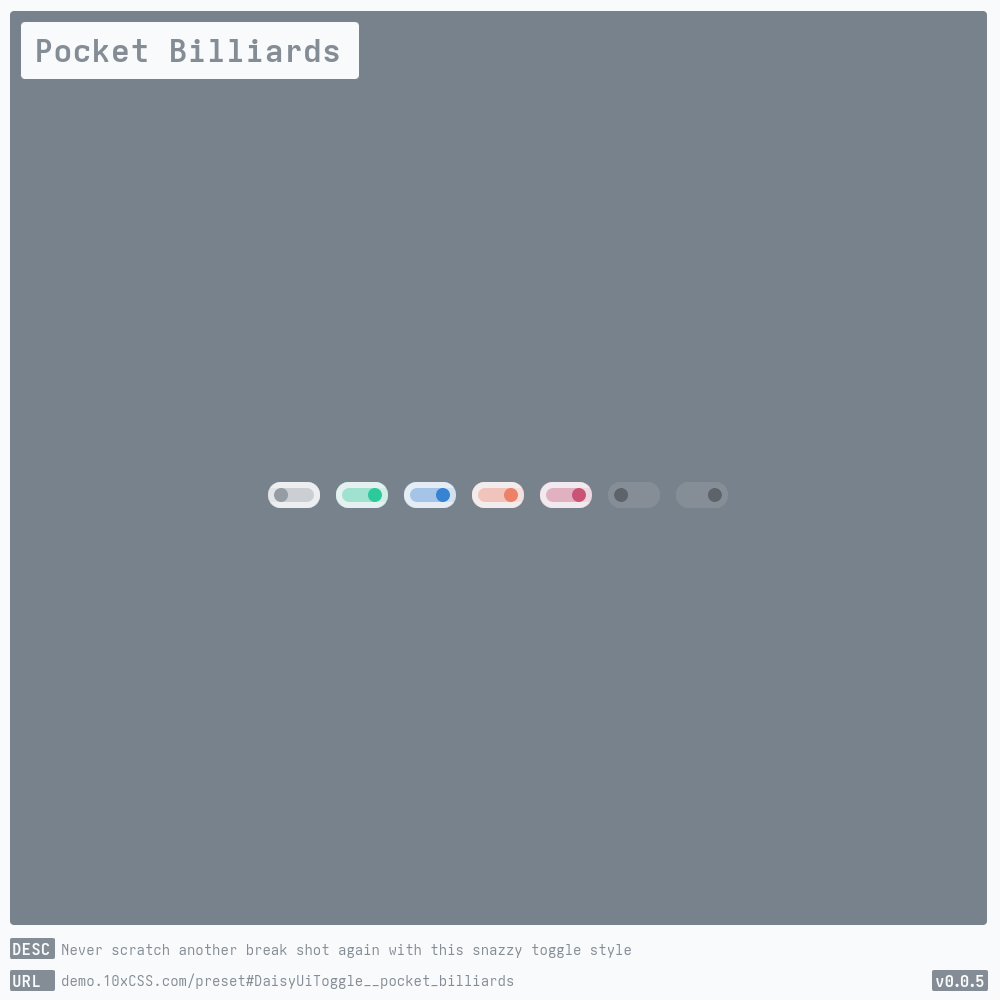

 <b>GIF</b> <i>(click to reveal)</i> 

### QuadOggle
> `desc`: As the name suggests, a quad of toggles  
> `link`: [demo.10xCSS.com/preset#DaisyUiToggle__quadoggle](https://demo.10xCSS.com/dashboard/presets?cid=DaisyUiToggle&uid=DaisyUiToggle__quadoggle)  
> `time`: 2024-03-23 ⇒ 2024-04-08  
> `vers`: 1  

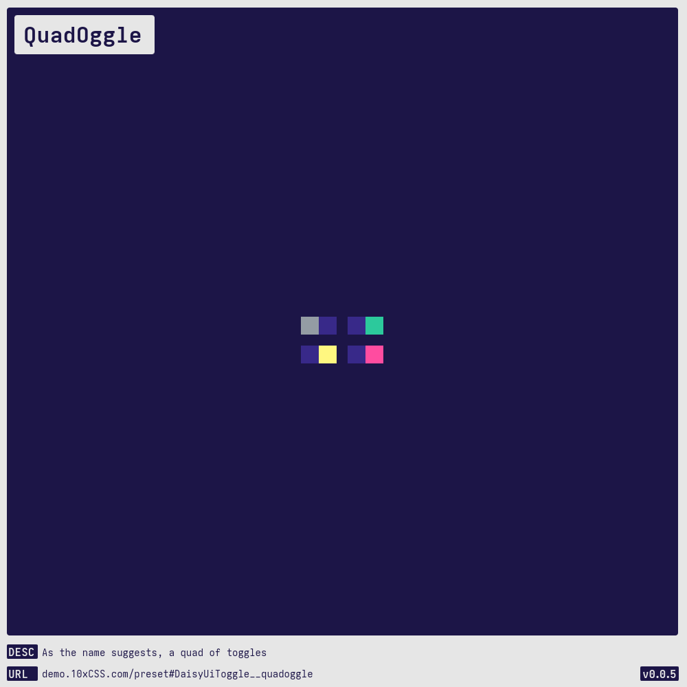

 <b>GIF</b> <i>(click to reveal)</i> 

### Quarter Circle
> `desc`: As the name suggests, a quarter circle, but kooler  
> `link`: [demo.10xCSS.com/preset#DaisyUiToggle__quarter_circle](https://demo.10xCSS.com/dashboard/presets?cid=DaisyUiToggle&uid=DaisyUiToggle__quarter_circle)  
> `time`: 2024-03-23 ⇒ 2024-04-08  
> `vers`: 1  

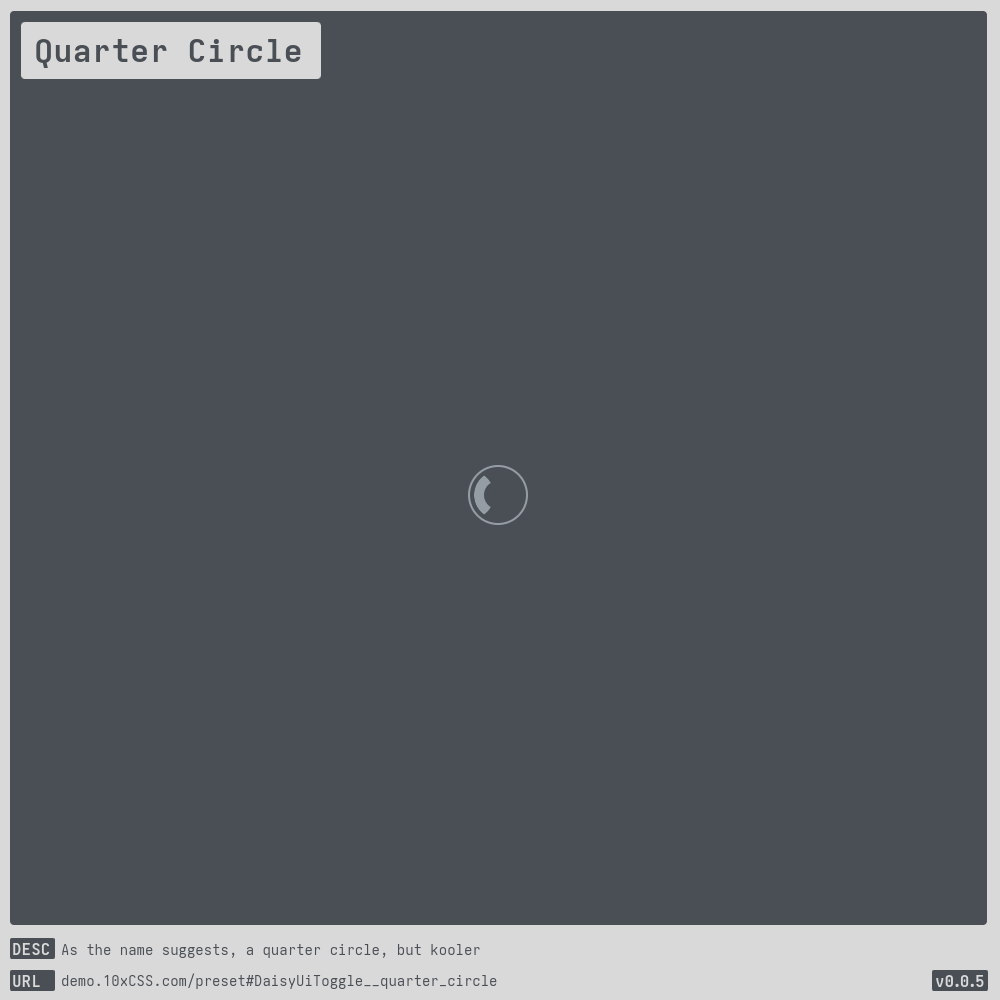

 <b>GIF</b> <i>(click to reveal)</i> 

### Red Wire Blue Wire
> `desc`: A mission critical toggle style  
> `link`: [demo.10xCSS.com/preset#DaisyUiToggle__red_wire_blue_wire](https://demo.10xCSS.com/dashboard/presets?cid=DaisyUiToggle&uid=DaisyUiToggle__red_wire_blue_wire)  
> `time`: 2024-03-22 ⇒ 2024-04-08  
> `vers`: 1  

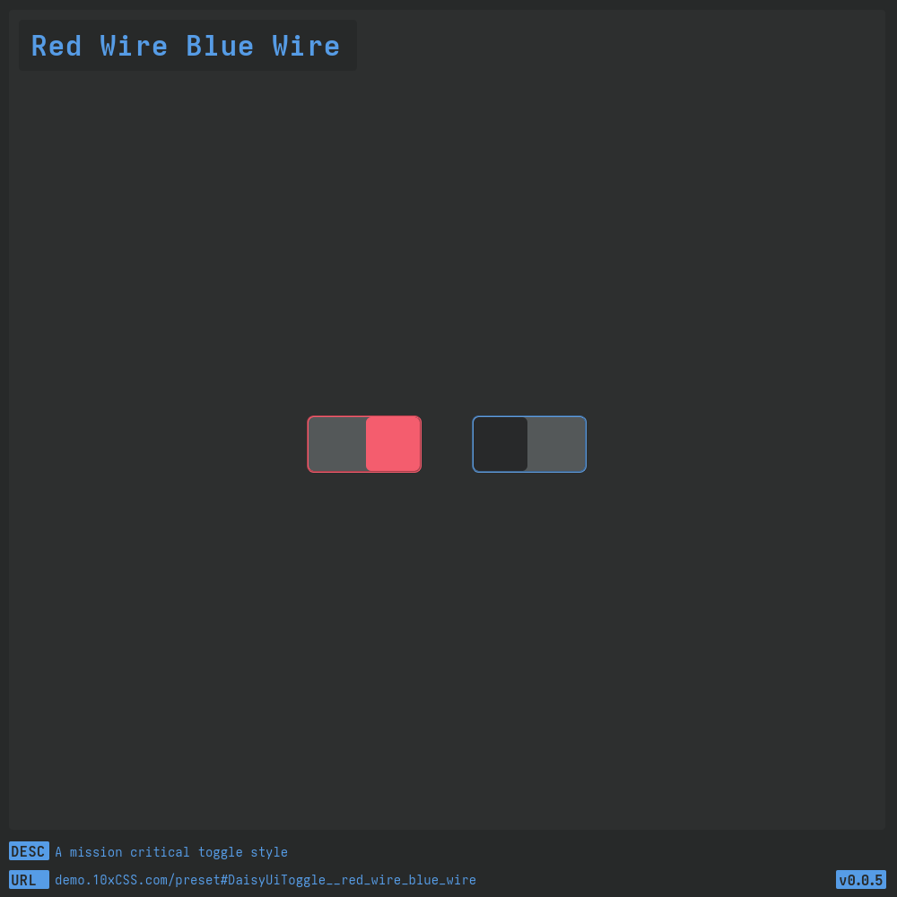

 <b>GIF</b> <i>(click to reveal)</i> 

### Right on Track
> `desc`: A toggle style that's right on track  
> `link`: [demo.10xCSS.com/preset#DaisyUiToggle__right_on_track](https://demo.10xCSS.com/dashboard/presets?cid=DaisyUiToggle&uid=DaisyUiToggle__right_on_track)  
> `time`: 2024-03-22 ⇒ 2024-04-08  
> `vers`: 1  

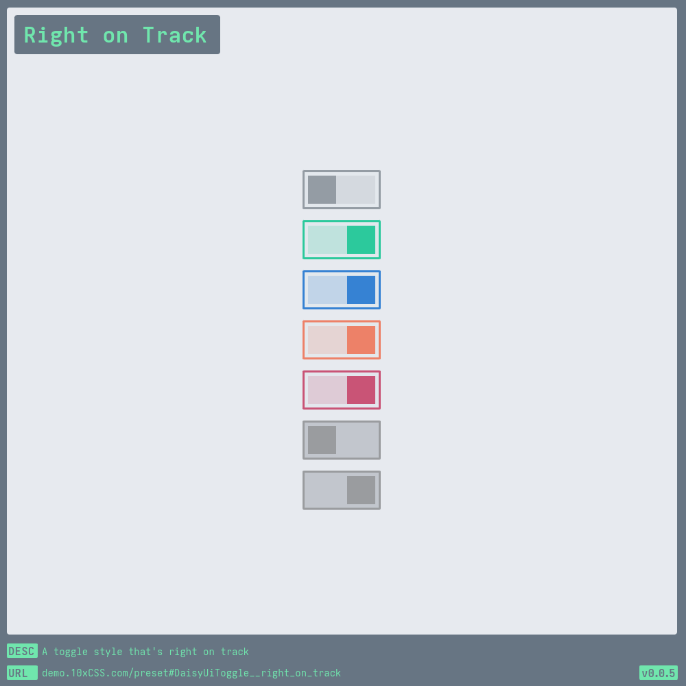

 <b>GIF</b> <i>(click to reveal)</i> 

### Stitched
> `desc`: A stitched toggle style with a quaint aesthetic  
> `link`: [demo.10xCSS.com/preset#DaisyUiToggle__stitched](https://demo.10xCSS.com/dashboard/presets?cid=DaisyUiToggle&uid=DaisyUiToggle__stitched)  
> `time`: 2024-03-21 ⇒ 2024-04-08  
> `vers`: 1  

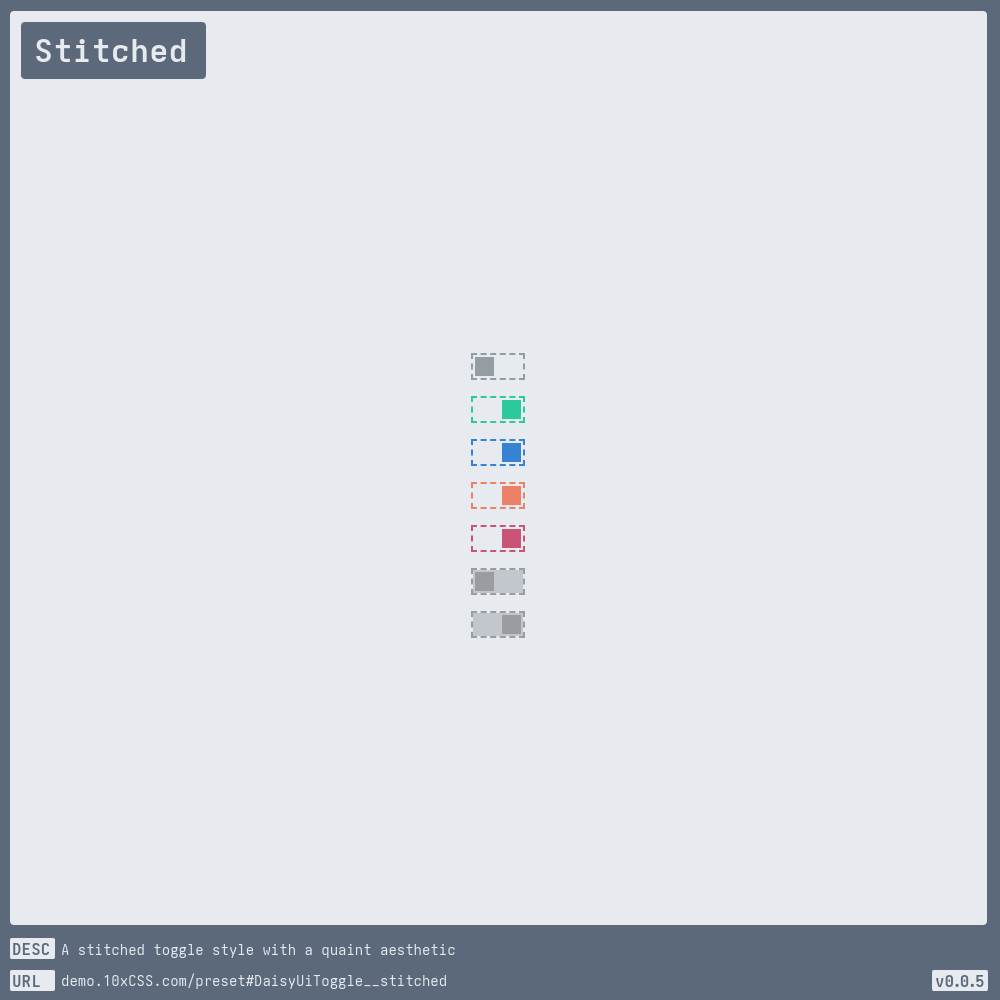

 <b>GIF</b> <i>(click to reveal)</i> 

### Teeny Tiny Row
> `desc`: A set of teeny-tiny toggles in a row, they're plus ultra adorbs  
> `link`: [demo.10xCSS.com/preset#DaisyUiToggle__teeny_tiny_row](https://demo.10xCSS.com/dashboard/presets?cid=DaisyUiToggle&uid=DaisyUiToggle__teeny_tiny_row)  
> `time`: 2024-03-26 ⇒ 2024-04-08  
> `vers`: 1  

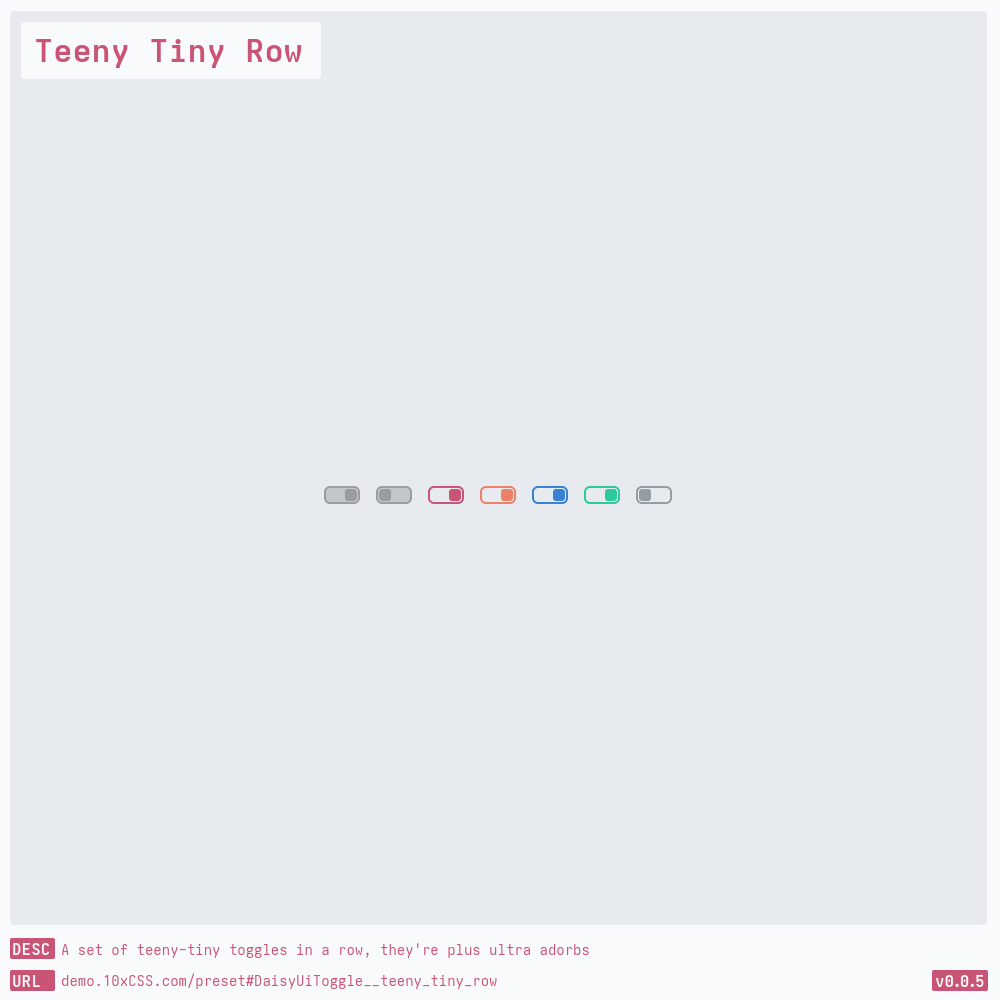

 <b>GIF</b> <i>(click to reveal)</i> 

### Teeny Tiny
> `desc`: A set of teeny-tiny toggles, they're like super adorbs  
> `link`: [demo.10xCSS.com/preset#DaisyUiToggle__teeny_tiny](https://demo.10xCSS.com/dashboard/presets?cid=DaisyUiToggle&uid=DaisyUiToggle__teeny_tiny)  
> `time`: 2024-03-21 ⇒ 2024-04-08  
> `vers`: 1  

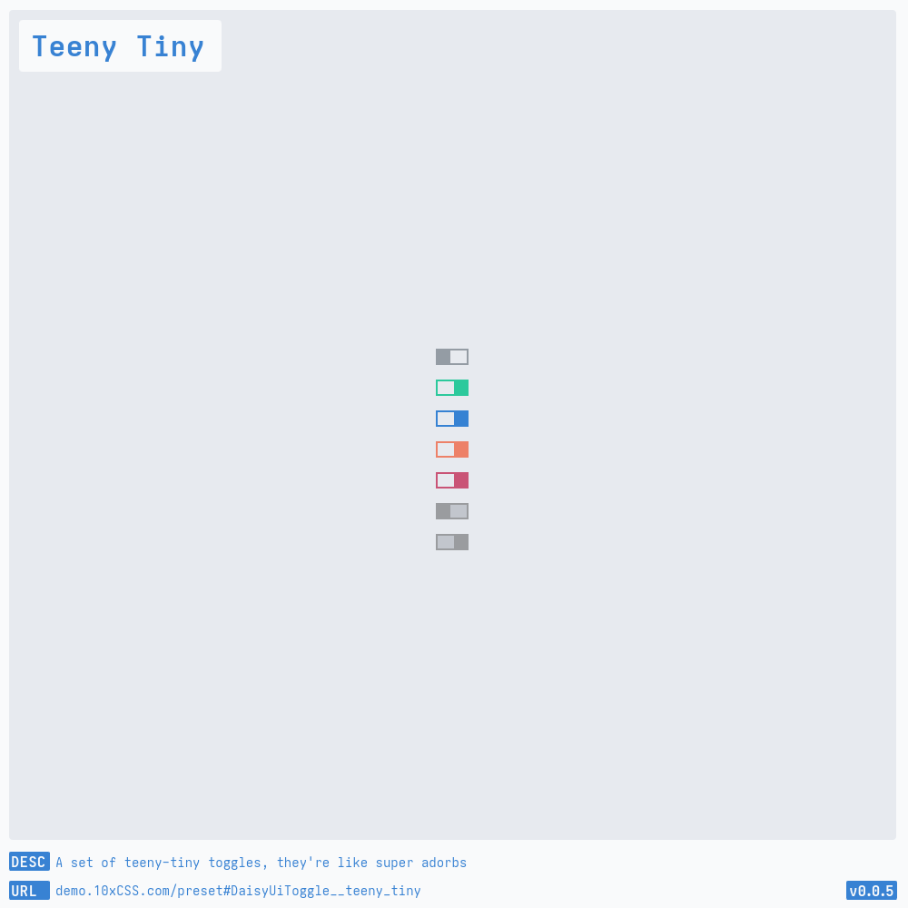

 <b>GIF</b> <i>(click to reveal)</i> 

### The Battery
> `desc`: A toggle style, a battery icon, or both  
> `link`: [demo.10xCSS.com/preset#DaisyUiToggle__the_battery](https://demo.10xCSS.com/dashboard/presets?cid=DaisyUiToggle&uid=DaisyUiToggle__the_battery)  
> `time`: 2024-03-22 ⇒ 2024-04-08  
> `vers`: 1  

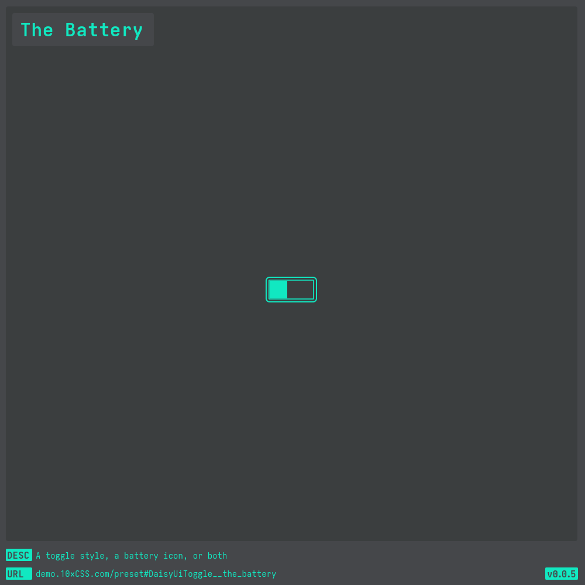

 <b>GIF</b> <i>(click to reveal)</i> 

### Top Up
> `desc`: The almost, but not quite, toggle style  
> `link`: [demo.10xCSS.com/preset#DaisyUiToggle__topup](https://demo.10xCSS.com/dashboard/presets?cid=DaisyUiToggle&uid=DaisyUiToggle__topup)  
> `time`: 2024-03-23 ⇒ 2024-04-08  
> `vers`: 1  

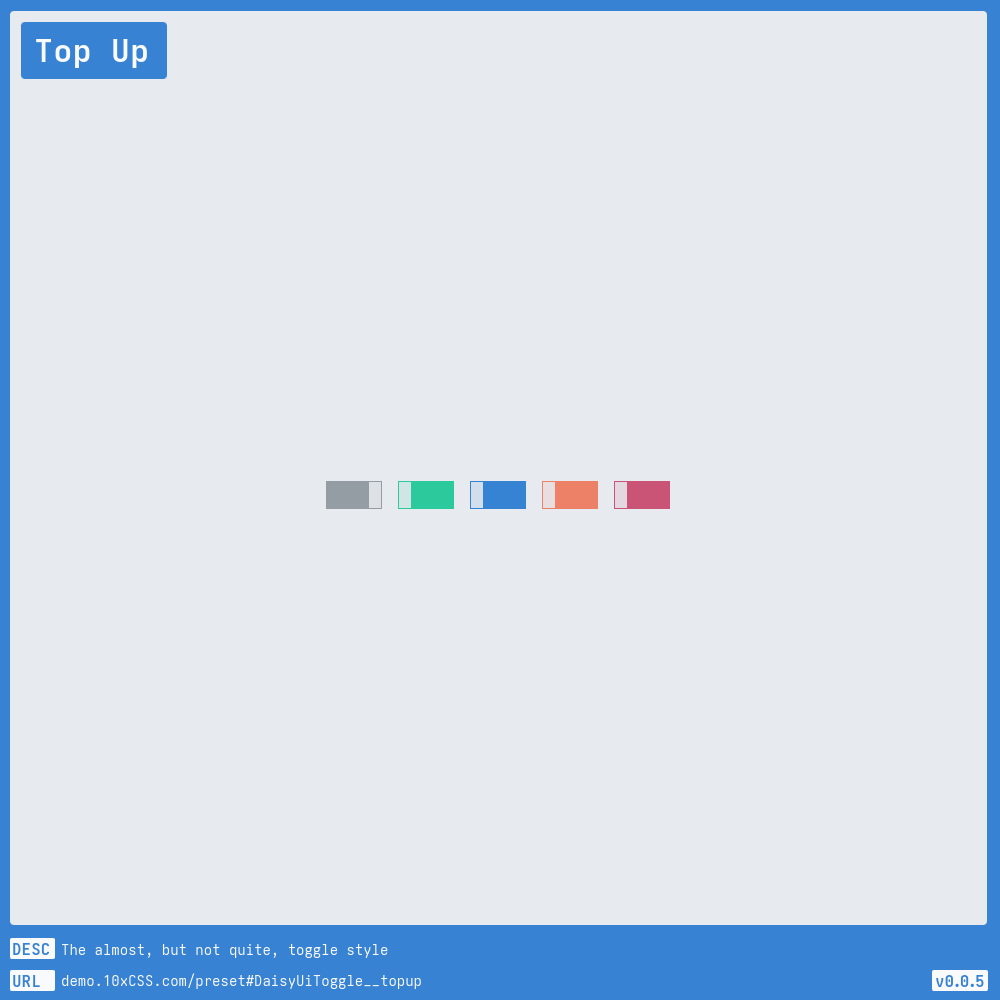

 <b>GIF</b> <i>(click to reveal)</i> 

### Traffic Light
> `desc`: A traffic light-like toggle style  
> `link`: [demo.10xCSS.com/preset#DaisyUiToggle__traffic_light](https://demo.10xCSS.com/dashboard/presets?cid=DaisyUiToggle&uid=DaisyUiToggle__traffic_light)  
> `time`: 2024-03-22 ⇒ 2024-04-08  
> `vers`: 1  

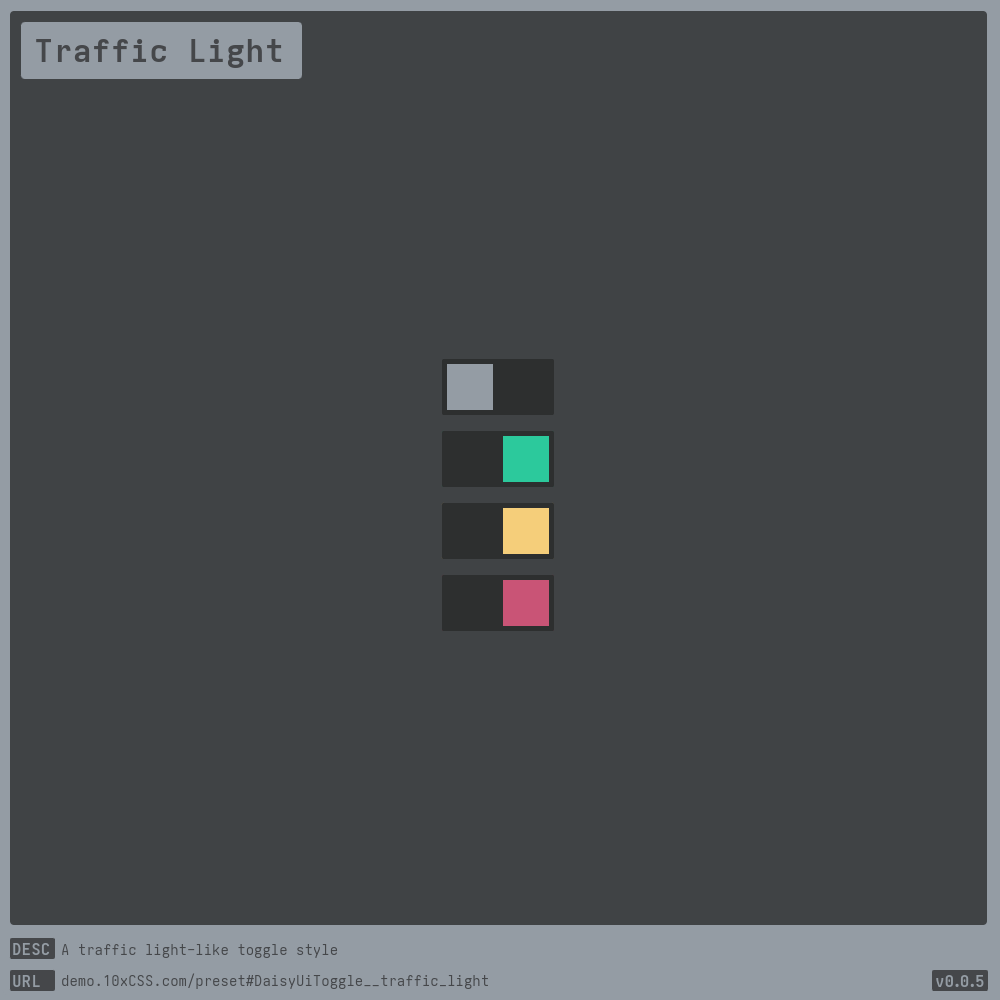

 <b>GIF</b> <i>(click to reveal)</i> 

### Wax On, Wane Off
> `desc`: A moon phase toggle style for those starlit nights  
> `link`: [demo.10xCSS.com/preset#DaisyUiToggle__wax_on_wane_off](https://demo.10xCSS.com/dashboard/presets?cid=DaisyUiToggle&uid=DaisyUiToggle__wax_on_wane_off)  
> `time`: 2024-03-23 ⇒ 2024-04-08  
> `vers`: 1  

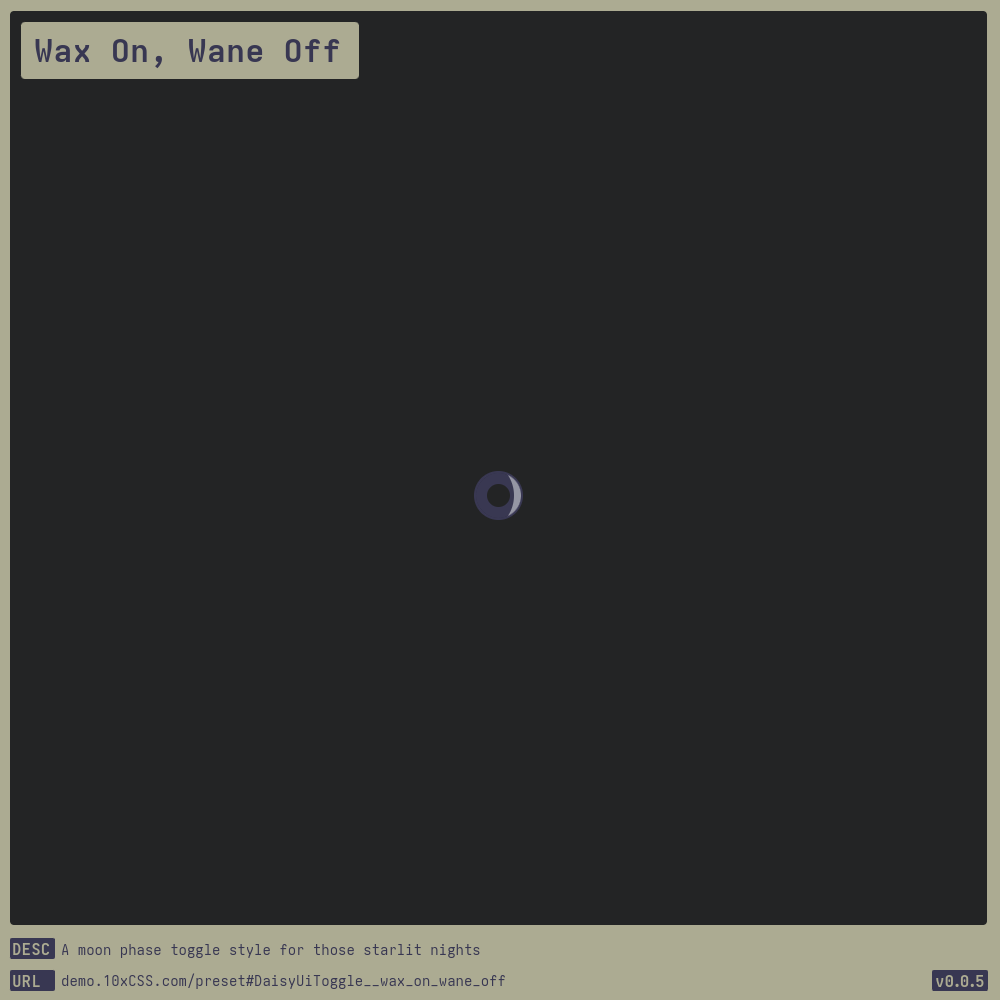

 <b>GIF</b> <i>(click to reveal)</i> 

### Zero Style
> `desc`: A baseline zero/blank style for the [#cssexp](https://www.youtube.com/playlist?list=PLjzn_iVJxcJgGSQSA5uhD3PCHObCQLOpG) video series  
> `link`: [demo.10xCSS.com/preset#DaisyUiToggle__zero_style](https://demo.10xCSS.com/dashboard/presets?cid=DaisyUiToggle&uid=DaisyUiToggle__zero_style)  
> `time`: 2024-03-26 ⇒ 2024-04-08  
> `vers`: 1  

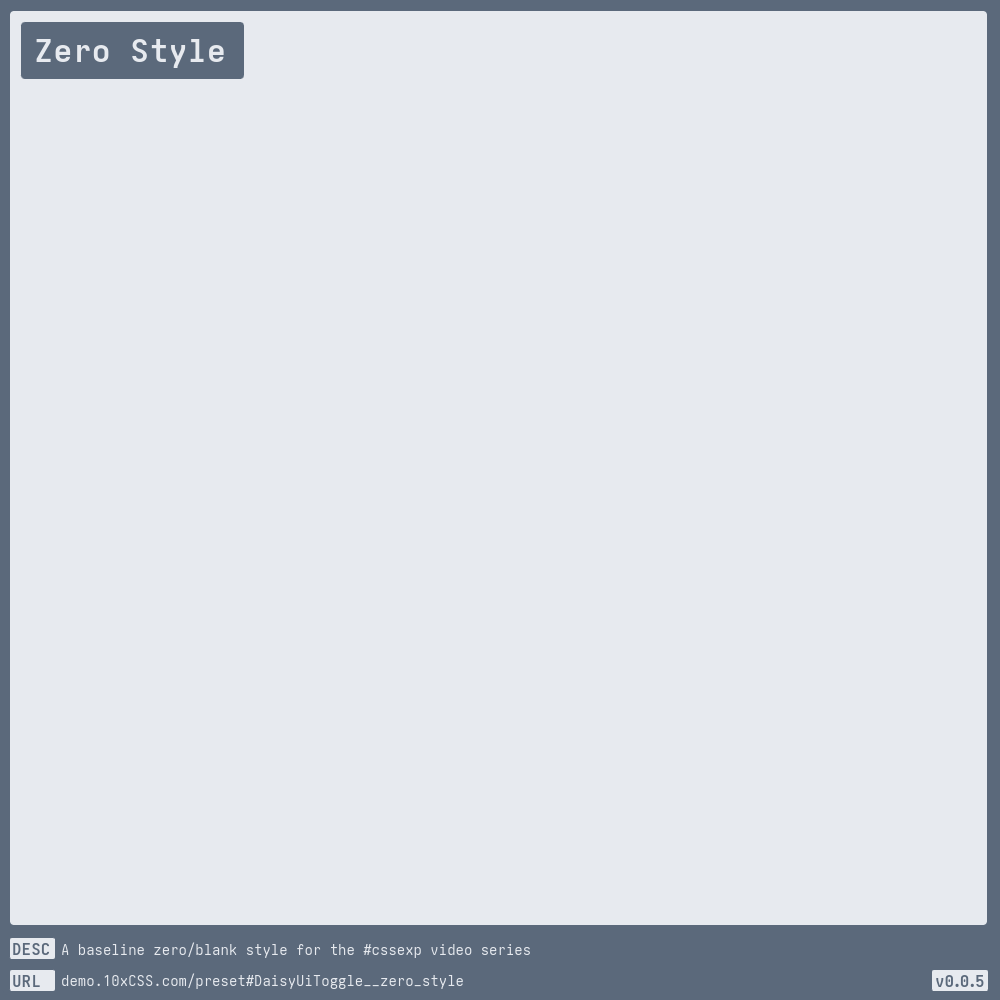

 <b>GIF</b> <i>(click to reveal)</i> 

