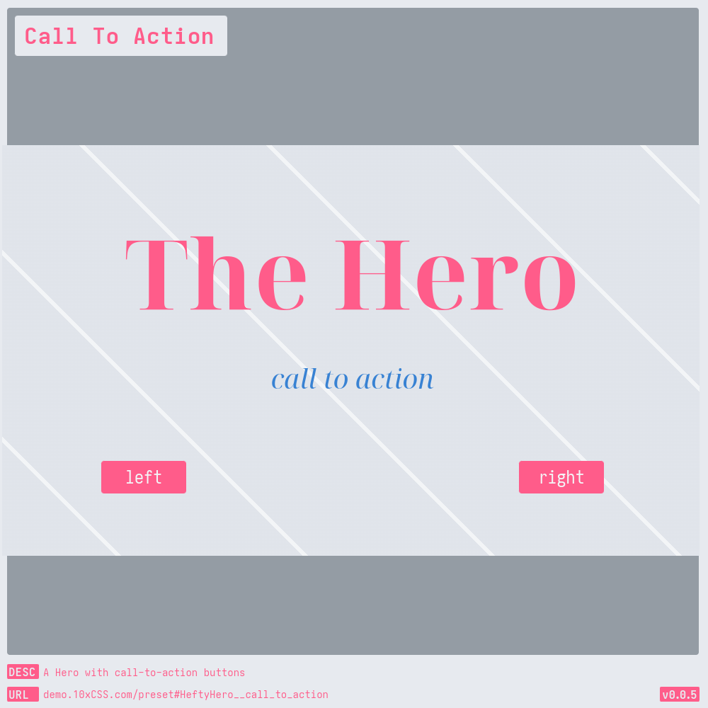
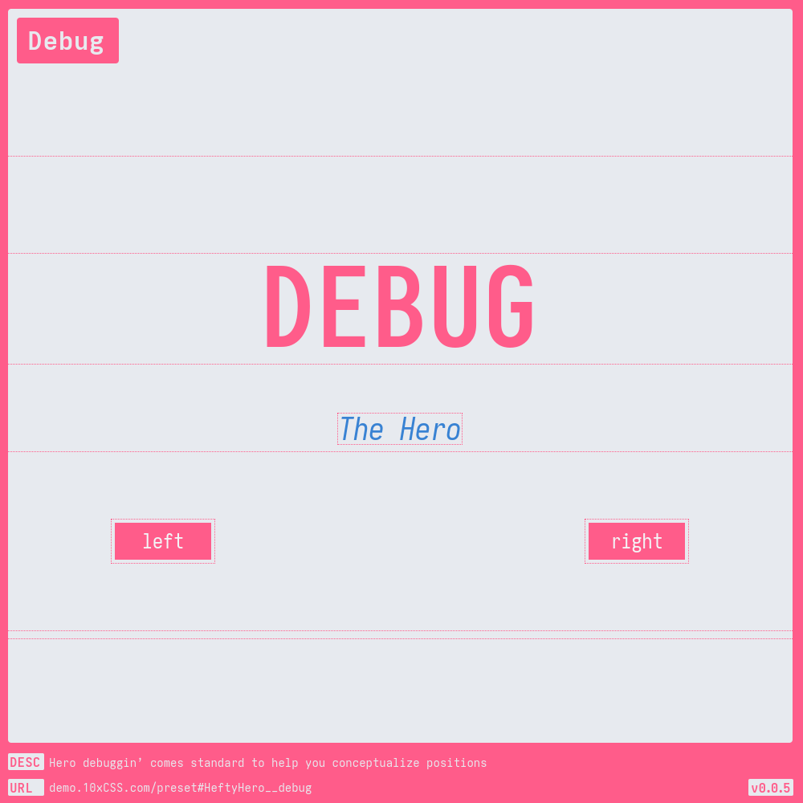
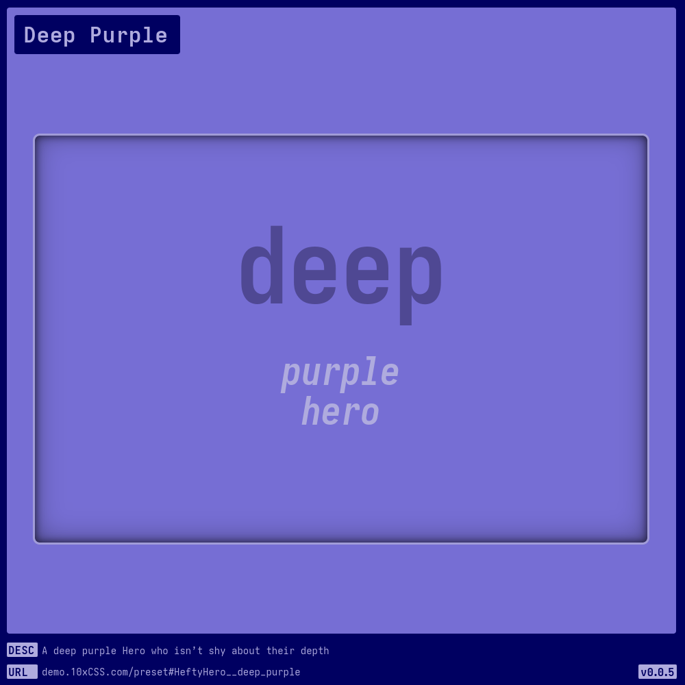
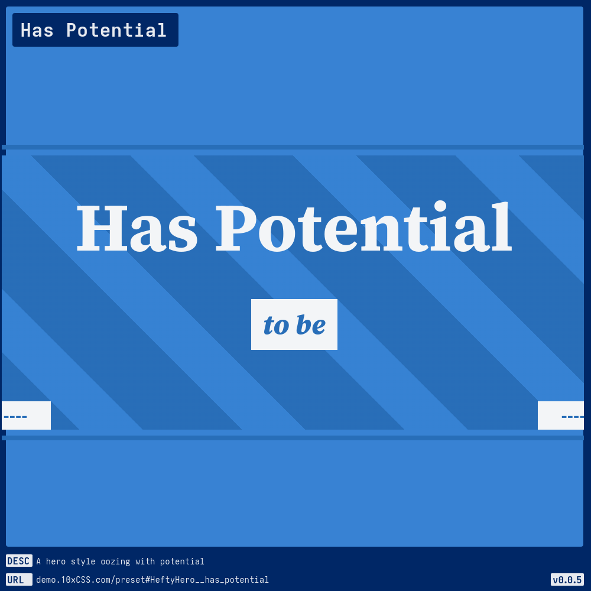
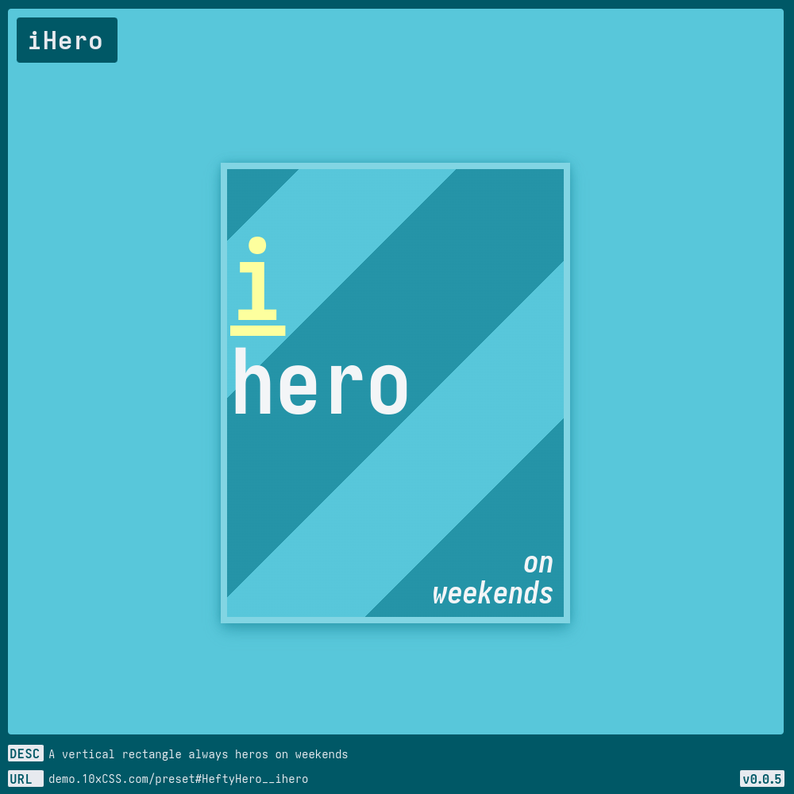
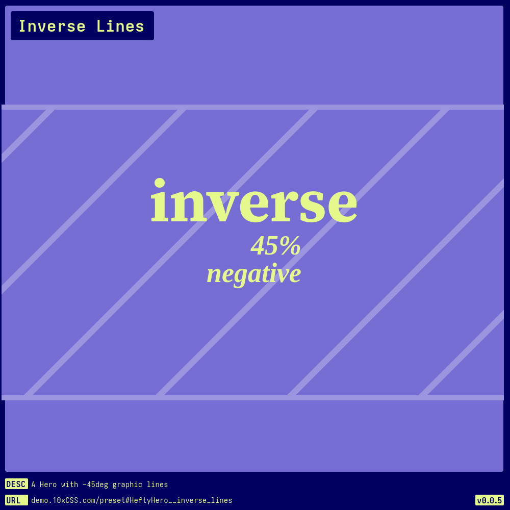
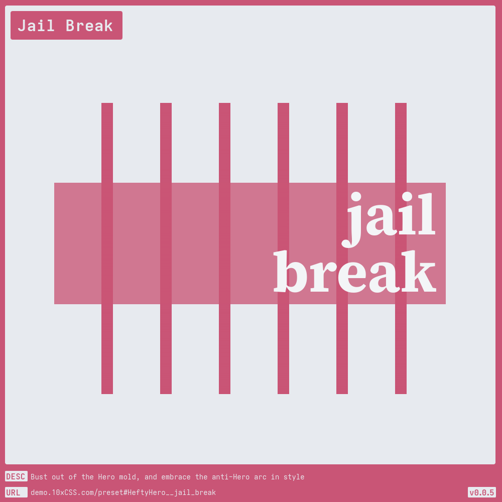
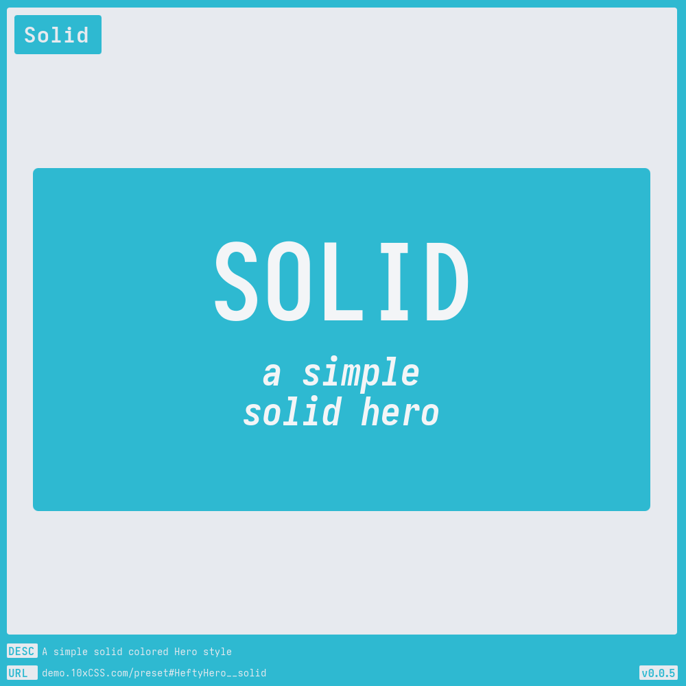
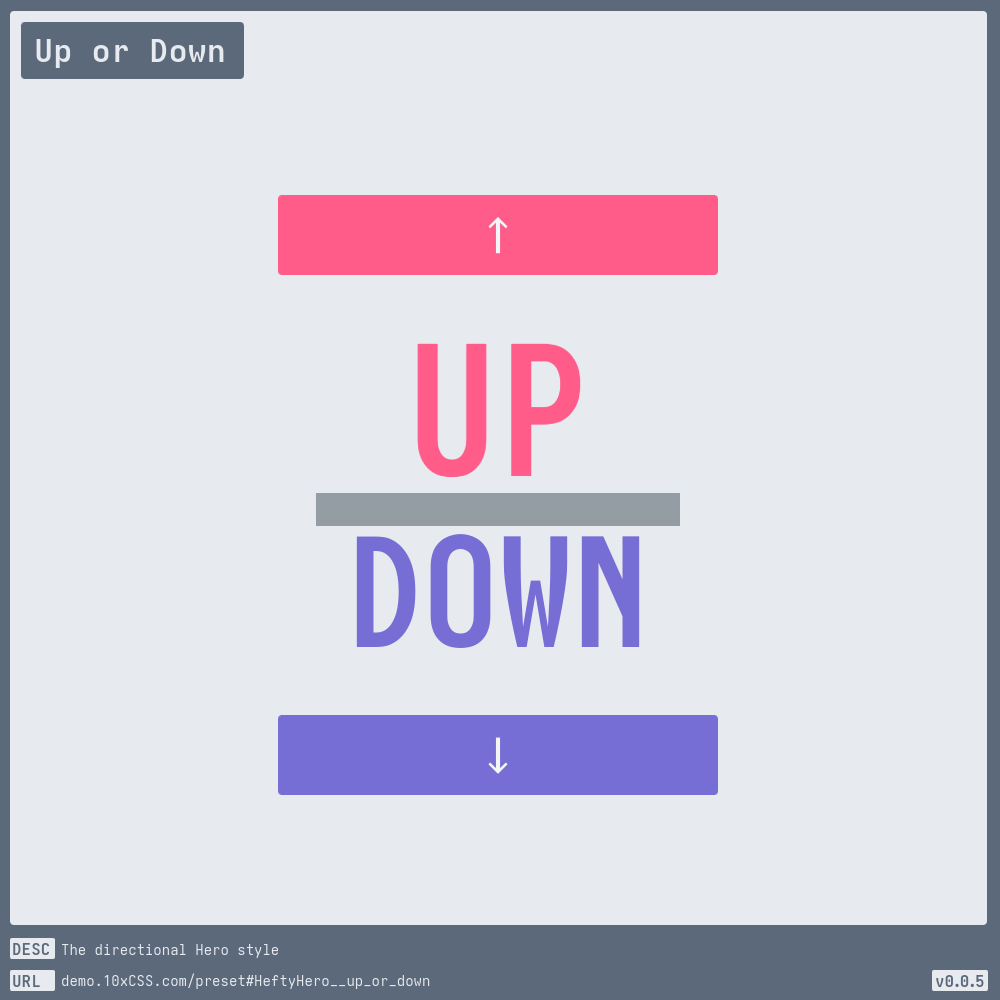

# [Hefty Hero](https://demo.10xCSS.com/preset#HeftyHero)

> __`CID `__  HeftyHero  
> __`DESC`__  A Hefty Hero component that embodies flexibility. Well, honestly, one thing led to another, and before I knew it, this thing was a Frankenstein's monster of flexibility. Unfortunately, much of this flexibility resulted in undue complexity, and my attempt to tame it by grouping like-properties under the `all-*` scheme, such as `All Background`, made things worse.  
> __`IMPORTANT`__  I'm keeping this style around as a cautionary tale – sometimes too much flexibility just leads to a big-ol' mess. Example 1a: This style.  
> __`LINK`__  [demo.10xCSS.com/preset#HeftyHero](https://demo.10xCSS.com/preset#HeftyHero)  
> __`NOTE`__  none  
> __`VERS`__  1  

|Table                            |of                               |Contents                         |                                 |                                 |
|:--------------------------------|:--------------------------------|:--------------------------------|:--------------------------------|:--------------------------------|
|[Default](#default)              |[Debug](#debug)                  |[Has Potential](#has-potential)  |[Jail Break](#jail-break)        |[Solid](#solid)                  |
|[Big Bold](#big-bold)            |[Deep Purple](#deep-purple)      |[iHero](#ihero)                  |[Level Line](#level-line)        |[Up or Down](#up-or-down)        |
|[Call To Action](#call-to-action)|[::first-line](#first-line)      |[Inverse Lines](#inverse-lines)  |[Line Level](#line-level)        |[Your Adventure](#your-adventure)|
---

### _All-in-One_
https://github.com/10xCSS/CHANGELOG/assets/9544140/3f9ee026-9e52-41e5-876d-d114430be04c

### Default
> `desc`: Default [HeftyHero](https://10xCSS.com/dashboard/presets?cid=HeftyHero&uid=HeftyHero__default) style  
> `link`: [demo.10xCSS.com/preset#HeftyHero__default](https://demo.10xCSS.com/dashboard/presets?cid=HeftyHero&uid=HeftyHero__default)  
> `time`: 2024-03-20 ⇒ 2024-04-09  
> `vers`: 1  

 <b>GIF</b> <i>(click to reveal)</i> 

### Big Bold
> `desc`: A vertical rectangle Hero that’s big, bold, and packs a statement  
> `link`: [demo.10xCSS.com/preset#HeftyHero__big_bold](https://demo.10xCSS.com/dashboard/presets?cid=HeftyHero&uid=HeftyHero__big_bold)  
> `time`: 2024-03-20 ⇒ 2024-04-08  
> `vers`: 1  

 <b>GIF</b> <i>(click to reveal)</i> 

### Call To Action
> `desc`: A Hero with call-to-action buttons  
> `link`: [demo.10xCSS.com/preset#HeftyHero__call_to_action](https://demo.10xCSS.com/dashboard/presets?cid=HeftyHero&uid=HeftyHero__call_to_action)  
> `time`: 2024-03-20 ⇒ 2024-06-07  
> `vers`: 1  

 <b>GIF</b> <i>(click to reveal)</i> 

### Debug
> `desc`: Hero debuggin’ comes standard to help you conceptualize positions  
> `link`: [demo.10xCSS.com/preset#HeftyHero__debug](https://demo.10xCSS.com/dashboard/presets?cid=HeftyHero&uid=HeftyHero__debug)  
> `time`: 2024-03-20 ⇒ 2024-04-08  
> `vers`: 1  

 <b>GIF</b> <i>(click to reveal)</i> 

### Deep Purple
> `desc`: A deep purple Hero who isn’t shy about their depth  
> `link`: [demo.10xCSS.com/preset#HeftyHero__deep_purple](https://demo.10xCSS.com/dashboard/presets?cid=HeftyHero&uid=HeftyHero__deep_purple)  
> `time`: 2024-03-20 ⇒ 2024-04-11  
> `vers`: 1  

 <b>GIF</b> <i>(click to reveal)</i> 

### ::first-line
> `desc`: An experiment with first-line  
> `link`: [demo.10xCSS.com/preset#HeftyHero__first_line](https://demo.10xCSS.com/dashboard/presets?cid=HeftyHero&uid=HeftyHero__first_line)  
> `time`: 2024-04-07 ⇒ 2024-06-07  
> `vers`: 1  

 <b>GIF</b> <i>(click to reveal)</i> 

### Has Potential
> `desc`: A hero style oozing with potential  
> `link`: [demo.10xCSS.com/preset#HeftyHero__has_potential](https://demo.10xCSS.com/dashboard/presets?cid=HeftyHero&uid=HeftyHero__has_potential)  
> `time`: 2024-03-20 ⇒ 2024-06-07  
> `vers`: 1  

 <b>GIF</b> <i>(click to reveal)</i> 

### iHero
> `desc`: A vertical rectangle always heros on weekends  
> `link`: [demo.10xCSS.com/preset#HeftyHero__ihero](https://demo.10xCSS.com/dashboard/presets?cid=HeftyHero&uid=HeftyHero__ihero)  
> `time`: 2024-03-20 ⇒ 2024-04-08  
> `vers`: 1  

 <b>GIF</b> <i>(click to reveal)</i> 

### Inverse Lines
> `desc`: A Hero with -45deg graphic lines  
> `link`: [demo.10xCSS.com/preset#HeftyHero__inverse_lines](https://demo.10xCSS.com/dashboard/presets?cid=HeftyHero&uid=HeftyHero__inverse_lines)  
> `time`: 2024-03-20 ⇒ 2024-06-07  
> `vers`: 1  

 <b>GIF</b> <i>(click to reveal)</i> 

### Jail Break
> `desc`: Bust out of the Hero mold, and embrace the anti-Hero arc in style  
> `link`: [demo.10xCSS.com/preset#HeftyHero__jail_break](https://demo.10xCSS.com/dashboard/presets?cid=HeftyHero&uid=HeftyHero__jail_break)  
> `time`: 2024-03-20 ⇒ 2024-06-07  
> `vers`: 1  

 <b>GIF</b> <i>(click to reveal)</i> 

### Level Line
> `desc`: Level by level, line by line, the Hero's journey  
> `link`: [demo.10xCSS.com/preset#HeftyHero__level_line](https://demo.10xCSS.com/dashboard/presets?cid=HeftyHero&uid=HeftyHero__level_line)  
> `time`: 2024-03-20 ⇒ 2024-04-08  
> `vers`: 1  

 <b>GIF</b> <i>(click to reveal)</i> 

### Line Level
> `desc`: Line by line, level by level, the Hero's journey  
> `link`: [demo.10xCSS.com/preset#HeftyHero__line_level](https://demo.10xCSS.com/dashboard/presets?cid=HeftyHero&uid=HeftyHero__line_level)  
> `time`: 2024-03-20 ⇒ 2024-04-08  
> `vers`: 1  

 <b>GIF</b> <i>(click to reveal)</i> 

### Solid
> `desc`: A simple solid colored Hero style  
> `link`: [demo.10xCSS.com/preset#HeftyHero__solid](https://demo.10xCSS.com/dashboard/presets?cid=HeftyHero&uid=HeftyHero__solid)  
> `time`: 2024-03-20 ⇒ 2024-04-08  
> `vers`: 1  

 <b>GIF</b> <i>(click to reveal)</i> 

### Up or Down
> `desc`: The directional Hero style  
> `link`: [demo.10xCSS.com/preset#HeftyHero__up_or_down](https://demo.10xCSS.com/dashboard/presets?cid=HeftyHero&uid=HeftyHero__up_or_down)  
> `time`: 2024-03-20 ⇒ 2024-04-08  
> `vers`: 1  

 <b>GIF</b> <i>(click to reveal)</i> 

### Your Adventure
> `desc`: The “choose your own adventure” Hero  
> `link`: [demo.10xCSS.com/preset#HeftyHero__your_adventure](https://demo.10xCSS.com/dashboard/presets?cid=HeftyHero&uid=HeftyHero__your_adventure)  
> `time`: 2024-03-20 ⇒ 2024-06-07  
> `vers`: 1  

 <b>GIF</b> <i>(click to reveal)</i> 

