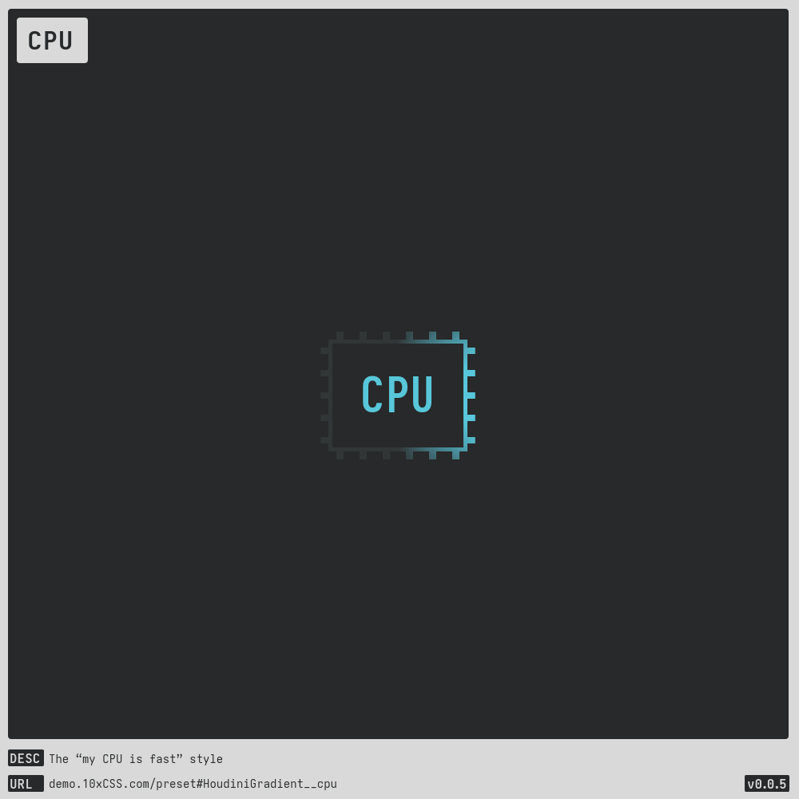
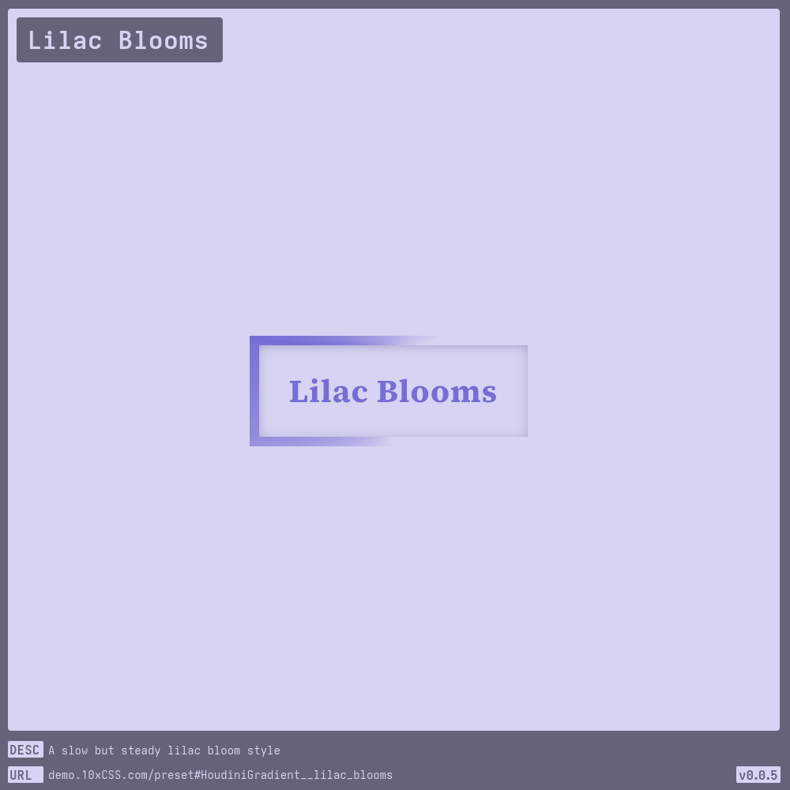
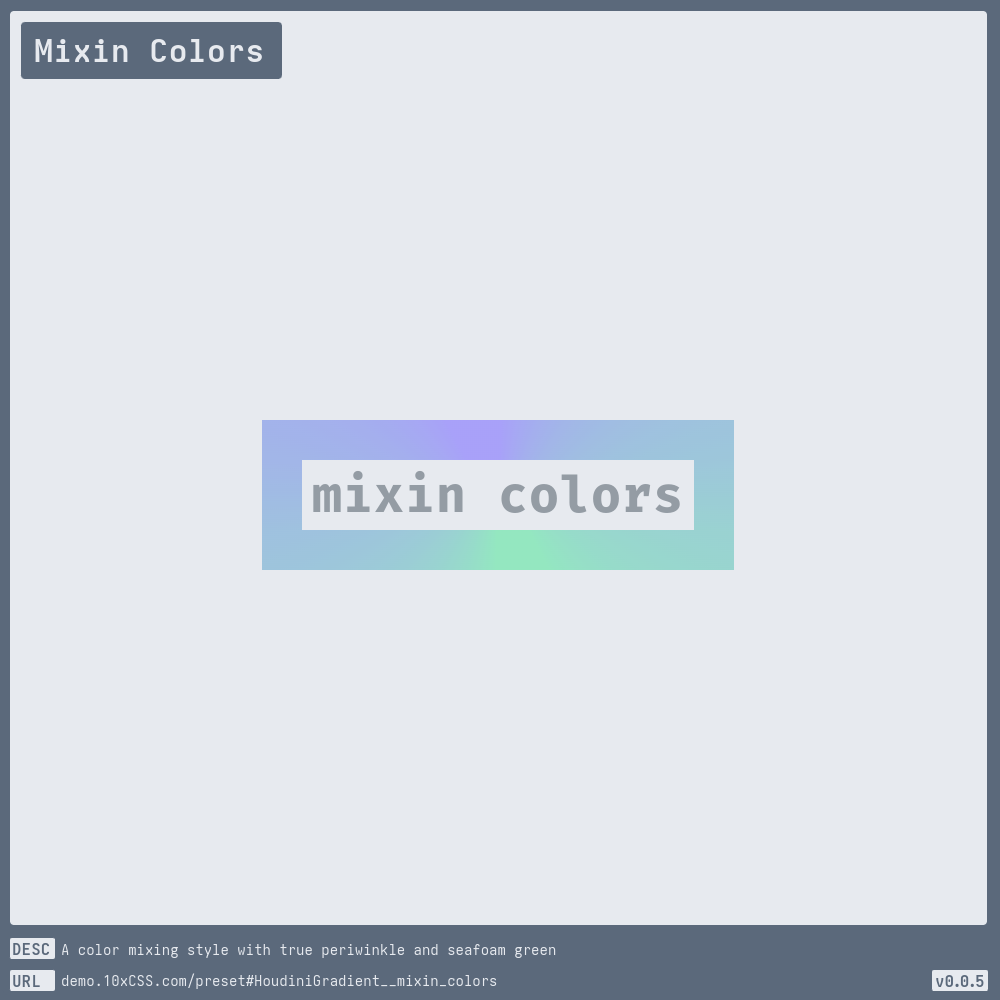

# [Houdini Gradient](https://demo.10xCSS.com/preset#HoudiniGradient)

> __`CID `__  HoudiniGradient  
> __`DESC`__  A spatially spectacular border animation, woven with [CSS Houdini](https://developer.mozilla.org/en-US/docs/Web/CSS/Using_CSS_custom_properties) wizardry by [Michelle Barker](https://michellebarker.co.uk), the brain behind [css-irl](https://css-irl.info).  
> __`LINK`__  [demo.10xCSS.com/preset#HoudiniGradient](https://demo.10xCSS.com/preset#HoudiniGradient)  
> __`NOTE`__  Currently, does not work in Firefox, check the bug [id=1763376](https://bugzilla.mozilla.org/show_bug.cgi?id=1763376) report. Fortunately, a fix should land in the future, but in the meantime a small fallback script will have to suffice. You can find an example fallback script in the generated HTML code or view it live when shared; for example: [HoudiniFallback](https://share.10xcss.com/HoudiniGradient_NNEKVmywjw).  
> __`VERS`__  1  

|Table                        |of                           |Contents                     |
|:----------------------------|:----------------------------|:----------------------------|
|[Default](#default)          |[Lilac Blooms](#lilac-blooms)|[TickTock](#ticktock)        |
|[Black Magic](#black-magic)  |[Manic & Panic](#manic-panic)|                             |
|[CPU](#cpu)                  |[Mixin Colors](#mixin-colors)|                             |
---

### _All-in-One_
_(todo-video-placeholder)_

### Default
> `desc`: Default [HoudiniGradient](https://10xCSS.com/dashboard/presets?cid=HoudiniGradient&uid=HoudiniGradient__default) style  
> `link`: [demo.10xCSS.com/preset#HoudiniGradient__default](https://demo.10xCSS.com/dashboard/presets?cid=HoudiniGradient&uid=HoudiniGradient__default)  
> `time`: 2023-10-22 ⇒ 2024-04-09  
> `vers`: 1  

### Black Magic
> `desc`: The black magic themed default HoudiniGradient  
> `link`: [demo.10xCSS.com/preset#HoudiniGradient__black_magic](https://demo.10xCSS.com/dashboard/presets?cid=HoudiniGradient&uid=HoudiniGradient__black_magic)  
> `time`: 2024-04-27  
> `vers`: 1  

### CPU
> `desc`: The “my CPU is fast” style  
> `link`: [demo.10xCSS.com/preset#HoudiniGradient__cpu](https://demo.10xCSS.com/dashboard/presets?cid=HoudiniGradient&uid=HoudiniGradient__cpu)  
> `time`: 2023-12-26 ⇒ 2024-04-08  
> `vers`: 1  

### Lilac Blooms
> `desc`: A slow but steady lilac bloom style  
> `link`: [demo.10xCSS.com/preset#HoudiniGradient__lilac_blooms](https://demo.10xCSS.com/dashboard/presets?cid=HoudiniGradient&uid=HoudiniGradient__lilac_blooms)  
> `time`: 2024-04-27  
> `vers`: 1  

### Manic & Panic
> `desc`: A doubly inducing manic and panic style  
> `link`: [demo.10xCSS.com/preset#HoudiniGradient__manic_panic](https://demo.10xCSS.com/dashboard/presets?cid=HoudiniGradient&uid=HoudiniGradient__manic_panic)  
> `time`: 2024-04-27  
> `vers`: 1  

### Mixin Colors
> `desc`: A color mixing style with true periwinkle and seafoam green  
> `link`: [demo.10xCSS.com/preset#HoudiniGradient__mixin_colors](https://demo.10xCSS.com/dashboard/presets?cid=HoudiniGradient&uid=HoudiniGradient__mixin_colors)  
> `time`: 2024-04-27 ⇒ 2024-04-29  
> `vers`: 1  

### TickTock
> `desc`: A tick-tock progress style  
> `link`: [demo.10xCSS.com/preset#HoudiniGradient__tick_tock](https://demo.10xCSS.com/dashboard/presets?cid=HoudiniGradient&uid=HoudiniGradient__tick_tock)  
> `time`: 2024-04-27 ⇒ 2024-05-03  
> `vers`: 1  

