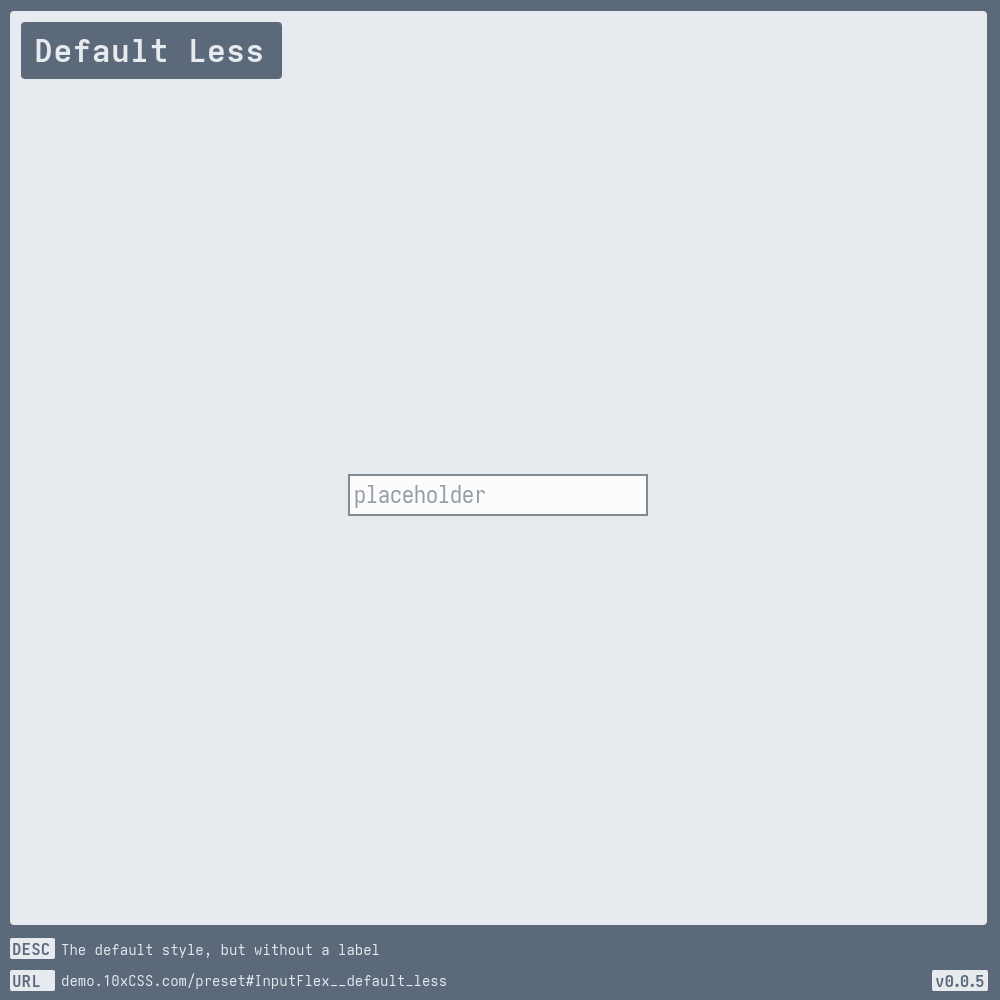
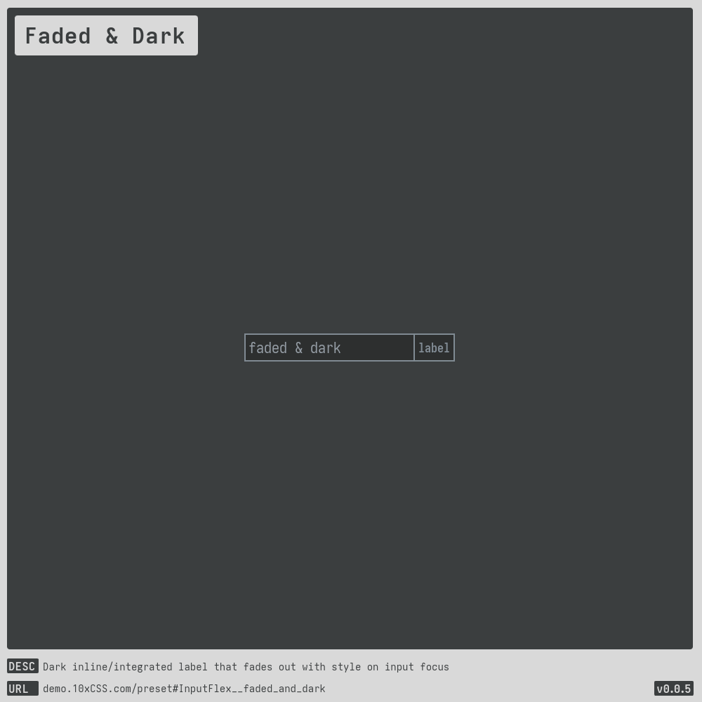
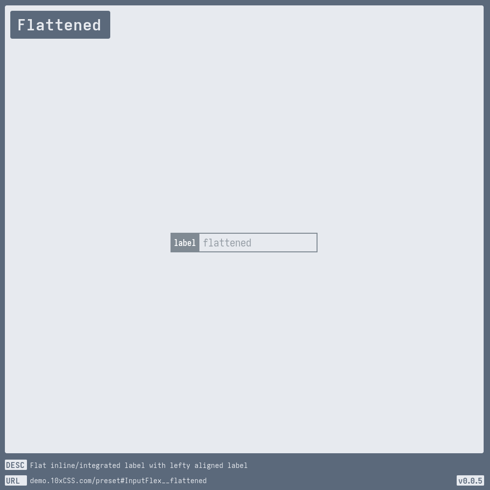
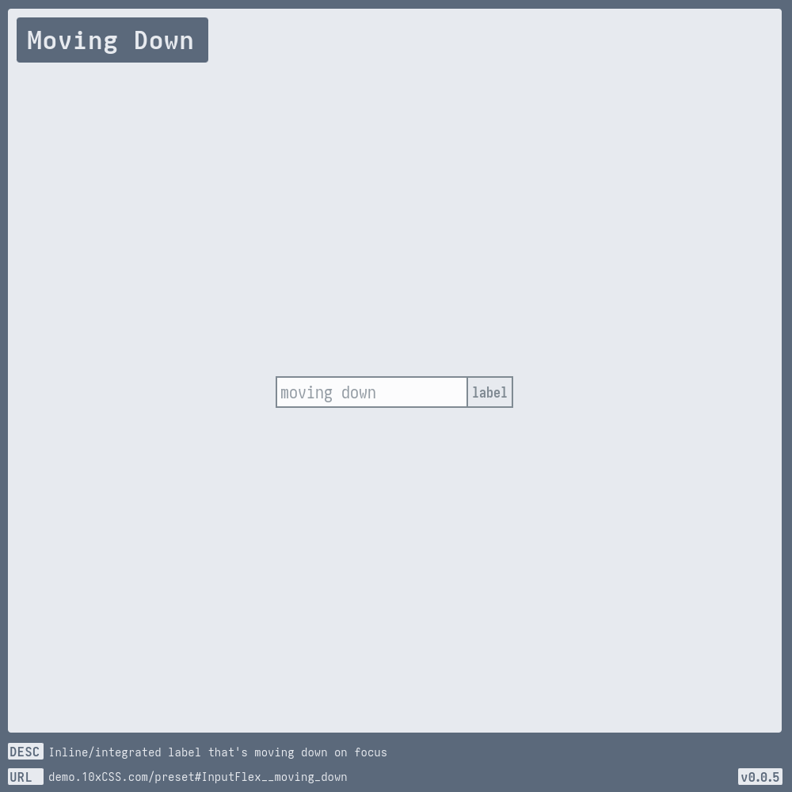
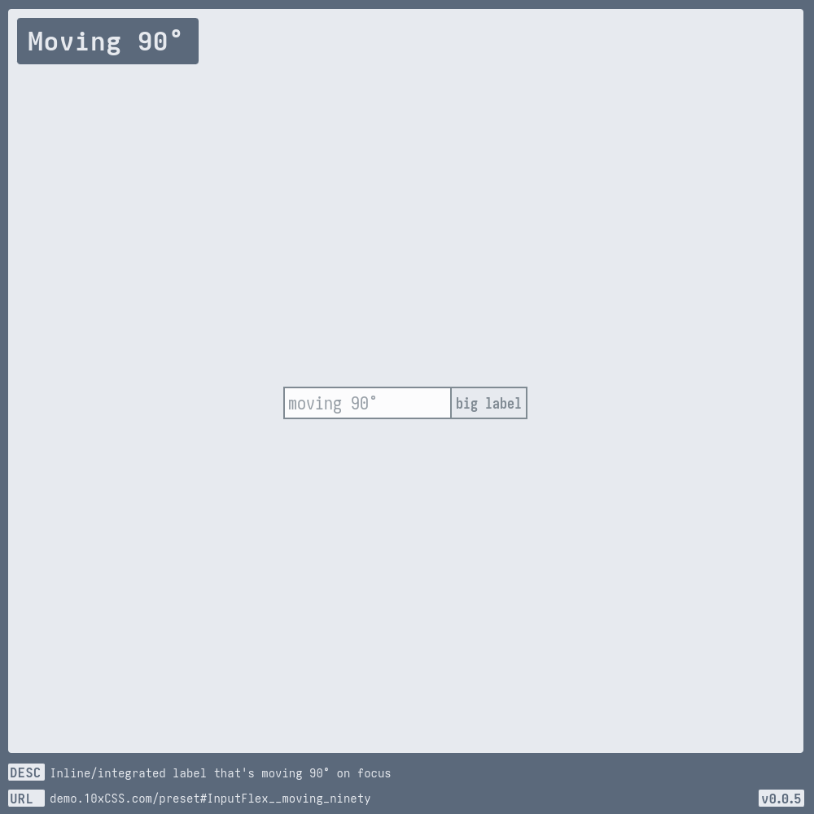
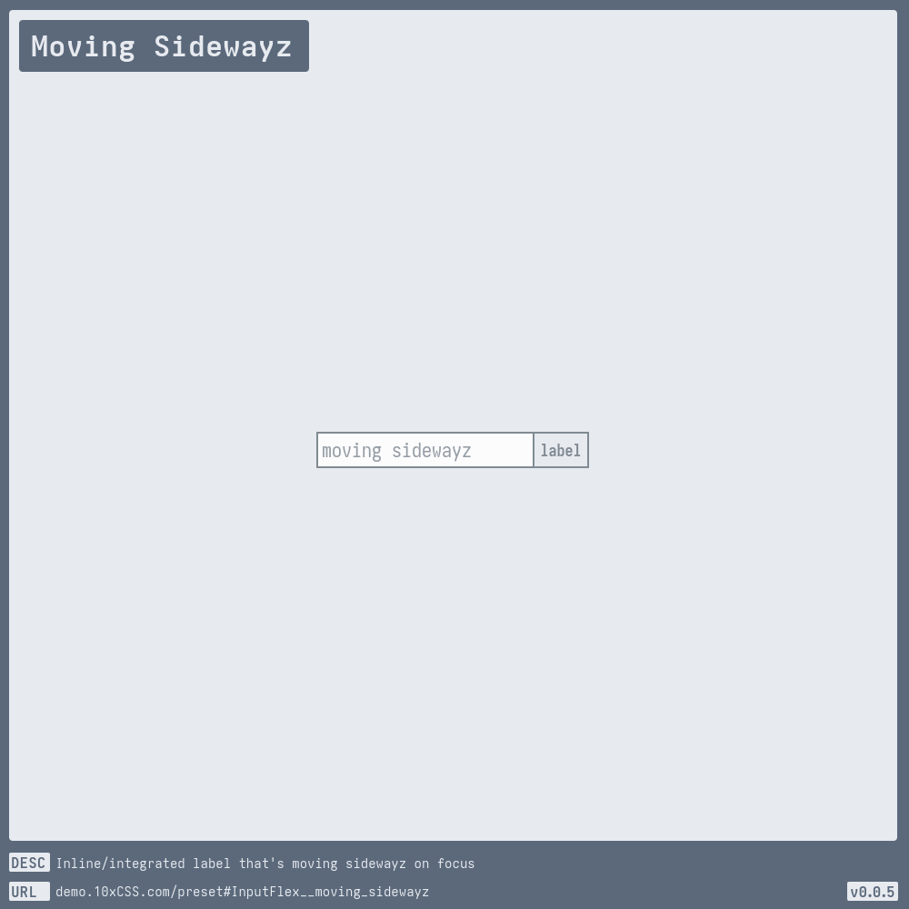
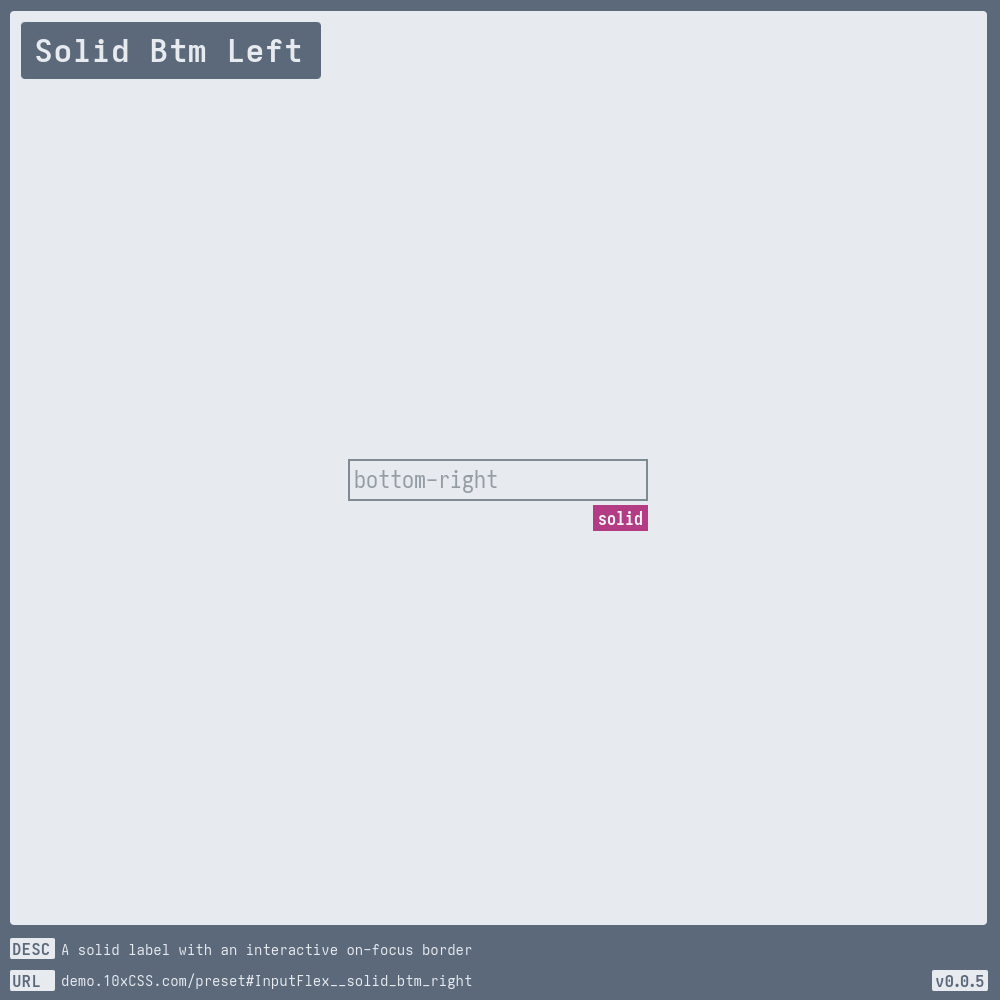
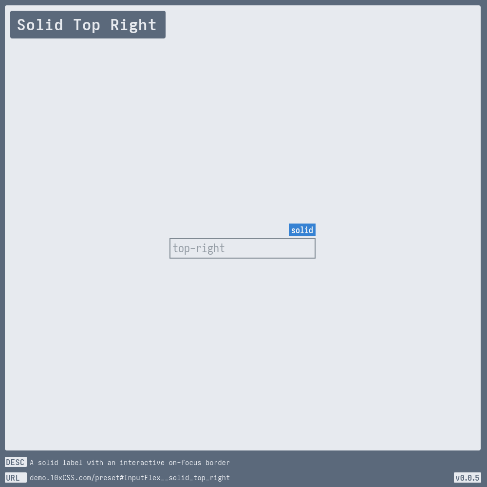
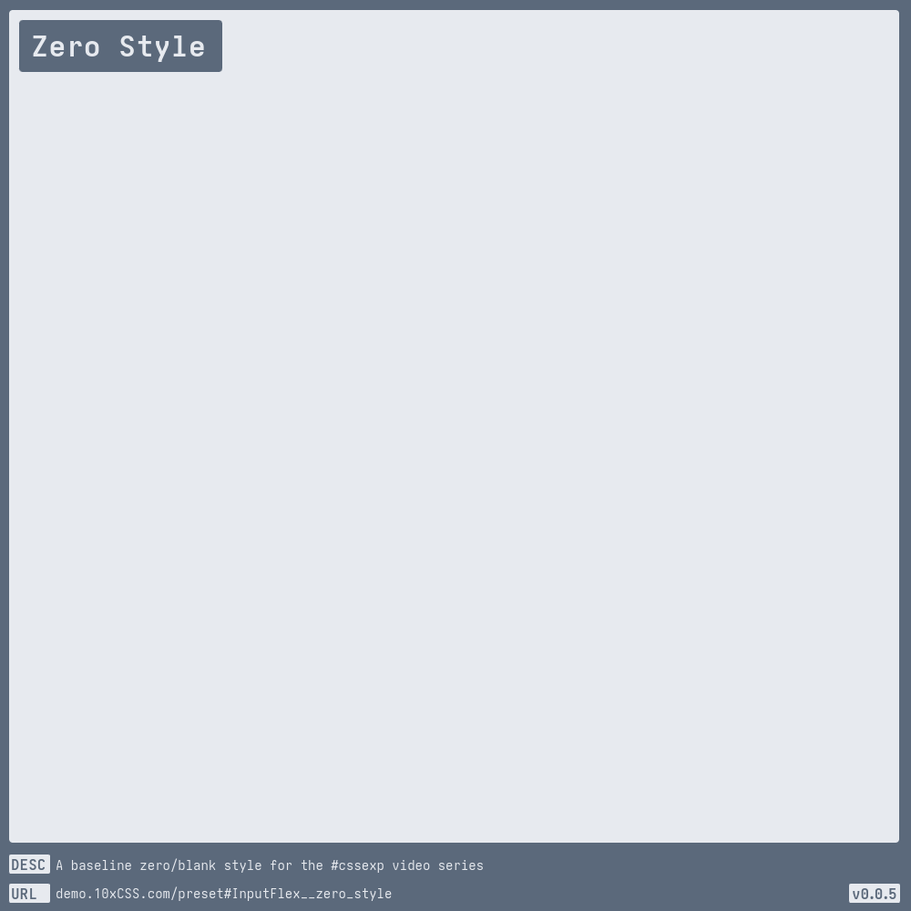

# [Input Flex](https://demo.10xCSS.com/preset#InputFlex)

> __`CID `__  InputFlex  
> __`DESC`__  A flex-ible-box text [input](https://developer.mozilla.org/en-US/docs/Web/HTML/Element/input) style with an optional [label](https://developer.mozilla.org/en-US/docs/Web/HTML/Element/label).  
> __`LINK`__  [demo.10xCSS.com/preset#InputFlex](https://demo.10xCSS.com/preset#InputFlex)  
> __`NOTE`__  This style is structured to be pre-configured, centering around a few main configurable properties, but you're welcome to modify anything you want.  
> __`VERS`__  1  

|Table                              |of                                 |Contents                           |
|:----------------------------------|:----------------------------------|:----------------------------------|
|[Default](#default)                |[Focus Clean Top](#focus-clean-top)|[Solid Btm Left](#solid-btm-left)  |
|[Default Less](#default-less)      |[Hideaway](#hideaway)              |[Solid Btm Left](#solid-btm-left)  |
|[Bare Noir Left](#bare-noir-left)  |[Moving Down](#moving-down)        |[Solid Top Left](#solid-top-left)  |
|[Bare Noir Right](#bare-noir-right)|[Moving -90°](#moving--90)         |[Solid Top Right](#solid-top-right)|
|[Faded & Dark](#faded-dark)        |[Moving 90°](#moving-90)           |[The Bank of R](#the-bank-of-r)    |
|[Faded & Jaded](#faded-jaded)      |[Moving Sidewayz](#moving-sidewayz)|[Zero Style](#zero-style)          |
|[Flattened](#flattened)            |[Moving Up](#moving-up)            |                                   |
|[Focus Clean Btm](#focus-clean-btm)|[Silly Slide](#silly-slide)        |                                   |
---

### _All-in-One_
_(todo-video-placeholder)_

### Default
> `desc`: Default [InputFlex](https://10xCSS.com/dashboard/presets?cid=InputFlex&uid=InputFlex__default) style; a flex [input](https://developer.mozilla.org/en-US/docs/Web/HTML/Element/input)  
> `link`: [demo.10xCSS.com/preset#InputFlex__default](https://demo.10xCSS.com/dashboard/presets?cid=InputFlex&uid=InputFlex__default)  
> `time`: 2024-01-30 ⇒ 2024-04-11  
> `vers`: 1  

### Default Less
> `desc`: The default style, but without a label  
> `link`: [demo.10xCSS.com/preset#InputFlex__default_less](https://demo.10xCSS.com/dashboard/presets?cid=InputFlex&uid=InputFlex__default_less)  
> `time`: 2024-02-03 ⇒ 2024-04-08  
> `vers`: 1  

### Bare Noir Left
> `desc`: Left aligned label with an input so clean it should be criminal  
> `link`: [demo.10xCSS.com/preset#InputFlex__bare_noir_left](https://demo.10xCSS.com/dashboard/presets?cid=InputFlex&uid=InputFlex__bare_noir_left)  
> `time`: 2024-02-10 ⇒ 2024-04-08  
> `vers`: 1  

### Bare Noir Right
> `desc`: Right aligned label with an input so clean it should be criminal  
> `link`: [demo.10xCSS.com/preset#InputFlex__bare_noir_right](https://demo.10xCSS.com/dashboard/presets?cid=InputFlex&uid=InputFlex__bare_noir_right)  
> `time`: 2024-02-10 ⇒ 2024-04-08  
> `vers`: 1  

### Faded & Dark
> `desc`: Dark inline/integrated label that fades out with style on input focus  
> `link`: [demo.10xCSS.com/preset#InputFlex__faded_and_dark](https://demo.10xCSS.com/dashboard/presets?cid=InputFlex&uid=InputFlex__faded_and_dark)  
> `time`: 2024-02-08 ⇒ 2024-04-08  
> `vers`: 1  

### Faded & Jaded
> `desc`: Inline/integrated label that fades out with input focus  
> `link`: [demo.10xCSS.com/preset#InputFlex__faded_and_jaded](https://demo.10xCSS.com/dashboard/presets?cid=InputFlex&uid=InputFlex__faded_and_jaded)  
> `time`: 2024-02-08 ⇒ 2024-04-08  
> `vers`: 1  

### Flattened
> `desc`: Flat inline/integrated label with lefty aligned label  
> `link`: [demo.10xCSS.com/preset#InputFlex__flattened](https://demo.10xCSS.com/dashboard/presets?cid=InputFlex&uid=InputFlex__flattened)  
> `time`: 2024-02-10 ⇒ 2024-04-08  
> `vers`: 1  

### Focus Clean Btm
> `desc`: An interactive input that is minimal with dash of flair  
> `link`: [demo.10xCSS.com/preset#InputFlex__focus_clean_btm](https://demo.10xCSS.com/dashboard/presets?cid=InputFlex&uid=InputFlex__focus_clean_btm)  
> `time`: 2024-02-03 ⇒ 2024-04-08  
> `vers`: 1  

### Focus Clean Top
> `desc`: An interactive input that is minimal with dash of flair  
> `link`: [demo.10xCSS.com/preset#InputFlex__focus_clean_top](https://demo.10xCSS.com/dashboard/presets?cid=InputFlex&uid=InputFlex__focus_clean_top)  
> `time`: 2024-02-03 ⇒ 2024-04-08  
> `vers`: 1  

### Hideaway
> `desc`: Label that slides-to-hide on focus  
> `link`: [demo.10xCSS.com/preset#InputFlex__hideaway](https://demo.10xCSS.com/dashboard/presets?cid=InputFlex&uid=InputFlex__hideaway)  
> `time`: 2024-02-10 ⇒ 2024-04-08  
> `vers`: 1  

### Moving Down
> `desc`: Inline/integrated label that's moving down on focus  
> `link`: [demo.10xCSS.com/preset#InputFlex__moving_down](https://demo.10xCSS.com/dashboard/presets?cid=InputFlex&uid=InputFlex__moving_down)  
> `time`: 2024-02-08 ⇒ 2024-04-08  
> `vers`: 1  

### Moving -90°
> `desc`: Inline/integrated label that's going for broke with -90° on focus  
> `link`: [demo.10xCSS.com/preset#InputFlex__moving_neg_ninety](https://demo.10xCSS.com/dashboard/presets?cid=InputFlex&uid=InputFlex__moving_neg_ninety)  
> `time`: 2024-02-08 ⇒ 2024-04-08  
> `vers`: 1  

### Moving 90°
> `desc`: Inline/integrated label that's moving 90° on focus  
> `link`: [demo.10xCSS.com/preset#InputFlex__moving_ninety](https://demo.10xCSS.com/dashboard/presets?cid=InputFlex&uid=InputFlex__moving_ninety)  
> `time`: 2024-02-08 ⇒ 2024-04-08  
> `vers`: 1  

### Moving Sidewayz
> `desc`: Inline/integrated label that's moving sidewayz on focus  
> `link`: [demo.10xCSS.com/preset#InputFlex__moving_sidewayz](https://demo.10xCSS.com/dashboard/presets?cid=InputFlex&uid=InputFlex__moving_sidewayz)  
> `time`: 2024-02-08 ⇒ 2024-04-08  
> `vers`: 1  

### Moving Up
> `desc`: Inline/integrated label that's moving up on focus  
> `link`: [demo.10xCSS.com/preset#InputFlex__moving_up](https://demo.10xCSS.com/dashboard/presets?cid=InputFlex&uid=InputFlex__moving_up)  
> `time`: 2024-02-08 ⇒ 2024-04-08  
> `vers`: 1  

### Silly Slide
> `desc`: A silly sliding label on focus  
> `link`: [demo.10xCSS.com/preset#InputFlex__silly_slide](https://demo.10xCSS.com/dashboard/presets?cid=InputFlex&uid=InputFlex__silly_slide)  
> `time`: 2024-02-10 ⇒ 2024-04-08  
> `vers`: 1  

### Solid Btm Left
> `desc`: A solid label with an interactive on-focus border  
> `link`: [demo.10xCSS.com/preset#InputFlex__solid_btm_left](https://demo.10xCSS.com/dashboard/presets?cid=InputFlex&uid=InputFlex__solid_btm_left)  
> `time`: 2024-02-03 ⇒ 2024-04-08  
> `vers`: 1  

### Solid Btm Left
> `desc`: A solid label with an interactive on-focus border  
> `link`: [demo.10xCSS.com/preset#InputFlex__solid_btm_right](https://demo.10xCSS.com/dashboard/presets?cid=InputFlex&uid=InputFlex__solid_btm_right)  
> `time`: 2024-02-03 ⇒ 2024-04-08  
> `vers`: 1  

### Solid Top Left
> `desc`: A solid label with an interactive on-focus border  
> `link`: [demo.10xCSS.com/preset#InputFlex__solid_top_left](https://demo.10xCSS.com/dashboard/presets?cid=InputFlex&uid=InputFlex__solid_top_left)  
> `time`: 2024-02-03 ⇒ 2024-04-08  
> `vers`: 1  

### Solid Top Right
> `desc`: A solid label with an interactive on-focus border  
> `link`: [demo.10xCSS.com/preset#InputFlex__solid_top_right](https://demo.10xCSS.com/dashboard/presets?cid=InputFlex&uid=InputFlex__solid_top_right)  
> `time`: 2024-02-03 ⇒ 2024-04-08  
> `vers`: 1  

### The Bank of R
> `desc`: An input style that always delivers with discretion  
> `link`: [demo.10xCSS.com/preset#InputFlex__the_bank_of_r](https://demo.10xCSS.com/dashboard/presets?cid=InputFlex&uid=InputFlex__the_bank_of_r)  
> `time`: 2024-04-11 ⇒ 2024-04-27  
> `vers`: 1  

### Zero Style
> `desc`: A baseline zero/blank style for the [#cssexp](https://www.youtube.com/playlist?list=PLjzn_iVJxcJgGSQSA5uhD3PCHObCQLOpG) video series  
> `link`: [demo.10xCSS.com/preset#InputFlex__zero_style](https://demo.10xCSS.com/dashboard/presets?cid=InputFlex&uid=InputFlex__zero_style)  
> `time`: 2024-02-28 ⇒ 2024-04-08  
> `vers`: 1  

