# [Input Radio Pop](https://demo.10xCSS.com/preset#InputRadioPop)

> __`CID `__  InputRadioPop  
> __`DESC`__  A set of [radio](https://developer.mozilla.org/en-US/docs/Web/HTML/Element/input/radio) [input](https://developer.mozilla.org/en-US/docs/Web/HTML/Element/input) options with optional [label](https://developer.mozilla.org/en-US/docs/Web/HTML/Element/label) markup.  
> __`LINK`__  [demo.10xCSS.com/preset#InputRadioPop](https://demo.10xCSS.com/preset#InputRadioPop)  
> __`NOTE`__  none  
> __`VERS`__  1  

|Table                              |of                                 |Contents                           |
|:----------------------------------|:----------------------------------|:----------------------------------|
|[Default](#default)                |[But Yo](#but-yo)                  |[Roasted](#roasted)                |
|[Default Column](#default-column)  |[Ease As](#ease-as)                |[Slowly Poppin’](#slowly-poppin)   |
|[Default Labeled](#default-labeled)|[Fading](#fading)                  |[Square CSS](#square-css)          |
|[Default Enabled](#default-enabled)|[Inlined](#inlined)                |[Square It](#square-it)            |
|[AperturEaling](#aperturealing)    |[On:Hover Bg](#onhover-bg)         |[Square Top](#square-top)          |
|[Bubblegum Pop](#bubblegum-pop)    |[On:So Fancy-ish](#onso-fancy-ish) |[What Not Todo](#what-not-todo)    |
|[But Yo, Srsly](#but-yo-srsly)     |[Quizzical Neon](#quizzical-neon)  |[Whole-Square](#whole-square)      |
---

### _All-in-One_
_(todo-video-placeholder)_

### Default
> `desc`: Default [InputRadioPop](https://10xCSS.com/dashboard/presets?cid=InputRadioPop&uid=InputRadioPop__default) style; a poppin’ single-selection [radio](https://developer.mozilla.org/en-US/docs/Web/HTML/Element/input/radio) group [input](https://developer.mozilla.org/en-US/docs/Web/HTML/Element/input)  
> `link`: [demo.10xCSS.com/preset#InputRadioPop__default](https://demo.10xCSS.com/dashboard/presets?cid=InputRadioPop&uid=InputRadioPop__default)  
> `time`: 2024-03-13 ⇒ 2024-04-16  
> `vers`: 1  

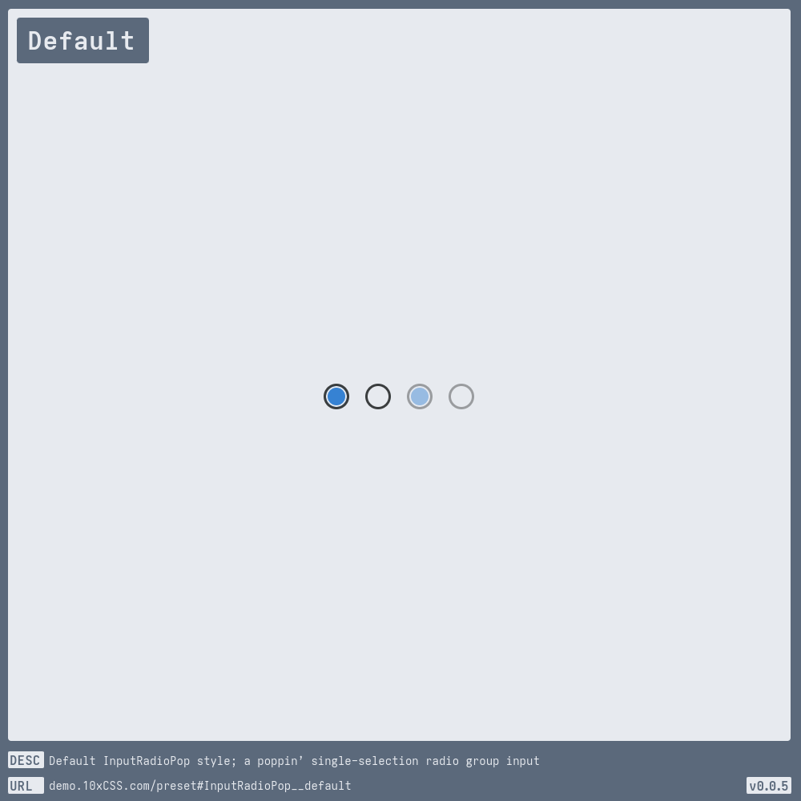

### Default Column
> `desc`: Default style, with a column layout  
> `link`: [demo.10xCSS.com/preset#InputRadioPop__default_column](https://demo.10xCSS.com/dashboard/presets?cid=InputRadioPop&uid=InputRadioPop__default_column)  
> `time`: 2024-03-18 ⇒ 2024-04-16  
> `vers`: 1  

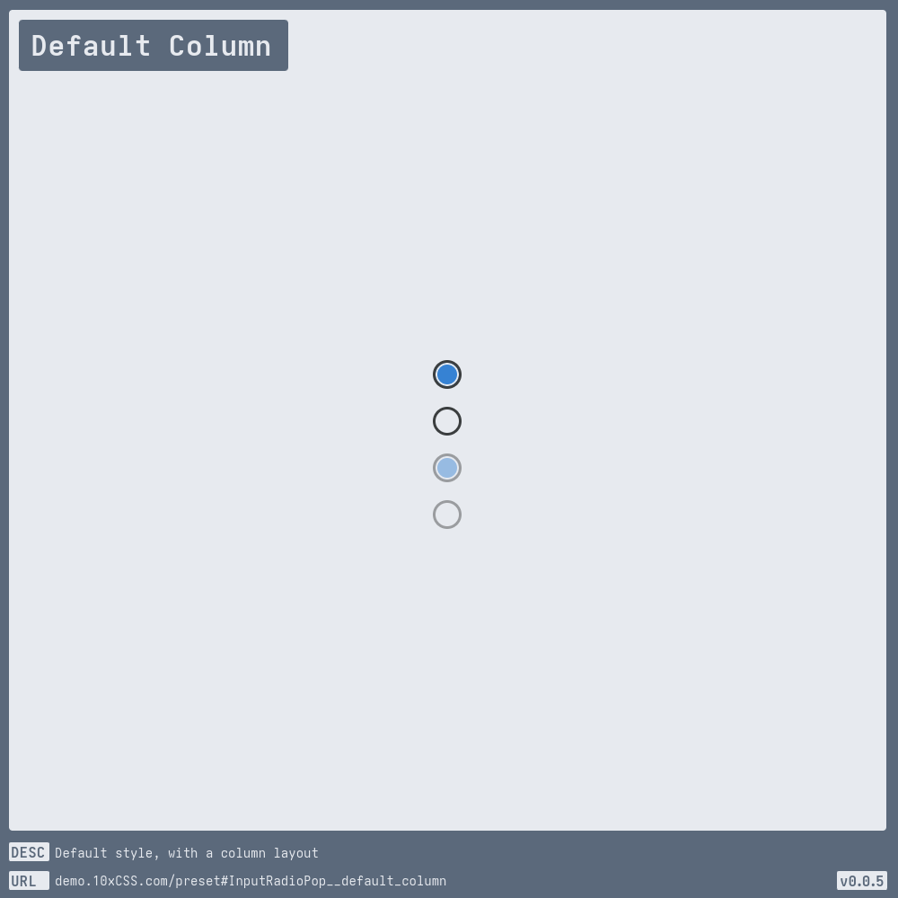

### Default Labeled
> `desc`: Default style, with corresponding text [label](https://developer.mozilla.org/en-US/docs/Web/HTML/Element/label) elements  
> `link`: [demo.10xCSS.com/preset#InputRadioPop__default_labeled](https://demo.10xCSS.com/dashboard/presets?cid=InputRadioPop&uid=InputRadioPop__default_labeled)  
> `time`: 2024-03-18 ⇒ 2024-04-16  
> `vers`: 1  

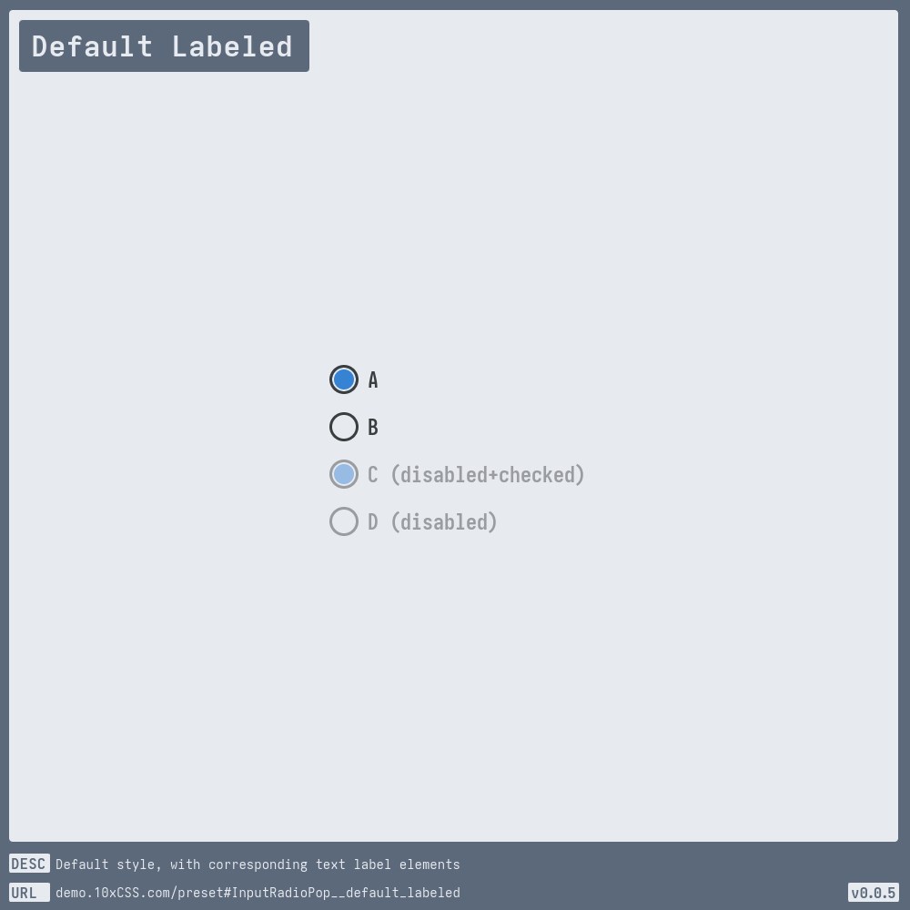

### Default Enabled
> `desc`: Default style, without disabled radio markup  
> `link`: [demo.10xCSS.com/preset#InputRadioPop__default_enabled](https://demo.10xCSS.com/dashboard/presets?cid=InputRadioPop&uid=InputRadioPop__default_enabled)  
> `time`: 2024-03-18 ⇒ 2024-04-16  
> `vers`: 1  

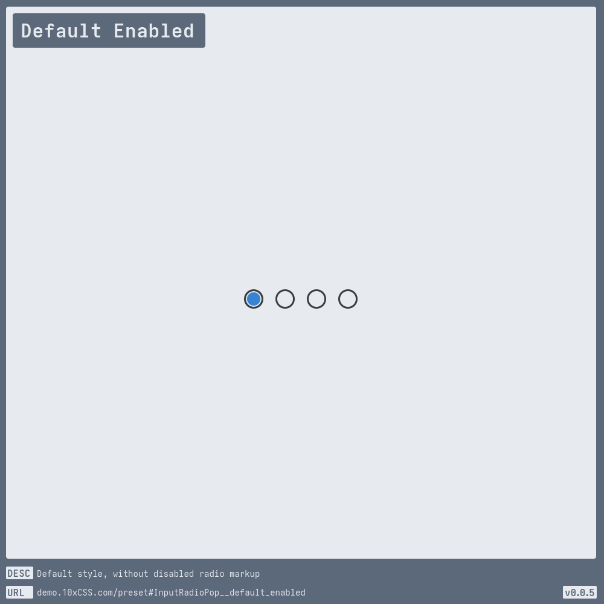

### AperturEaling
> `desc`: A radio style that’s absolutely apertur-ealing  
> `link`: [demo.10xCSS.com/preset#InputRadioPop__aperturealing](https://demo.10xCSS.com/dashboard/presets?cid=InputRadioPop&uid=InputRadioPop__aperturealing)  
> `time`: 2024-03-19 ⇒ 2024-04-16  
> `vers`: 1  

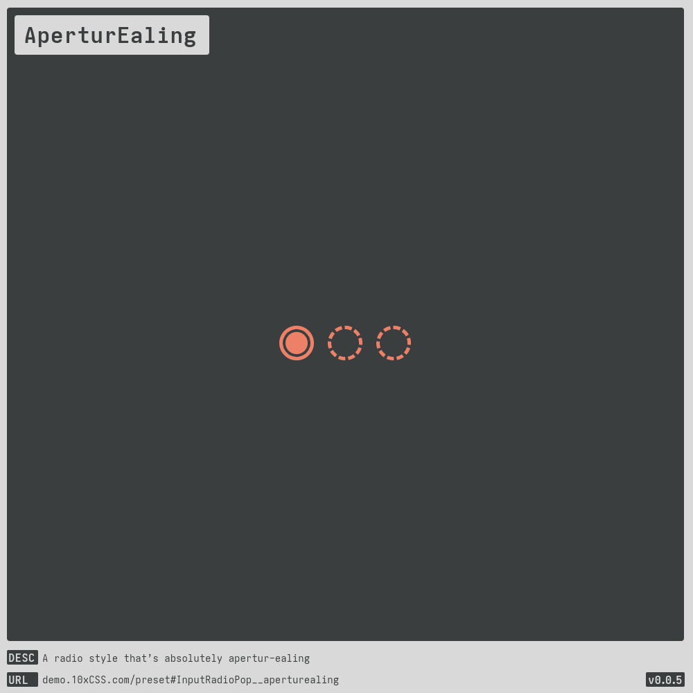

### Bubblegum Pop
> `desc`: Doubling the pop without doubling the risk of diabetes  
> `link`: [demo.10xCSS.com/preset#InputRadioPop__bubblegum_pop](https://demo.10xCSS.com/dashboard/presets?cid=InputRadioPop&uid=InputRadioPop__bubblegum_pop)  
> `time`: 2024-03-19 ⇒ 2024-04-16  
> `vers`: 1  

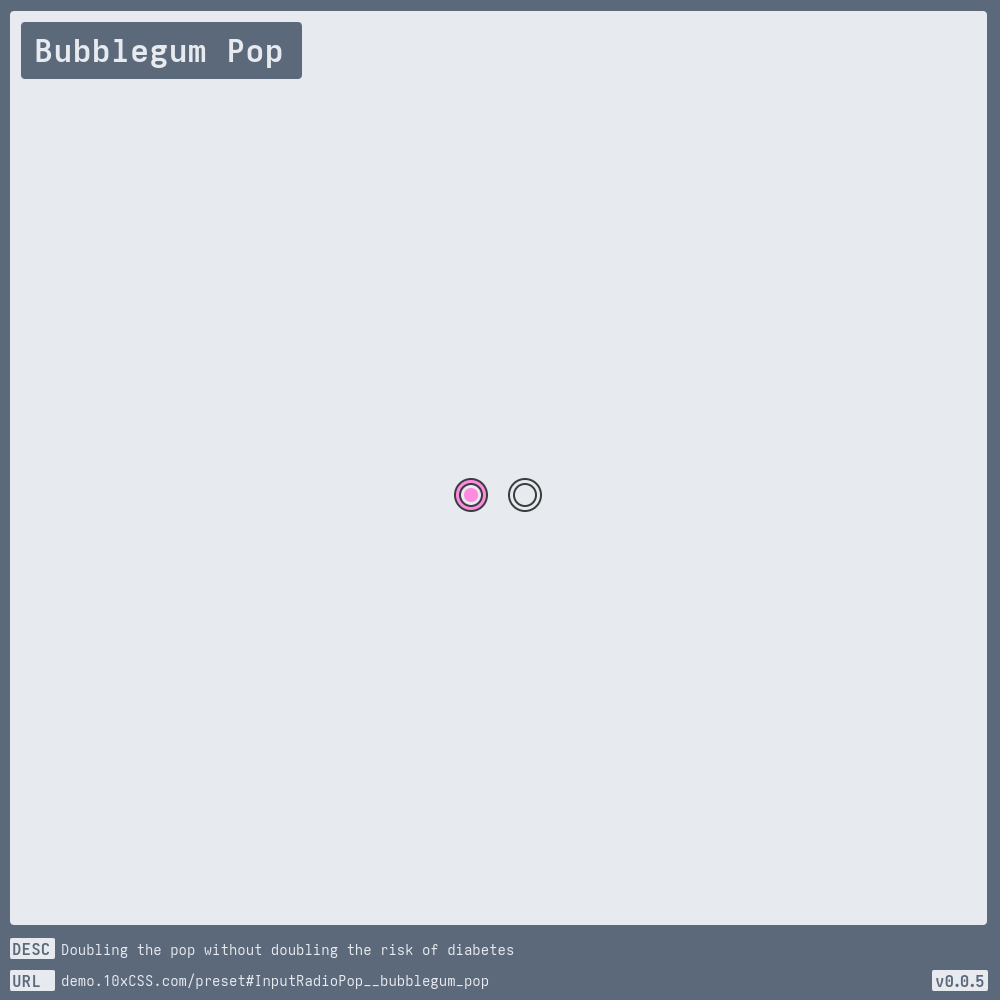

### But Yo, Srsly
> `desc`: If this prove to be cross-compatible, my input aspirations will be fulfilled  
> `link`: [demo.10xCSS.com/preset#InputRadioPop__but_yo_srsly](https://demo.10xCSS.com/dashboard/presets?cid=InputRadioPop&uid=InputRadioPop__but_yo_srsly)  
> `time`: 2024-03-19 ⇒ 2024-04-16  
> `vers`: 1  

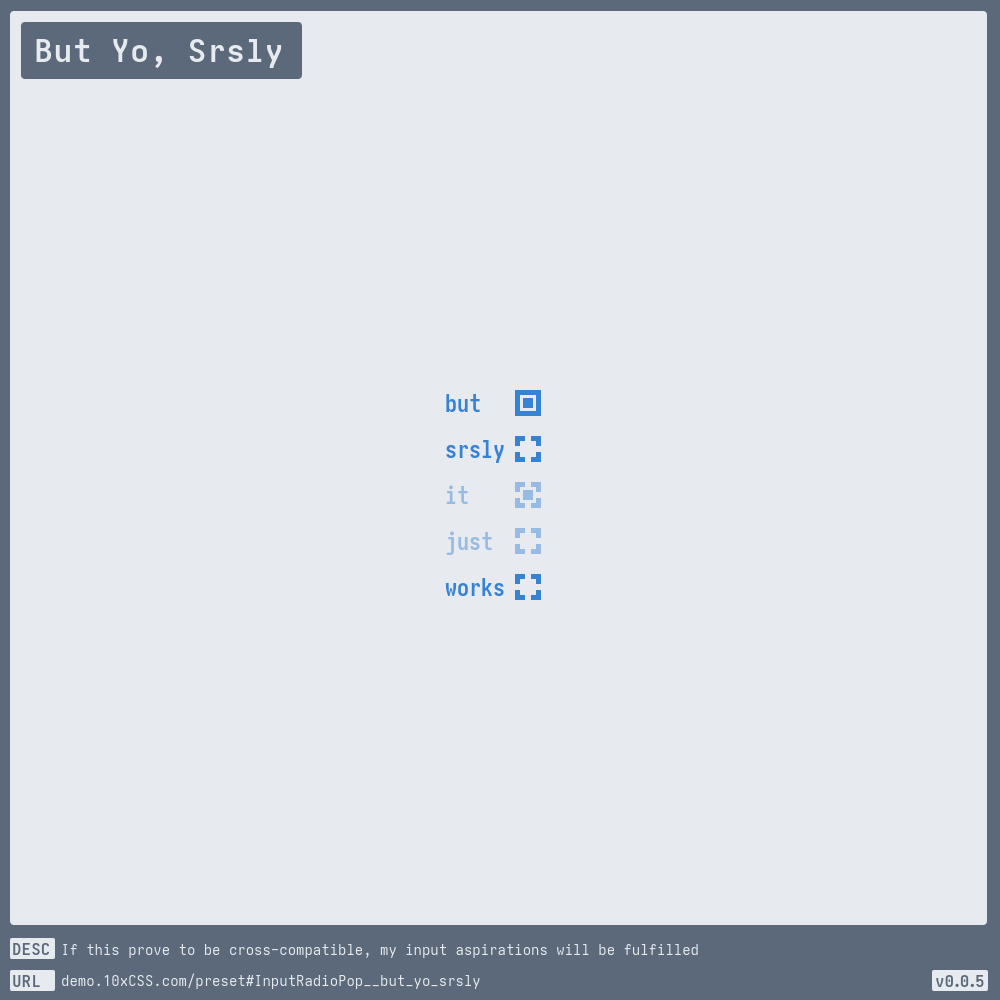

### But Yo
> `desc`: I’ve been designing radio inputs all wrong for the past ten years  
> `link`: [demo.10xCSS.com/preset#InputRadioPop__but_yo](https://demo.10xCSS.com/dashboard/presets?cid=InputRadioPop&uid=InputRadioPop__but_yo)  
> `time`: 2024-03-19 ⇒ 2024-04-16  
> `vers`: 1  

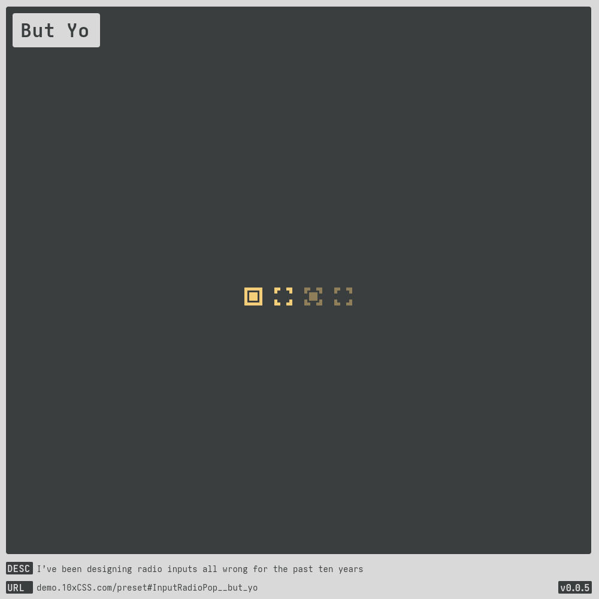

### Ease As
> `desc`: Defining multiple custom radio values is easy: one, two, three  
> `link`: [demo.10xCSS.com/preset#InputRadioPop__ease_as](https://demo.10xCSS.com/dashboard/presets?cid=InputRadioPop&uid=InputRadioPop__ease_as)  
> `time`: 2024-03-18 ⇒ 2024-04-16  
> `vers`: 1  

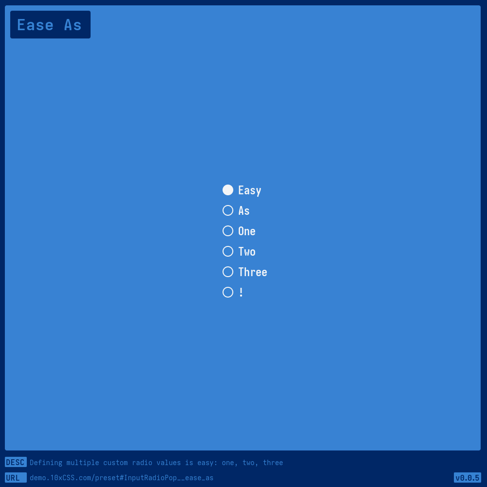

### Fading
> `desc`: A radio button style that puts the shading in fading  
> `link`: [demo.10xCSS.com/preset#InputRadioPop__fading](https://demo.10xCSS.com/dashboard/presets?cid=InputRadioPop&uid=InputRadioPop__fading)  
> `time`: 2024-03-19 ⇒ 2024-04-16  
> `vers`: 1  

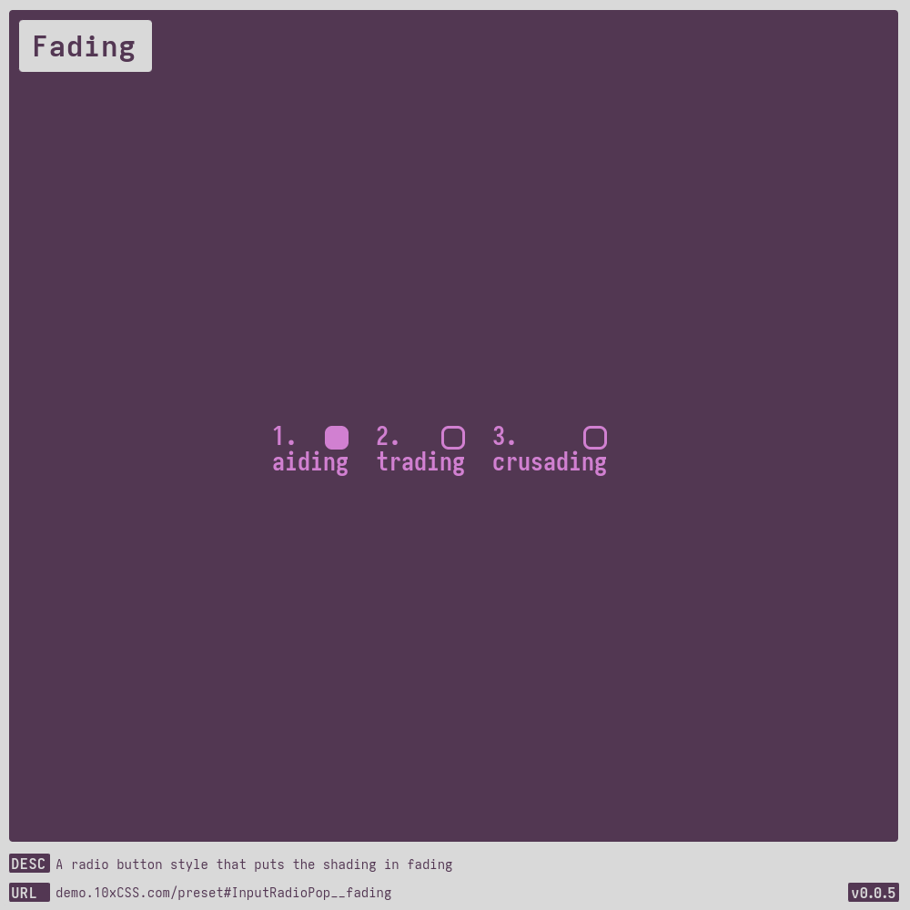

### Inlined
> `desc`: The infamous inlined radio button set  
> `link`: [demo.10xCSS.com/preset#InputRadioPop__inlined](https://demo.10xCSS.com/dashboard/presets?cid=InputRadioPop&uid=InputRadioPop__inlined)  
> `time`: 2024-03-18 ⇒ 2024-04-16  
> `vers`: 1  

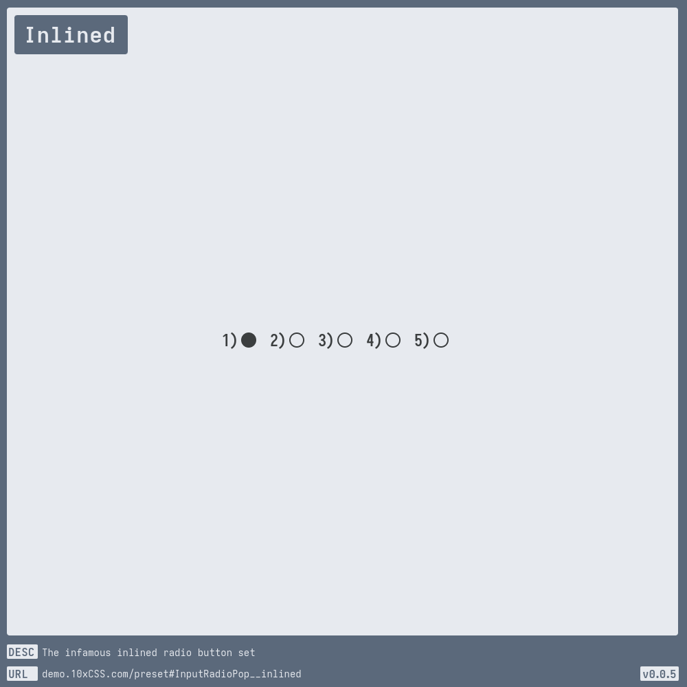

### On:Hover Bg
> `desc`: Enhance your family-friendly radio inputs with a subtle on-hover effect  
> `link`: [demo.10xCSS.com/preset#InputRadioPop__on_hover_bg](https://demo.10xCSS.com/dashboard/presets?cid=InputRadioPop&uid=InputRadioPop__on_hover_bg)  
> `time`: 2024-03-19 ⇒ 2024-04-16  
> `vers`: 1  

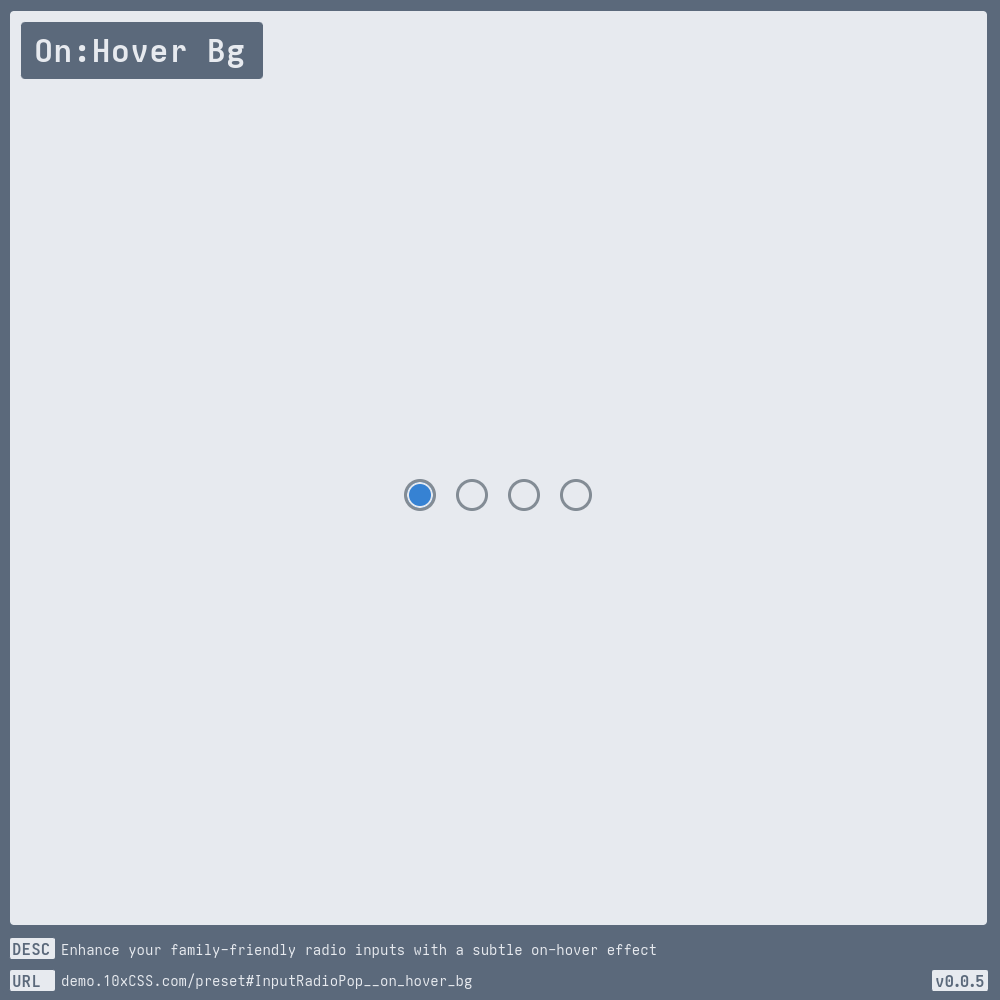

### On:So Fancy-ish
> `desc`: A fancy-ish on-state radio input, catering to both mouse and keyboard folk  
> `link`: [demo.10xCSS.com/preset#InputRadioPop__on_so_fancyish](https://demo.10xCSS.com/dashboard/presets?cid=InputRadioPop&uid=InputRadioPop__on_so_fancyish)  
> `time`: 2024-03-19 ⇒ 2024-04-16  
> `vers`: 1  

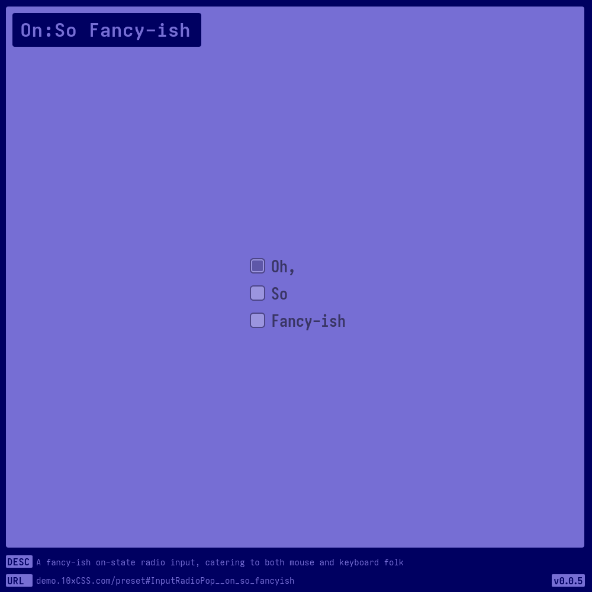

### Quizzical Neon
> `desc`: A quiz like radio style with dark neon flare  
> `link`: [demo.10xCSS.com/preset#InputRadioPop__quizzical_neon](https://demo.10xCSS.com/dashboard/presets?cid=InputRadioPop&uid=InputRadioPop__quizzical_neon)  
> `time`: 2024-03-18 ⇒ 2024-04-16  
> `vers`: 1  

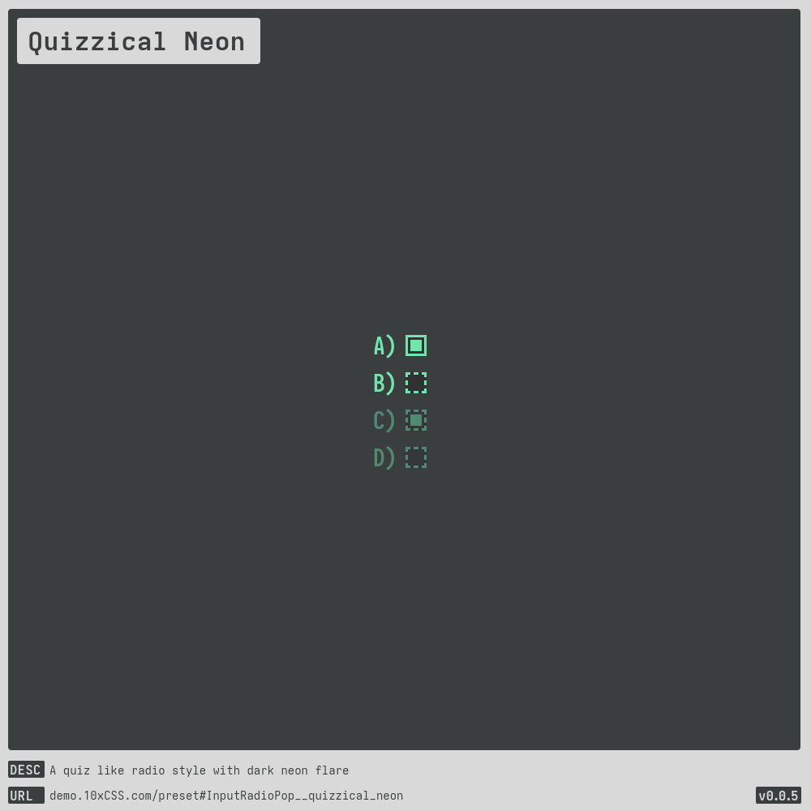

### Roasted
> `desc`: Freshly roasted radio buttons made with organic wonderstate.com beanz  
> `link`: [demo.10xCSS.com/preset#InputRadioPop__roasted](https://demo.10xCSS.com/dashboard/presets?cid=InputRadioPop&uid=InputRadioPop__roasted)  
> `time`: 2024-03-19 ⇒ 2024-04-16  
> `vers`: 1  

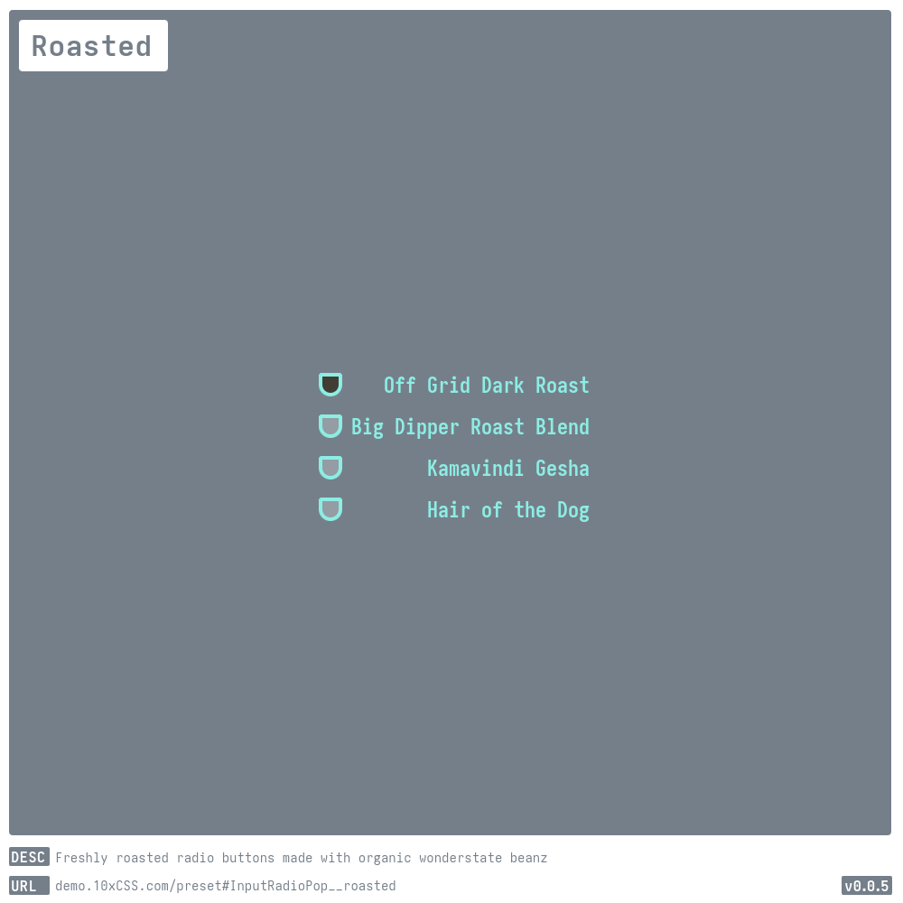

### Slowly Poppin’
> `desc`: It’s more than a radio button style; it’s the preferred lifestyle  
> `link`: [demo.10xCSS.com/preset#InputRadioPop__slowly_poppin](https://demo.10xCSS.com/dashboard/presets?cid=InputRadioPop&uid=InputRadioPop__slowly_poppin)  
> `time`: 2024-03-19 ⇒ 2024-04-16  
> `vers`: 1  

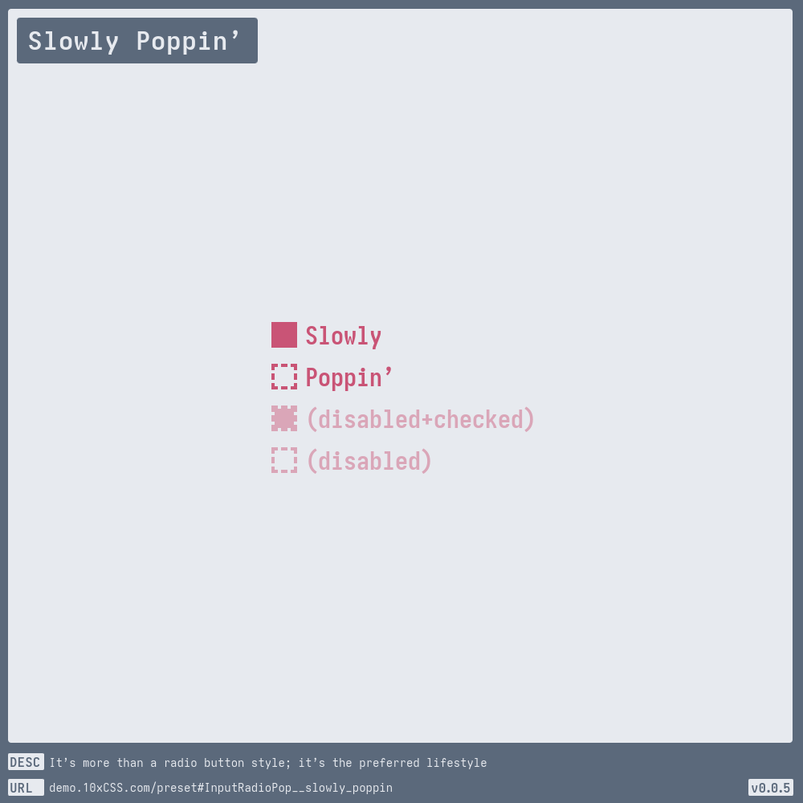

### Square CSS
> `desc`: A style otherwise known as, Counter-Strike: Source, if you dust de_dust  
> `link`: [demo.10xCSS.com/preset#InputRadioPop__square_css](https://demo.10xCSS.com/dashboard/presets?cid=InputRadioPop&uid=InputRadioPop__square_css)  
> `time`: 2024-03-19 ⇒ 2024-04-16  
> `vers`: 1  

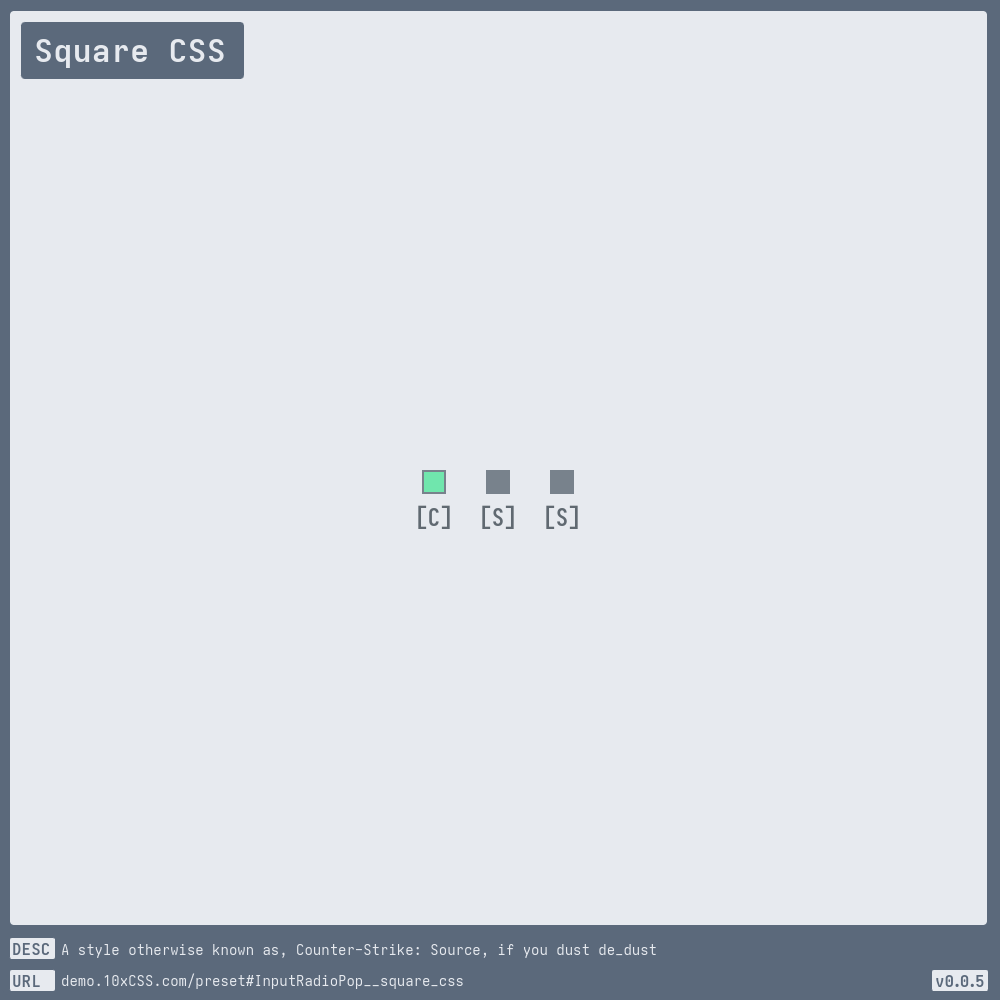

### Square It
> `desc`: A radio input style with square^2  
> `link`: [demo.10xCSS.com/preset#InputRadioPop__square_it](https://demo.10xCSS.com/dashboard/presets?cid=InputRadioPop&uid=InputRadioPop__square_it)  
> `time`: 2024-03-19 ⇒ 2024-04-16  
> `vers`: 1  

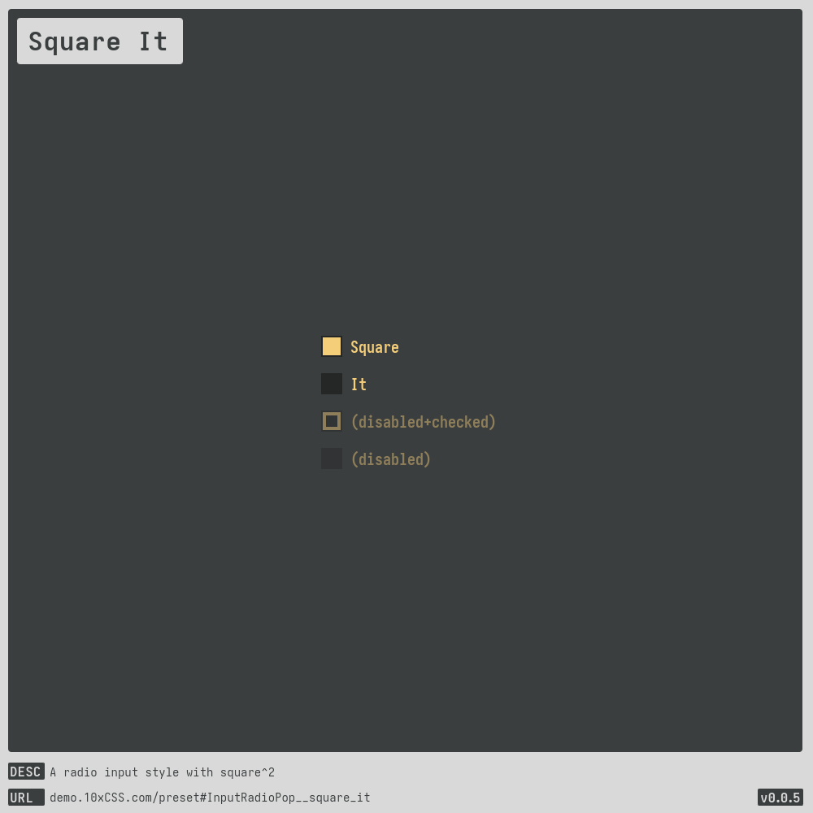

### Square Top
> `desc`: Hairstyle or shirt style? It’s the existential question of our time  
> `link`: [demo.10xCSS.com/preset#InputRadioPop__square_top](https://demo.10xCSS.com/dashboard/presets?cid=InputRadioPop&uid=InputRadioPop__square_top)  
> `time`: 2024-03-19 ⇒ 2024-04-16  
> `vers`: 1  

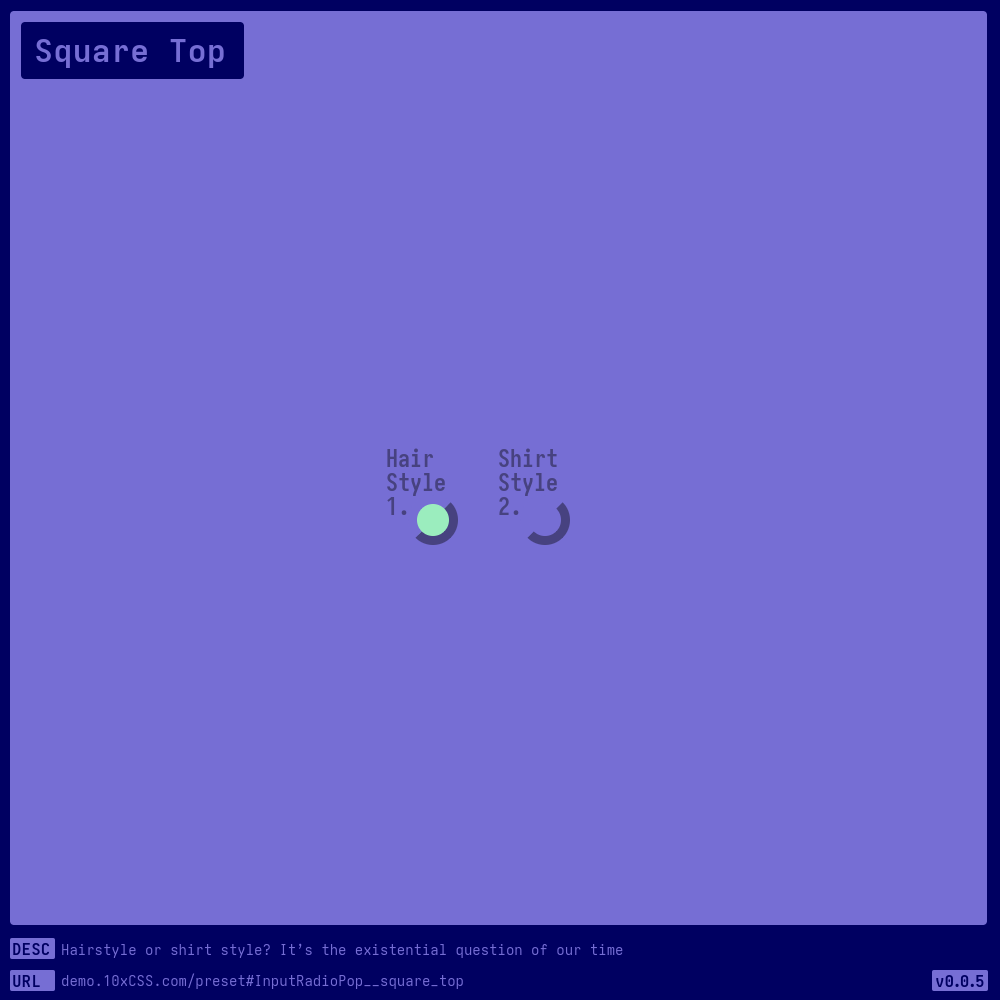

### What Not Todo
> `desc`: All the things you shouldn’t do packed into one hot style  
> `link`: [demo.10xCSS.com/preset#InputRadioPop__what_not_todo](https://demo.10xCSS.com/dashboard/presets?cid=InputRadioPop&uid=InputRadioPop__what_not_todo)  
> `time`: 2024-03-19 ⇒ 2024-04-16  
> `vers`: 1  

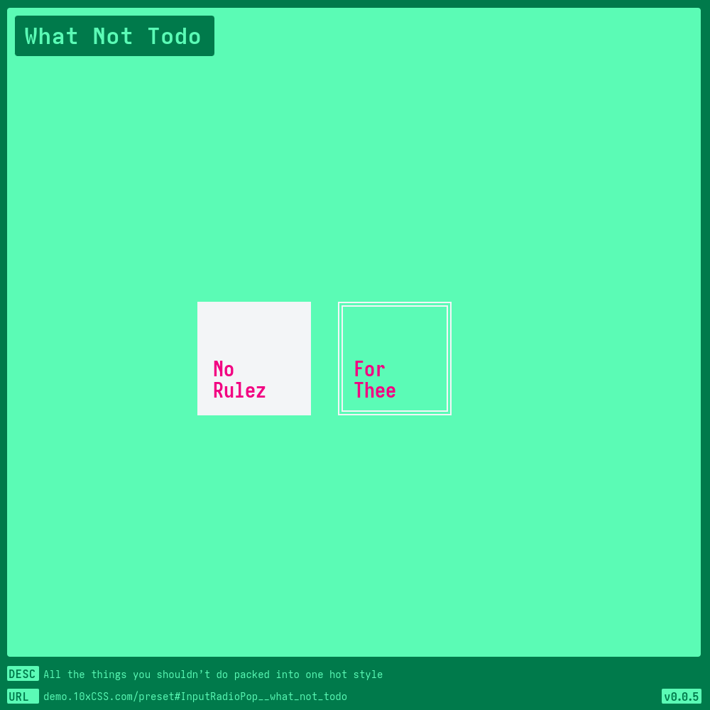

### Whole-Square
> `desc`: Slinging whole-square styles at wholesale prices  
> `link`: [demo.10xCSS.com/preset#InputRadioPop__whole_square](https://demo.10xCSS.com/dashboard/presets?cid=InputRadioPop&uid=InputRadioPop__whole_square)  
> `time`: 2024-03-20 ⇒ 2024-04-16  
> `vers`: 1  

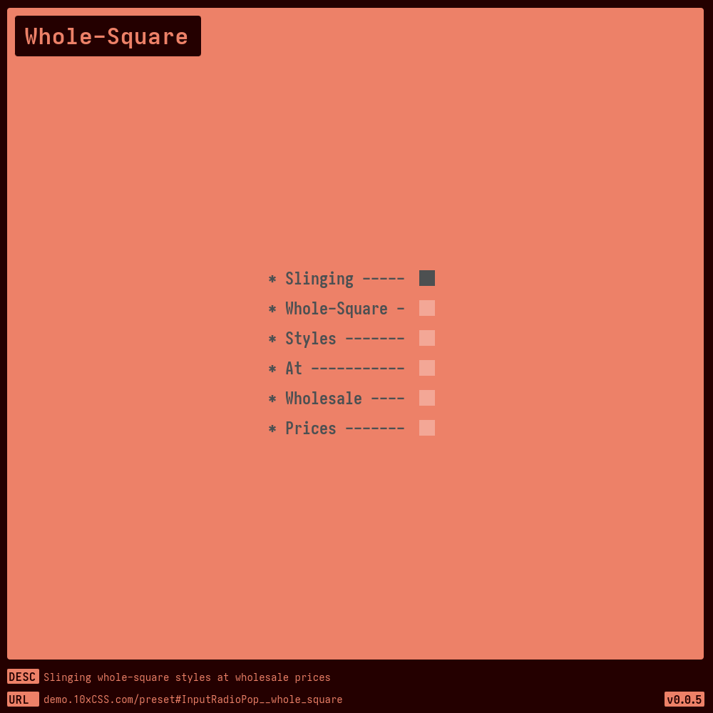