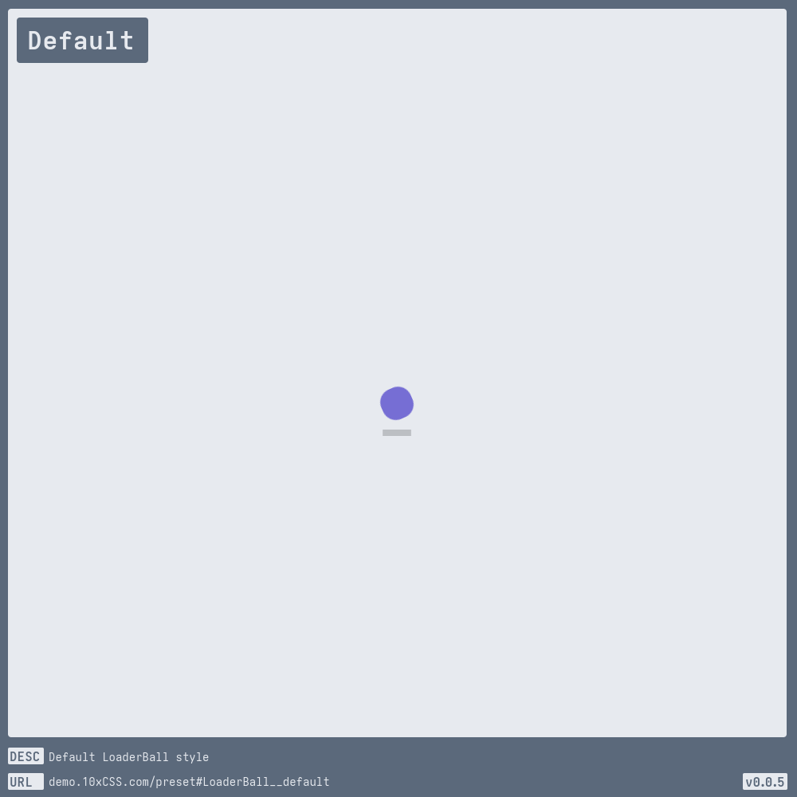
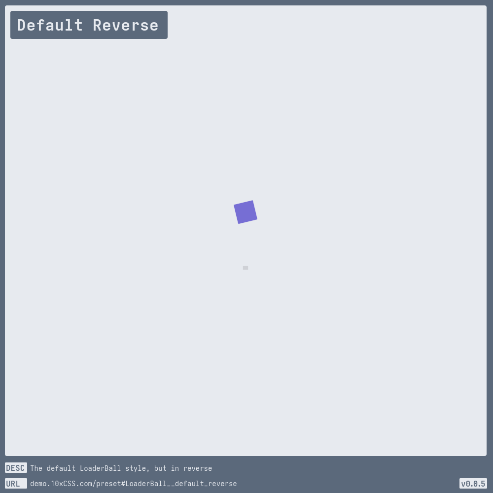
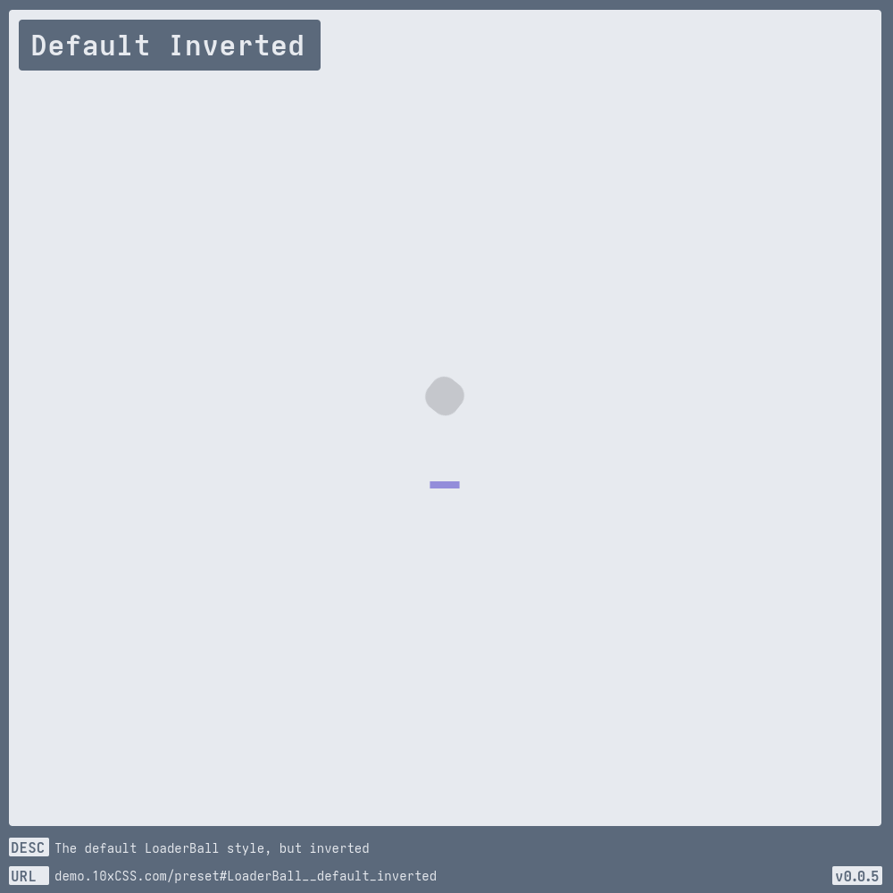
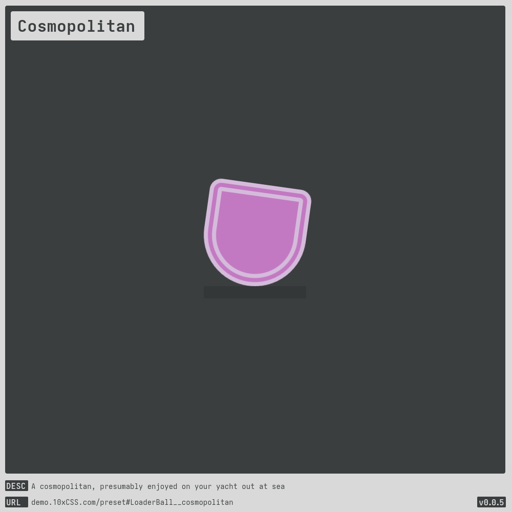
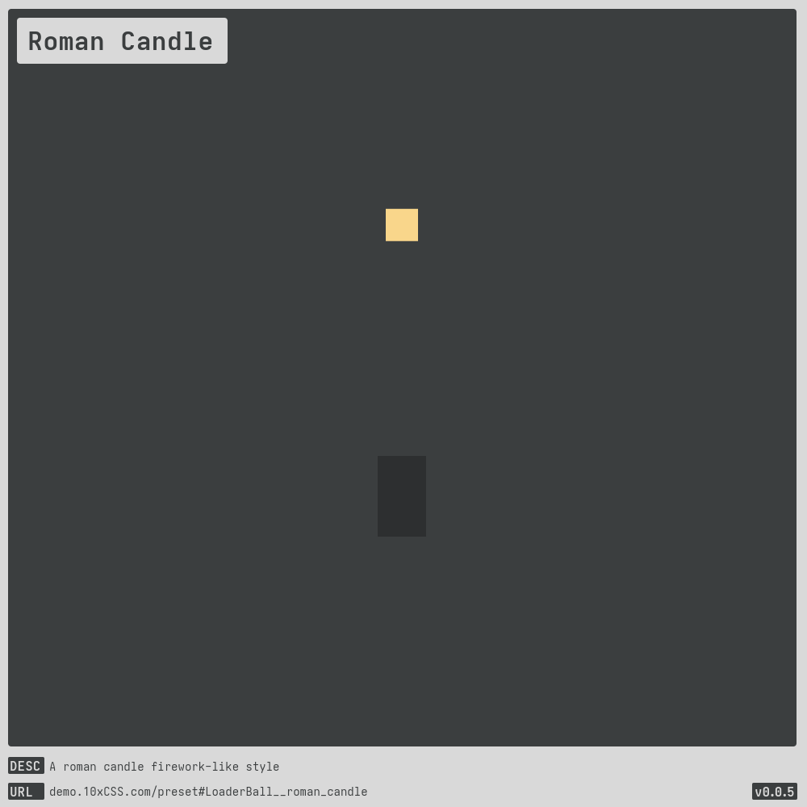
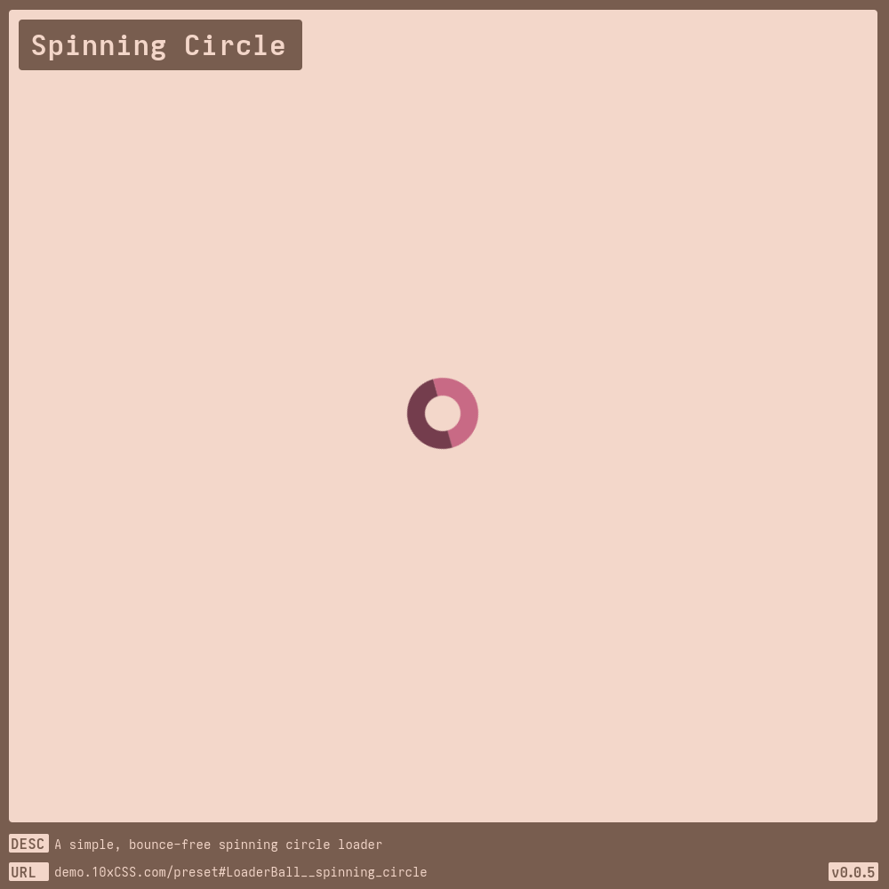
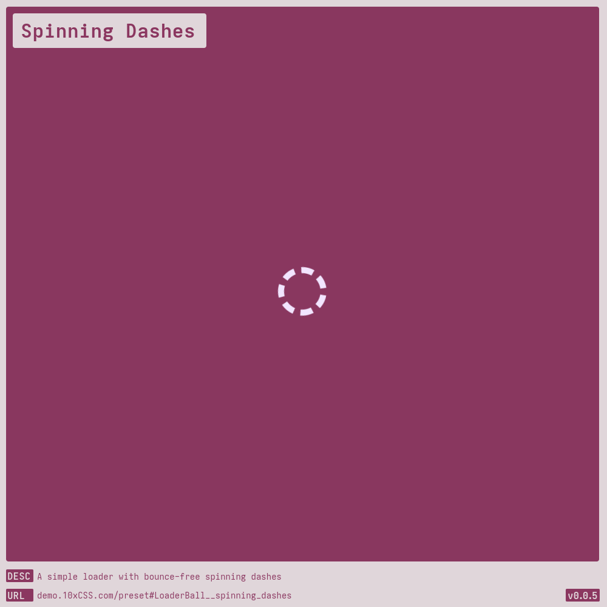
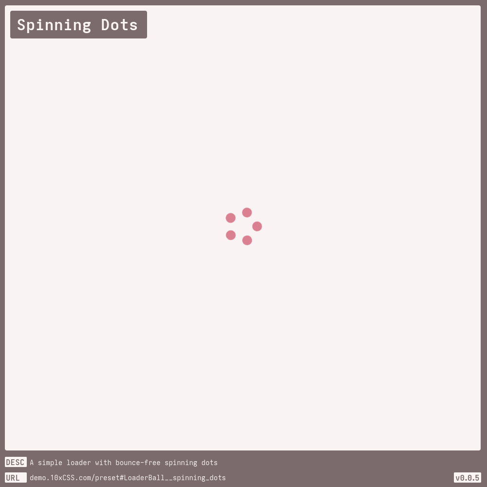
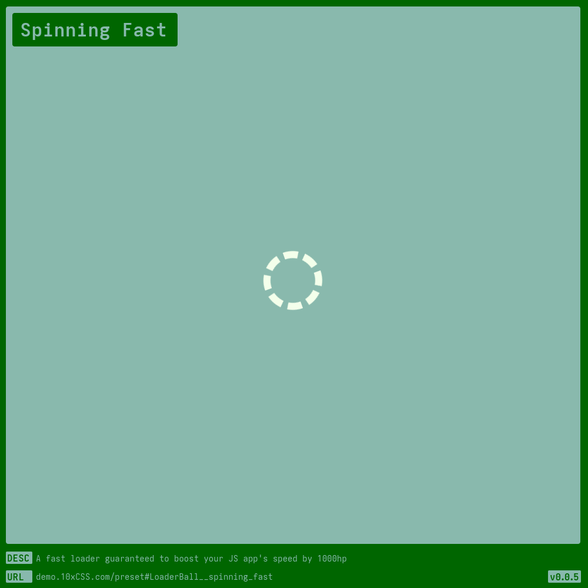
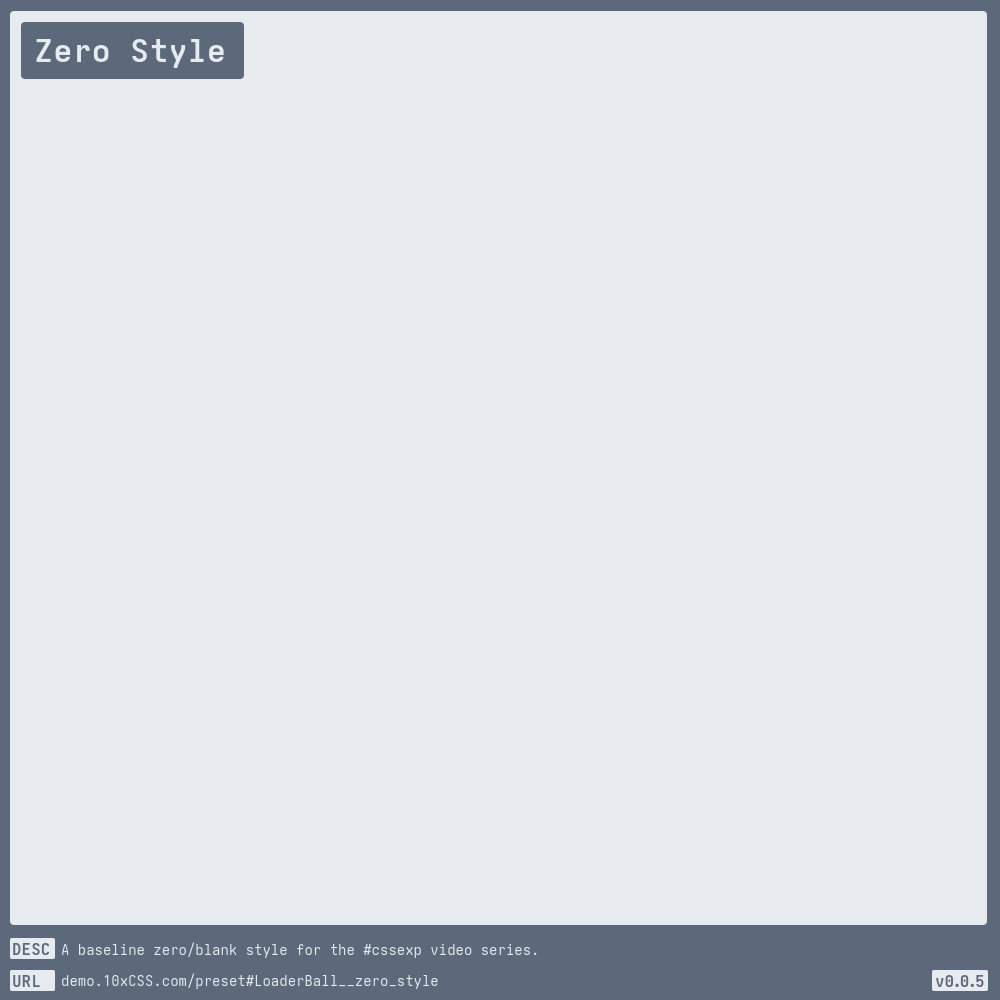

# [Loader Ball](https://demo.10xCSS.com/preset#LoaderBall)

> __`CID `__  LoaderBall  
> __`DESC`__  A bouncing loader animation to entertain those waiting in the queue.  
> __`LINK`__  [demo.10xCSS.com/preset#LoaderBall](https://demo.10xCSS.com/preset#LoaderBall)  
> __`NOTE`__  none  
> __`VERS`__  1  

|Table                                    |of                                       |Contents                                 |                                         |                                         |
|:----------------------------------------|:----------------------------------------|:----------------------------------------|:----------------------------------------|:----------------------------------------|
|[Default](#default)                      |[Alternate](#alternate)                  |[From To](#from-to)                      |[Roman Candle](#roman-candle)            |[Spinning Fast](#spinning-fast)          |
|[Default Reverse](#default-reverse)      |[Ballin](#ballin)                        |[No Shadow](#no-shadow)                  |[Spinning Circle](#spinning-circle)      |[Spinning Lifebouy](#spinning-lifebouy)  |
|[Default Inverted](#default-inverted)    |[Chatty](#chatty)                        |[Once A Square](#once-a-square)          |[Spinning Dashes](#spinning-dashes)      |[Spinning Radiation](#spinning-radiation)|
|[Almost](#almost)                        |[Cosmopolitan](#cosmopolitan)            |[Paused](#paused)                        |[Spinning Dots](#spinning-dots)          |[Zero Style](#zero-style)                |
---

### _All-in-One_
_(todo-video-placeholder)_

### Default
> `desc`: Default [LoaderBall](https://10xCSS.com/dashboard/presets?cid=LoaderBall&uid=LoaderBall__default) style  
> `link`: [demo.10xCSS.com/preset#LoaderBall__default](https://demo.10xCSS.com/dashboard/presets?cid=LoaderBall&uid=LoaderBall__default)  
> `time`: 2023-12-26 ⇒ 2024-04-09  
> `vers`: 1  

### Default Reverse
> `desc`: The default LoaderBall style, but in reverse  
> `link`: [demo.10xCSS.com/preset#LoaderBall__default_reverse](https://demo.10xCSS.com/dashboard/presets?cid=LoaderBall&uid=LoaderBall__default_reverse)  
> `time`: 2024-04-27  
> `vers`: 1  

### Default Inverted
> `desc`: The default LoaderBall style, but inverted  
> `link`: [demo.10xCSS.com/preset#LoaderBall__default_inverted](https://demo.10xCSS.com/dashboard/presets?cid=LoaderBall&uid=LoaderBall__default_inverted)  
> `time`: 2024-04-27  
> `vers`: 1  

### Almost
> `desc`: A loader animation that almost rotates  
> `link`: [demo.10xCSS.com/preset#LoaderBall__almost](https://demo.10xCSS.com/dashboard/presets?cid=LoaderBall&uid=LoaderBall__almost)  
> `time`: 2024-01-10 ⇒ 2024-04-27  
> `vers`: 1  

### Alternate
> `desc`: LoaderBall style that alternates rotate fall direction  
> `link`: [demo.10xCSS.com/preset#LoaderBall__alternate](https://demo.10xCSS.com/dashboard/presets?cid=LoaderBall&uid=LoaderBall__alternate)  
> `time`: 2023-12-26 ⇒ 2024-04-08  
> `vers`: 1  

### Ballin
> `desc`: A proper bouncing ball, that’s ballin  
> `link`: [demo.10xCSS.com/preset#LoaderBall__ballin](https://demo.10xCSS.com/dashboard/presets?cid=LoaderBall&uid=LoaderBall__ballin)  
> `time`: 2024-01-10 ⇒ 2024-04-27  
> `vers`: 1  

### Chatty
> `desc`: A chat-bubble loader, response notification, or just on-hold animation  
> `link`: [demo.10xCSS.com/preset#LoaderBall__chatty](https://demo.10xCSS.com/dashboard/presets?cid=LoaderBall&uid=LoaderBall__chatty)  
> `time`: 2023-12-26 ⇒ 2024-04-27  
> `vers`: 1  

### Cosmopolitan
> `desc`: A cosmopolitan, presumably enjoyed on your yacht out at sea  
> `link`: [demo.10xCSS.com/preset#LoaderBall__cosmopolitan](https://demo.10xCSS.com/dashboard/presets?cid=LoaderBall&uid=LoaderBall__cosmopolitan)  
> `time`: 2024-01-10 ⇒ 2024-04-08  
> `vers`: 1  

### From To
> `desc`: A Flip Cup loader to demonstrate from/to @keyframes  
> `link`: [demo.10xCSS.com/preset#LoaderBall__from_to](https://demo.10xCSS.com/dashboard/presets?cid=LoaderBall&uid=LoaderBall__from_to)  
> `time`: 2024-04-27  
> `vers`: 1  

### No Shadow
> `desc`: Look ma! No shadow!  
> `link`: [demo.10xCSS.com/preset#LoaderBall__no_shadow](https://demo.10xCSS.com/dashboard/presets?cid=LoaderBall&uid=LoaderBall__no_shadow)  
> `time`: 2024-04-27  
> `vers`: 1  

### Once A Square
> `desc`: Always a square, fitting squarely inside the mold.  
> `link`: [demo.10xCSS.com/preset#LoaderBall__once_a_square](https://demo.10xCSS.com/dashboard/presets?cid=LoaderBall&uid=LoaderBall__once_a_square)  
> `time`: 2024-04-27  
> `vers`: 1  

### Paused
> `desc`: A paused loader style (may appear incorrectly in the dashboard preview)  
> `link`: [demo.10xCSS.com/preset#LoaderBall__paused](https://demo.10xCSS.com/dashboard/presets?cid=LoaderBall&uid=LoaderBall__paused)  
> `time`: 2024-01-10 ⇒ 2024-04-08  
> `vers`: 1  

### Roman Candle
> `desc`: A roman candle firework-like style  
> `link`: [demo.10xCSS.com/preset#LoaderBall__roman_candle](https://demo.10xCSS.com/dashboard/presets?cid=LoaderBall&uid=LoaderBall__roman_candle)  
> `time`: 2024-04-27  
> `vers`: 1  

### Spinning Circle
> `desc`: A simple, bounce-free spinning circle loader  
> `link`: [demo.10xCSS.com/preset#LoaderBall__spinning_circle](https://demo.10xCSS.com/dashboard/presets?cid=LoaderBall&uid=LoaderBall__spinning_circle)  
> `time`: 2024-04-27  
> `vers`: 1  

### Spinning Dashes
> `desc`: A simple loader with bounce-free spinning dashes  
> `link`: [demo.10xCSS.com/preset#LoaderBall__spinning_dashes](https://demo.10xCSS.com/dashboard/presets?cid=LoaderBall&uid=LoaderBall__spinning_dashes)  
> `time`: 2024-04-27  
> `vers`: 1  

### Spinning Dots
> `desc`: A simple loader with bounce-free spinning dots  
> `link`: [demo.10xCSS.com/preset#LoaderBall__spinning_dots](https://demo.10xCSS.com/dashboard/presets?cid=LoaderBall&uid=LoaderBall__spinning_dots)  
> `time`: 2024-04-27  
> `vers`: 1  

### Spinning Fast
> `desc`: A fast loader guaranteed to boost your JS app's speed by 1000hp  
> `link`: [demo.10xCSS.com/preset#LoaderBall__spinning_fast](https://demo.10xCSS.com/dashboard/presets?cid=LoaderBall&uid=LoaderBall__spinning_fast)  
> `time`: 2024-04-27 ⇒ 2024-04-29  
> `vers`: 1  

### Spinning Lifebouy
> `desc`: A life saving bouy, for loading out in the ocean  
> `link`: [demo.10xCSS.com/preset#LoaderBall__spinning_life_bouy](https://demo.10xCSS.com/dashboard/presets?cid=LoaderBall&uid=LoaderBall__spinning_life_bouy)  
> `time`: 2024-04-29  
> `vers`: 1  

### Spinning Radiation
> `desc`: A ionising trefoi loader, because even radiation takes time to load  
> `link`: [demo.10xCSS.com/preset#LoaderBall__spinning_radiation](https://demo.10xCSS.com/dashboard/presets?cid=LoaderBall&uid=LoaderBall__spinning_radiation)  
> `time`: 2024-04-29  
> `vers`: 1  

### Zero Style
> `desc`: A baseline zero/blank style for the [#cssexp](https://www.youtube.com/playlist?list=PLjzn_iVJxcJgGSQSA5uhD3PCHObCQLOpG) video series.  
> `link`: [demo.10xCSS.com/preset#LoaderBall__zero_style](https://demo.10xCSS.com/dashboard/presets?cid=LoaderBall&uid=LoaderBall__zero_style)  
> `time`: 2024-04-27  
> `vers`: 1  

