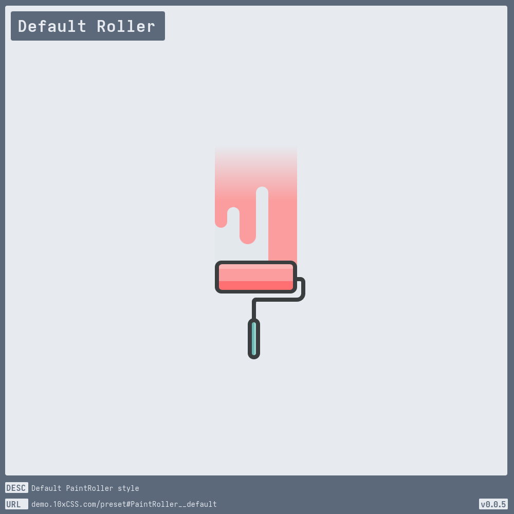
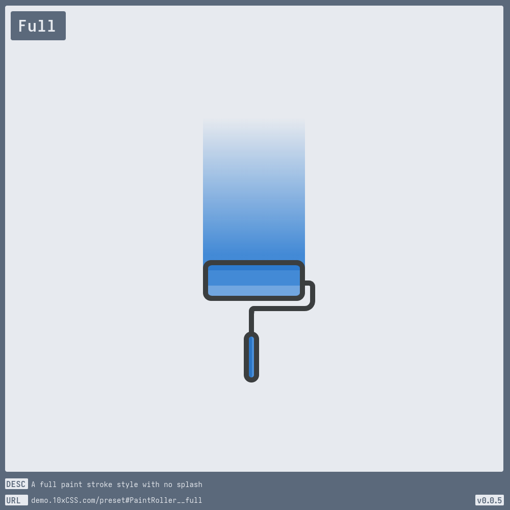
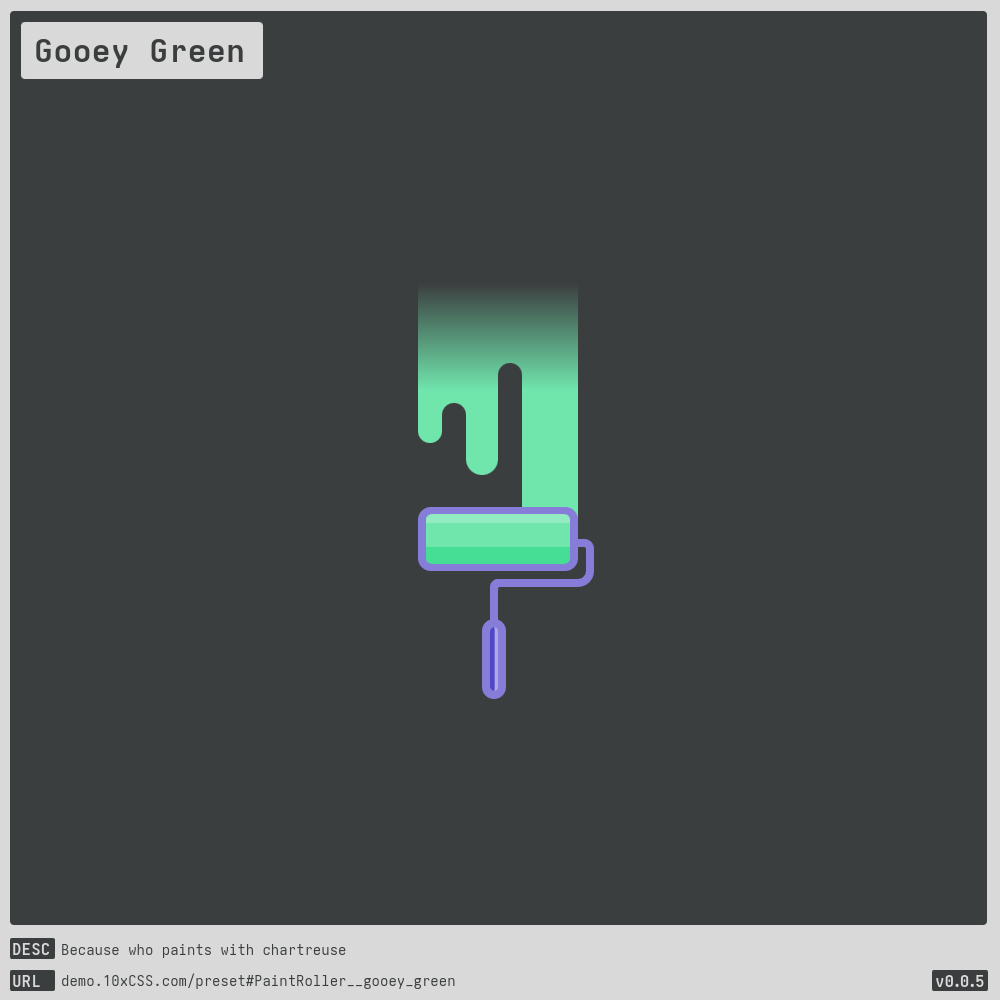
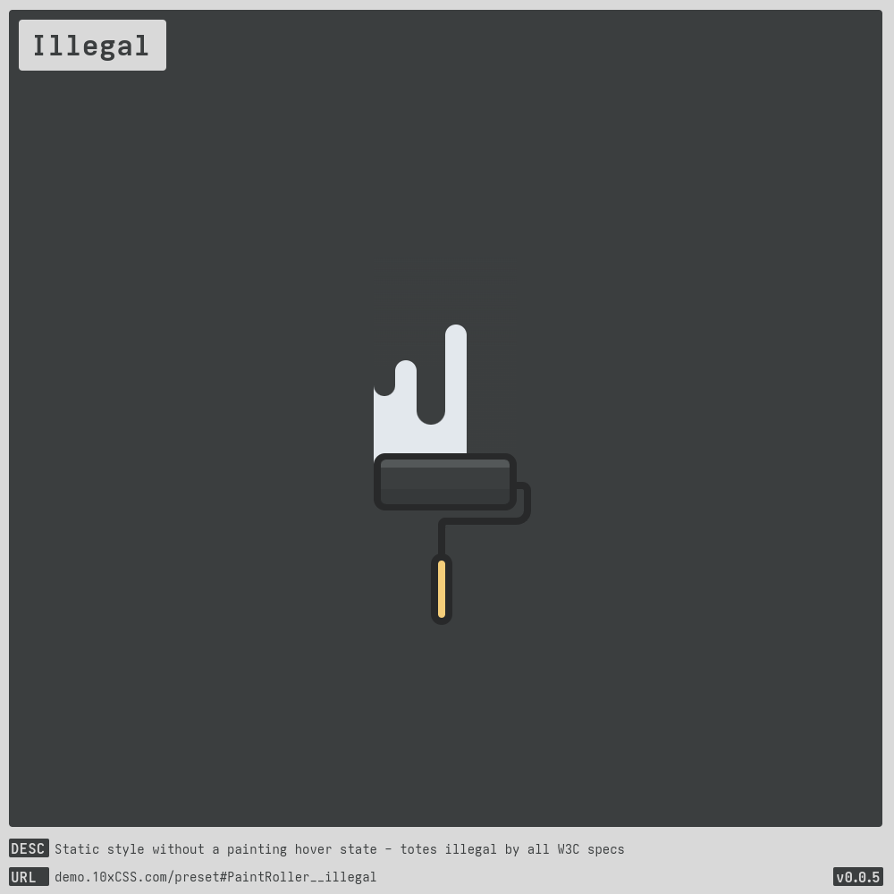

# [PaintRoller](https://demo.10xCSS.com/preset#PaintRoller)

> __`CID `__  PaintRoller  
> __`DESC`__  A Paint Roller style, sourced from Chicago’s finest CSS export, [cassidoo](https://cassidoo.co).  
> __`LINK`__  [demo.10xCSS.com/preset#PaintRoller](https://demo.10xCSS.com/preset#PaintRoller)  
> __`NOTE`__  none  
> __`VERS`__  1  

|Table                            |of                               |Contents                         |
|:--------------------------------|:--------------------------------|:--------------------------------|
|[Default Roller](#default-roller)|[Gooey Green](#gooey-green)      |[Smallest](#smallest)            |
|[Full](#full)                    |[Illegal](#illegal)              |[Zero Style](#zero-style)        |
---

### _All-in-One_
_(todo-video-placeholder)_

### Default Roller
> `desc`: Default [PaintRoller](https://10xCSS.com/dashboard/presets?cid=PaintRoller&uid=PaintRoller__default) style  
> `link`: [demo.10xCSS.com/preset#PaintRoller__default](https://demo.10xCSS.com/dashboard/presets?cid=PaintRoller&uid=PaintRoller__default)  
> `time`: 2023-10-22 ⇒ 2024-04-09  
> `vers`: 1  

### Full
> `desc`: A full paint stroke style with no splash  
> `link`: [demo.10xCSS.com/preset#PaintRoller__full](https://demo.10xCSS.com/dashboard/presets?cid=PaintRoller&uid=PaintRoller__full)  
> `time`: 2023-10-22 ⇒ 2024-04-08  
> `vers`: 1  

### Gooey Green
> `desc`: Because who paints with chartreuse  
> `link`: [demo.10xCSS.com/preset#PaintRoller__gooey_green](https://demo.10xCSS.com/dashboard/presets?cid=PaintRoller&uid=PaintRoller__gooey_green)  
> `time`: 2024-04-27  
> `vers`: 1  

### Illegal
> `desc`: Static style without a painting hover state - totes illegal by all W3C specs  
> `link`: [demo.10xCSS.com/preset#PaintRoller__illegal](https://demo.10xCSS.com/dashboard/presets?cid=PaintRoller&uid=PaintRoller__illegal)  
> `time`: 2023-10-22 ⇒ 2024-04-08  
> `vers`: 1  

### Smallest
> `desc`: You can go smaller, but it's designed for whole pixels, not subpixels  
> `link`: [demo.10xCSS.com/preset#PaintRoller__smallest](https://demo.10xCSS.com/dashboard/presets?cid=PaintRoller&uid=PaintRoller__smallest)  
> `time`: 2023-10-22 ⇒ 2024-04-08  
> `vers`: 1  

### Zero Style
> `desc`: A baseline zero/blank style for the [#cssexp](https://www.youtube.com/playlist?list=PLjzn_iVJxcJgGSQSA5uhD3PCHObCQLOpG) video series  
> `link`: [demo.10xCSS.com/preset#PaintRoller__zero_style](https://demo.10xCSS.com/dashboard/presets?cid=PaintRoller&uid=PaintRoller__zero_style)  
> `time`: 2024-04-27 ⇒ 2024-04-29  
> `vers`: 1  

