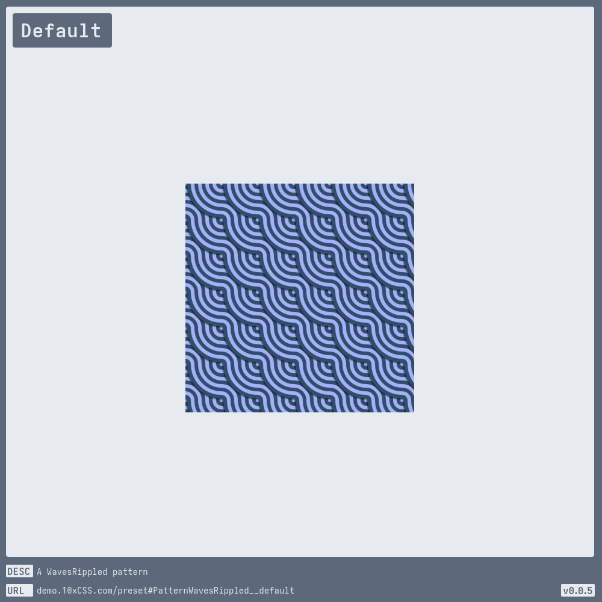
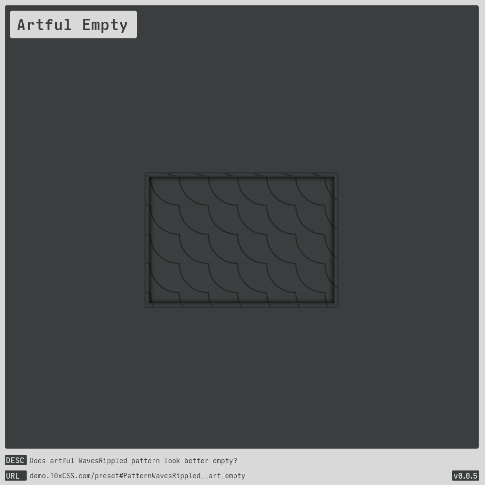
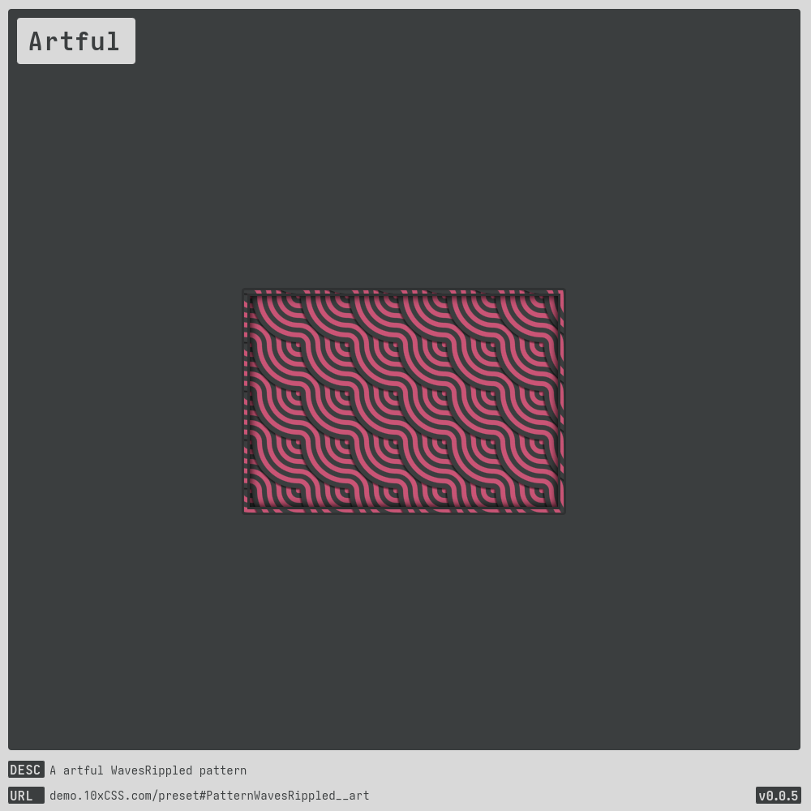
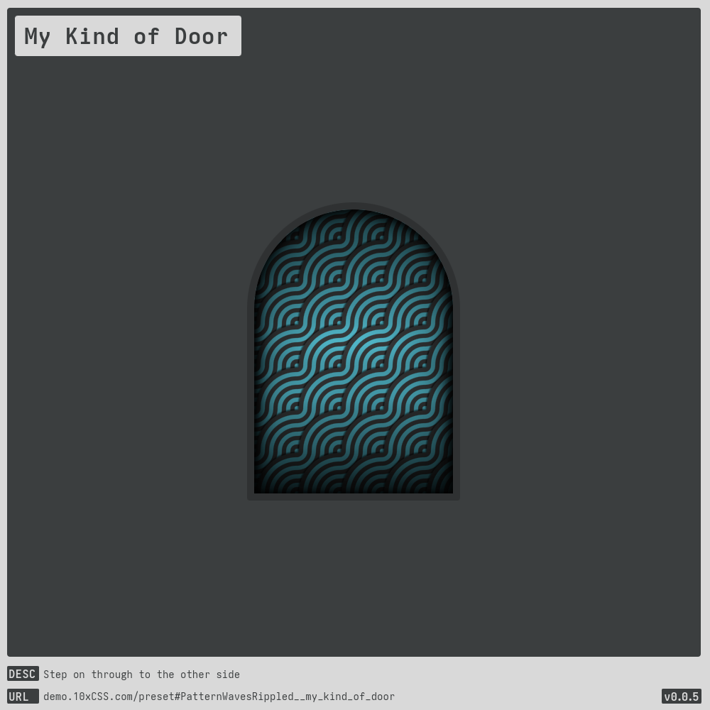
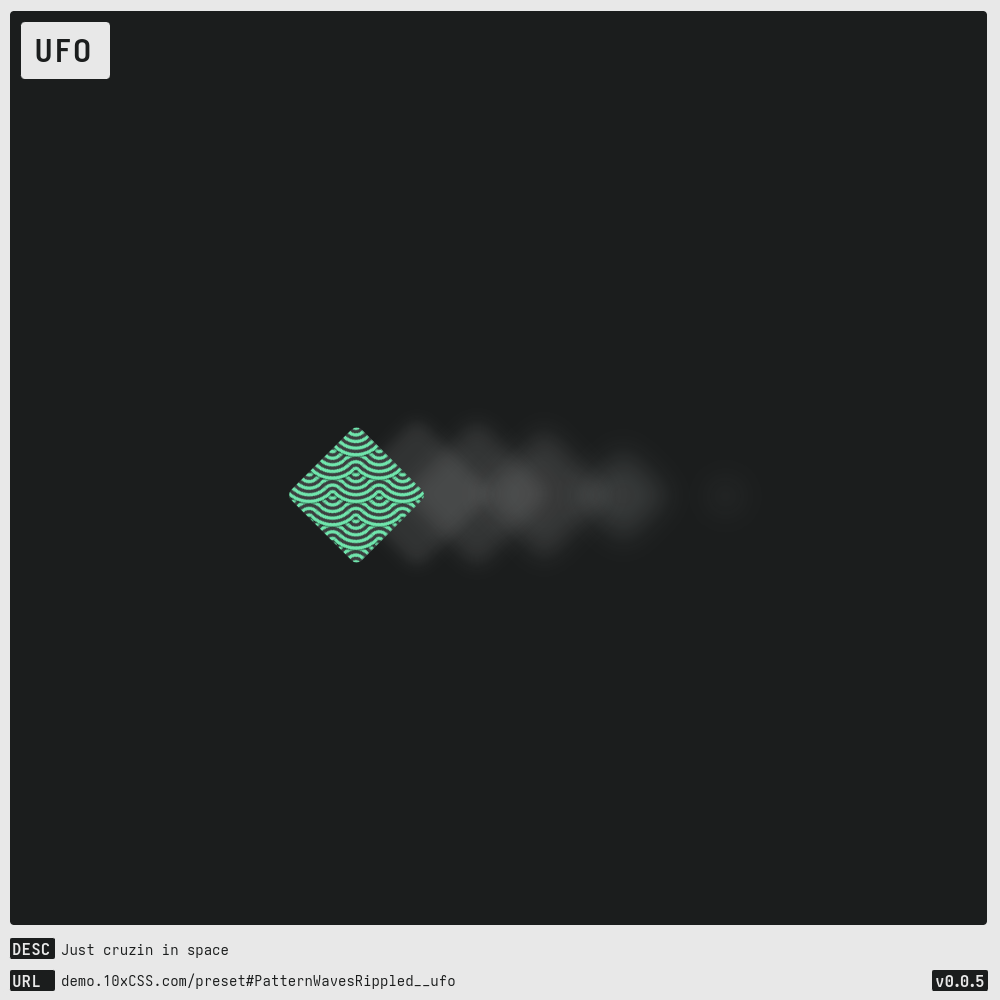

# [Pattern WavesRippled](https://demo.10xCSS.com/preset#PatternWavesRippled)

> __`CID `__  PatternWavesRippled  
> __`DESC`__  A pattern style: WavesRippled  
> __`SPON`__  Just a heads-up, this style is scheduled to soon vanish behind the Great Paywall of Sponsorship.  
> __`LINK`__  [demo.10xCSS.com/preset#PatternWavesRippled](https://demo.10xCSS.com/preset#PatternWavesRippled)  
> __`NOTE`__  none  
> __`VERS`__  1  

|Table                              |of                                 |Contents                           |
|:----------------------------------|:----------------------------------|:----------------------------------|
|[Default](#default)                |[Artful](#artful)                  |[UFO](#ufo)                        |
|[Artful Empty](#artful-empty)      |[My Kind of Door](#my-kind-of-door)|                                   |
---

### _All-in-One_
_(todo-video-placeholder)_

### Default
> `desc`: A WavesRippled pattern  
> `link`: [demo.10xCSS.com/preset#PatternWavesRippled__default](https://demo.10xCSS.com/dashboard/presets?cid=PatternWavesRippled&uid=PatternWavesRippled__default)  
> __type__: ★ sponsor ★  
> `time`: 2024-07-04 ⇒ 2024-07-08  
> `vers`: 1  

### Artful Empty
> `desc`: Does artful WavesRippled pattern look better empty?  
> `link`: [demo.10xCSS.com/preset#PatternWavesRippled__art_empty](https://demo.10xCSS.com/dashboard/presets?cid=PatternWavesRippled&uid=PatternWavesRippled__art_empty)  
> __type__: ★ sponsor ★  
> `time`: 2024-08-07  
> `vers`: 1  

### Artful
> `desc`: A artful WavesRippled pattern  
> `link`: [demo.10xCSS.com/preset#PatternWavesRippled__art](https://demo.10xCSS.com/dashboard/presets?cid=PatternWavesRippled&uid=PatternWavesRippled__art)  
> __type__: ★ sponsor ★  
> `time`: 2024-07-04 ⇒ 2024-07-08  
> `vers`: 1  

### My Kind of Door
> `desc`: Step on through to the other side  
> `link`: [demo.10xCSS.com/preset#PatternWavesRippled__my_kind_of_door](https://demo.10xCSS.com/dashboard/presets?cid=PatternWavesRippled&uid=PatternWavesRippled__my_kind_of_door)  
> __type__: ★ sponsor ★  
> `time`: 2024-08-07  
> `vers`: 1  

### UFO
> `desc`: Just cruzin in space  
> `link`: [demo.10xCSS.com/preset#PatternWavesRippled__ufo](https://demo.10xCSS.com/dashboard/presets?cid=PatternWavesRippled&uid=PatternWavesRippled__ufo)  
> __type__: ★ sponsor ★  
> `time`: 2024-08-07  
> `vers`: 1  

