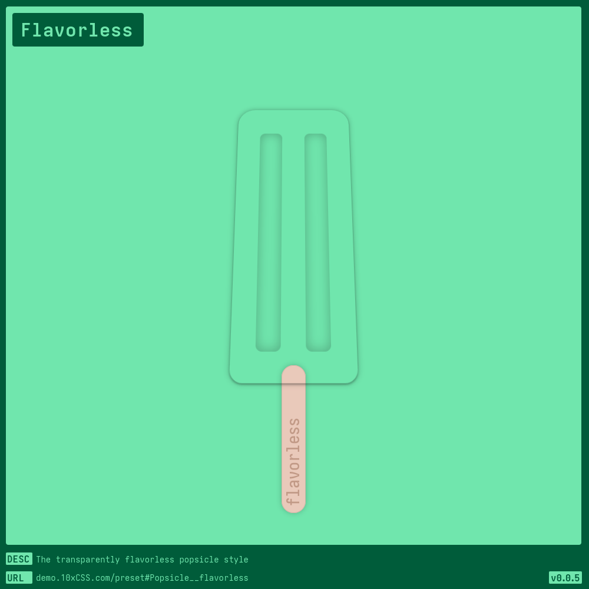
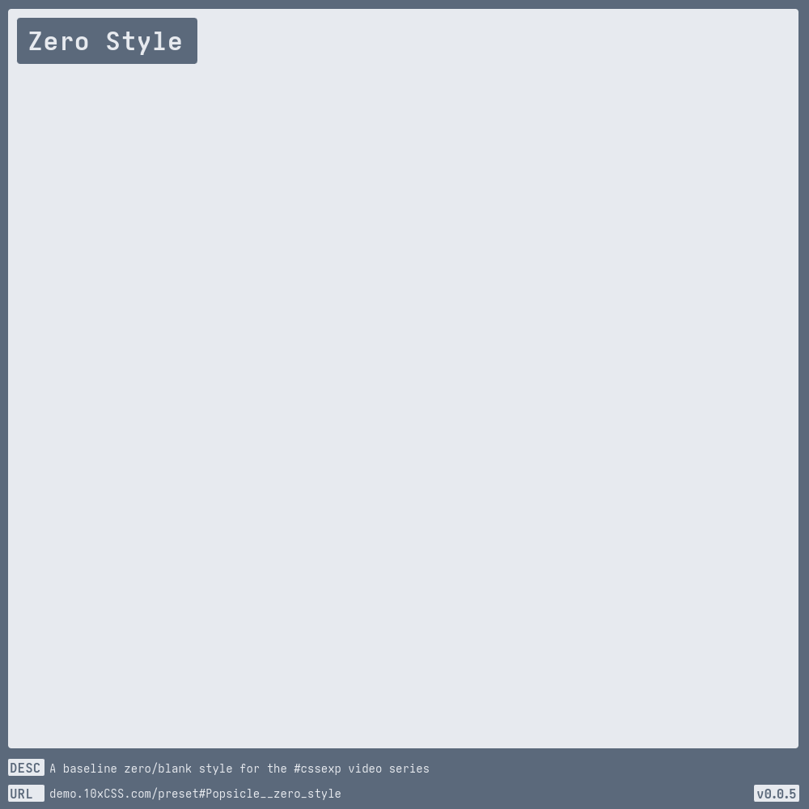

# [Popsicle](https://demo.10xCSS.com/preset#Popsicle)

> __`CID `__  Popsicle  
> __`DESC`__  A family favorite — a Popsicle style by [@wesbos](https://twitter.com/wesbos).  
> __`LINK`__  [demo.10xCSS.com/preset#Popsicle](https://demo.10xCSS.com/preset#Popsicle)  
> __`NOTE`__  An example of a simpler component in terms of its editable properties.  
> __`VERS`__  2  

|Table                                |of                                   |Contents                             |
|:------------------------------------|:------------------------------------|:------------------------------------|
|[Default Popsicle](#default-popsicle)|[Pixel Pop](#pixel-pop)              |[ARCHIVE](#archive)                  |
|[Flat](#flat)                        |[tenXcss](#tenxcss)                  |                                     |
|[Flavorless](#flavorless)            |[Zero Style](#zero-style)            |                                     |
---

### _All-in-One_
_(todo-video-placeholder)_

### Default Popsicle
> `desc`: Default red, white, and blue [Popsicle](https://10xCSS.com/dashboard/presets?cid=Popsicle&uid=Popsicle__default) style  
> `link`: [demo.10xCSS.com/preset#Popsicle__default](https://demo.10xCSS.com/dashboard/presets?cid=Popsicle&uid=Popsicle__default)  
> `time`: 2023-10-22 ⇒ 2024-05-03  
> `vers`: 2  

### Flat
> `desc`: A flat popsicle  
> `link`: [demo.10xCSS.com/preset#Popsicle__flat](https://demo.10xCSS.com/dashboard/presets?cid=Popsicle&uid=Popsicle__flat)  
> `time`: 2023-10-22 ⇒ 2024-05-03  
> `vers`: 2  

### Flavorless
> `desc`: The transparently flavorless popsicle style  
> `link`: [demo.10xCSS.com/preset#Popsicle__flavorless](https://demo.10xCSS.com/dashboard/presets?cid=Popsicle&uid=Popsicle__flavorless)  
> `time`: 2023-10-22 ⇒ 2024-05-03  
> `vers`: 2  

### Pixel Pop
> `desc`: A fixed pixel popsicle style, for that static taste  
> `link`: [demo.10xCSS.com/preset#Popsicle__pixel](https://demo.10xCSS.com/dashboard/presets?cid=Popsicle&uid=Popsicle__pixel)  
> `time`: 2023-10-22 ⇒ 2024-05-03  
> `vers`: 2  

### tenXcss
> `desc`: The 10xCSS flavored popsicle  
> `link`: [demo.10xCSS.com/preset#Popsicle__tenxcss](https://demo.10xCSS.com/dashboard/presets?cid=Popsicle&uid=Popsicle__tenxcss)  
> `time`: 2023-10-22 ⇒ 2024-05-03  
> `vers`: 2  

### Zero Style
> `desc`: A baseline zero/blank style for the [#cssexp](https://www.youtube.com/playlist?list=PLjzn_iVJxcJgGSQSA5uhD3PCHObCQLOpG) video series  
> `link`: [demo.10xCSS.com/preset#Popsicle__zero_style](https://demo.10xCSS.com/dashboard/presets?cid=Popsicle&uid=Popsicle__zero_style)  
> `time`: 2024-04-27 ⇒ 2024-05-03  
> `vers`: 2  

---

### ARCHIVE

The styles listed here in the ARCHIVE have been phased out, reworked, or trashed for one reason or another. However, should the need or desire arise, you have the ability to create or alter any of these styles, as they are statically linked to the version in which they were last used with.

|Popsicle v1                                                                                            |[v003.10xCSS.com](https://v003.10xCSS.com/dashboard/presets?cid=Popsicle)                              |                                                                                                       |
|:------------------------------------------------------------------------------------------------------|:------------------------------------------------------------------------------------------------------|:------------------------------------------------------------------------------------------------------|
|[Popsicle__default](https://v003.10xCSS.com/dashboard/presets?cid=Popsicle&uid=Popsicle__default)      |[Popsicle__flavorless](https://v003.10xCSS.com/dashboard/presets?cid=Popsicle&uid=Popsicle__flavorless)|[Popsicle__tenxcss](https://v003.10xCSS.com/dashboard/presets?cid=Popsicle&uid=Popsicle__tenxcss)      |
|[Popsicle__flat](https://v003.10xCSS.com/dashboard/presets?cid=Popsicle&uid=Popsicle__flat)            |[Popsicle__pixel](https://v003.10xCSS.com/dashboard/presets?cid=Popsicle&uid=Popsicle__pixel)          |[Popsicle__zero_style](https://v003.10xCSS.com/dashboard/presets?cid=Popsicle&uid=Popsicle__zero_style)|
