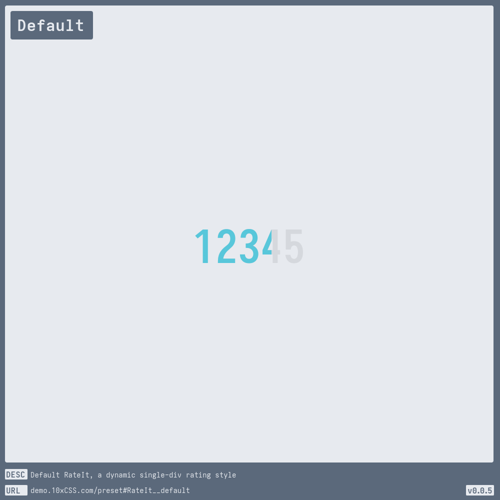
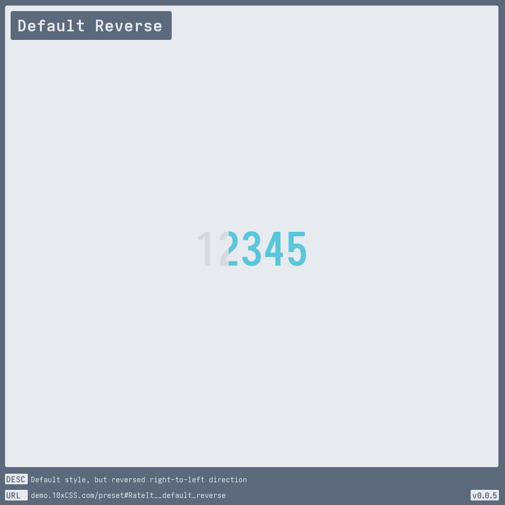
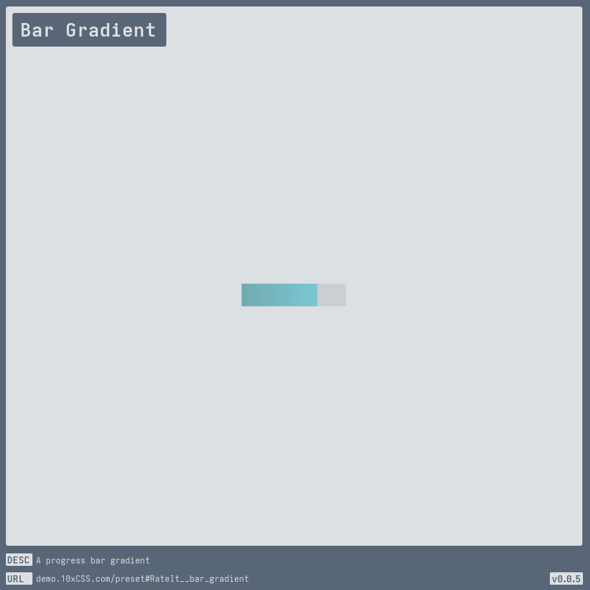
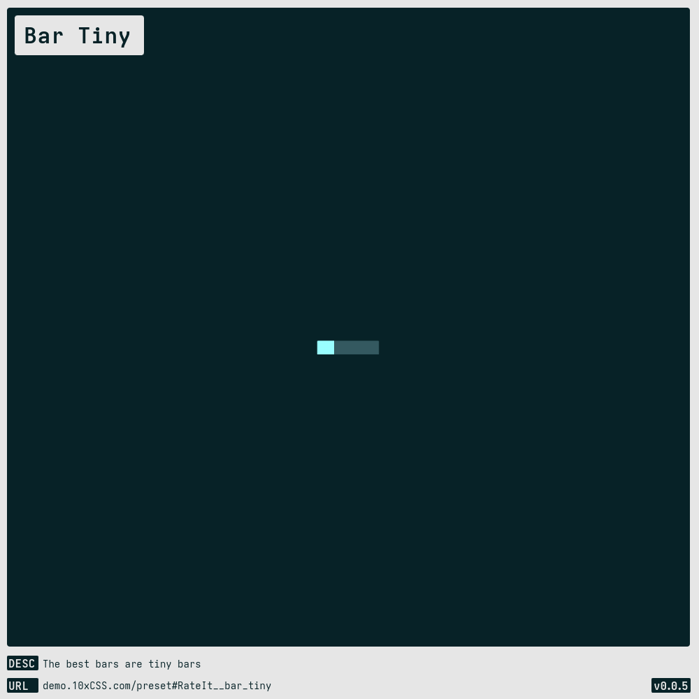
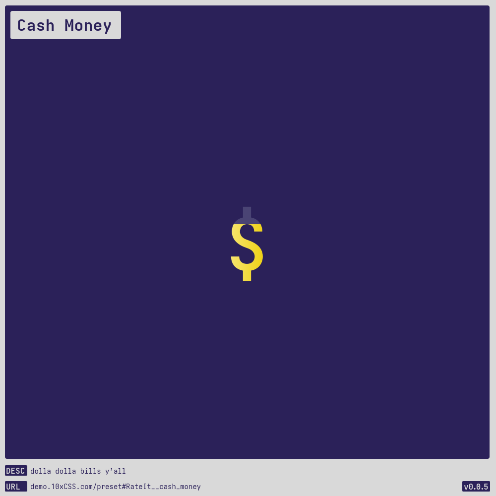
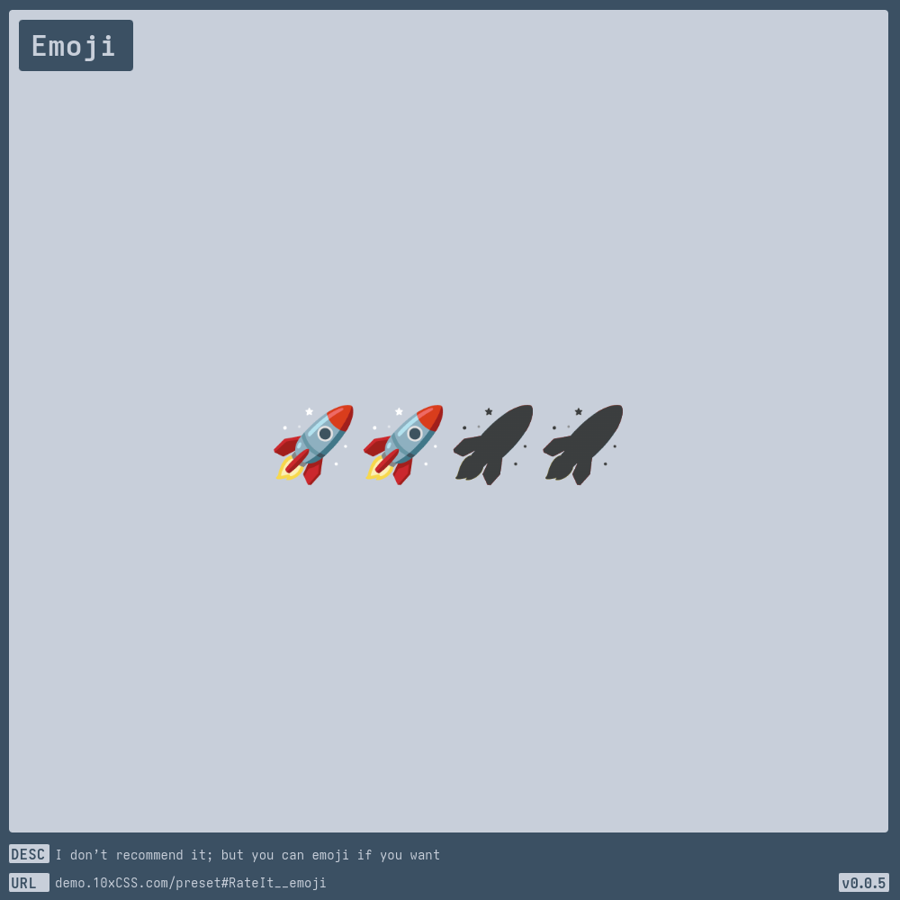
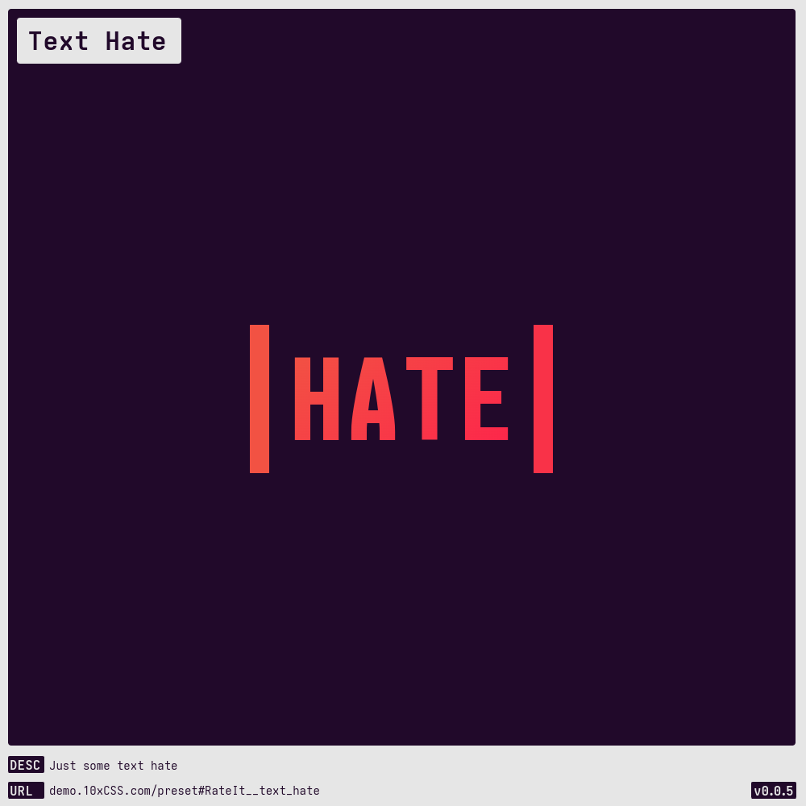
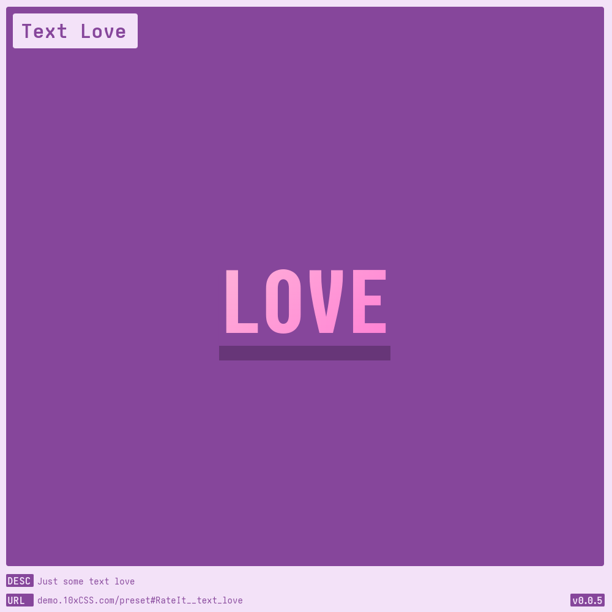

# [Rate It](https://demo.10xCSS.com/preset#RateIt)

> __`CID `__  RateIt  
> __`DESC`__  A dynamic single-div rating icon, text, and/or thingamabob, sourced from one of my favorite CSS deities, [@anatudor](https://twitter.com/anatudor).  
> __`LINK`__  [demo.10xCSS.com/preset#RateIt](https://demo.10xCSS.com/preset#RateIt)  
> __`NOTE`__  The rating value can be dynamically adjustable via the  CSS property `--RateIt-rating-value`. For a basic example, refer to the JavaScript implementation within the HTML output.  
> __`VERS`__  2  

|Table                                                |of                                                   |Contents                                             |
|:----------------------------------------------------|:----------------------------------------------------|:----------------------------------------------------|
|[Default](#default)                                  |[Cash Money](#cash-money)                            |[Funding](#funding)                                  |
|[Default Reverse](#default-reverse)                  |[Code](#code)                                        |[Rainy Rating](#rainy-rating)                        |
|[Default Vertical](#default-vertical)                |[Death](#death)                                      |[Text At Most](#text-at-most)                        |
|[Default Vertical Reverse](#default-vertical-reverse)|[Dubs](#dubs)                                        |[Text Hate](#text-hate)                              |
|[Bar Gradient](#bar-gradient)                        |[Dusty Six Star](#dusty-six-star)                    |[Text Love](#text-love)                              |
|[Bar Tiny](#bar-tiny)                                |[Emoji Alt](#emoji-alt)                              |[Yes](#yes)                                          |
|[Bar Vertical](#bar-vertical)                        |[Emoji](#emoji)                                      |[ARCHIVE](#archive)                                  |
---

### _All-in-One_
_(todo-video-placeholder)_

### Default
> `desc`: Default [RateIt](https://10xCSS.com/dashboard/presets?cid=RateIt&uid=RateIt__default), a dynamic single-div rating style  
> `link`: [demo.10xCSS.com/preset#RateIt__default](https://demo.10xCSS.com/dashboard/presets?cid=RateIt&uid=RateIt__default)  
> `time`: 2023-10-22 ⇒ 2024-05-03  
> `vers`: 2  

### Default Reverse
> `desc`: Default style, but reversed right-to-left direction  
> `link`: [demo.10xCSS.com/preset#RateIt__default_reverse](https://demo.10xCSS.com/dashboard/presets?cid=RateIt&uid=RateIt__default_reverse)  
> `time`: 2024-05-03  
> `vers`: 2  

### Default Vertical
> `desc`: Default style, but vertical top-to-bottom  
> `link`: [demo.10xCSS.com/preset#RateIt__default_vertical](https://demo.10xCSS.com/dashboard/presets?cid=RateIt&uid=RateIt__default_vertical)  
> `time`: 2024-04-30  
> `vers`: 2  

### Default Vertical Reverse
> `desc`: Default style, but vertical bottom-to-top  
> `link`: [demo.10xCSS.com/preset#RateIt__default_vertical_reverse](https://demo.10xCSS.com/dashboard/presets?cid=RateIt&uid=RateIt__default_vertical_reverse)  
> `time`: 2024-05-03  
> `vers`: 2  

### Bar Gradient
> `desc`: A progress bar gradient  
> `link`: [demo.10xCSS.com/preset#RateIt__bar_gradient](https://demo.10xCSS.com/dashboard/presets?cid=RateIt&uid=RateIt__bar_gradient)  
> `time`: 2024-05-03  
> `vers`: 2  

### Bar Tiny
> `desc`: The best bars are tiny bars  
> `link`: [demo.10xCSS.com/preset#RateIt__bar_tiny](https://demo.10xCSS.com/dashboard/presets?cid=RateIt&uid=RateIt__bar_tiny)  
> `time`: 2024-05-03  
> `vers`: 2  

### Bar Vertical
> `desc`: A vertical bar, for vertical things  
> `link`: [demo.10xCSS.com/preset#RateIt__bar_vertical](https://demo.10xCSS.com/dashboard/presets?cid=RateIt&uid=RateIt__bar_vertical)  
> `time`: 2024-05-03  
> `vers`: 2  

### Cash Money
> `desc`: dolla dolla bills y’all  
> `link`: [demo.10xCSS.com/preset#RateIt__cash_money](https://demo.10xCSS.com/dashboard/presets?cid=RateIt&uid=RateIt__cash_money)  
> `time`: 2024-05-03  
> `vers`: 2  

### Code
> `desc`: Only code with languages that have an HN rating of three tildes or greater  
> `link`: [demo.10xCSS.com/preset#RateIt__code](https://demo.10xCSS.com/dashboard/presets?cid=RateIt&uid=RateIt__code)  
> `time`: 2024-05-03  
> `vers`: 2  

### Death
> `desc`: One out of five skullz, do not recommend  
> `link`: [demo.10xCSS.com/preset#RateIt__death](https://demo.10xCSS.com/dashboard/presets?cid=RateIt&uid=RateIt__death)  
> `time`: 2023-10-22 ⇒ 2024-05-03  
> `vers`: 2  

### Dubs
> `desc`: Double the fun with two colors  
> `link`: [demo.10xCSS.com/preset#RateIt__dubs](https://demo.10xCSS.com/dashboard/presets?cid=RateIt&uid=RateIt__dubs)  
> `time`: 2024-04-30  
> `vers`: 2  

### Dusty Six Star
> `desc`: The sheriff in town  
> `link`: [demo.10xCSS.com/preset#RateIt__dusty_six_star](https://demo.10xCSS.com/dashboard/presets?cid=RateIt&uid=RateIt__dusty_six_star)  
> `time`: 2024-05-03  
> `vers`: 2  

### Emoji Alt
> `desc`: Mileage varies as glyph/symobls != emojis which tend to bleed  
> `link`: [demo.10xCSS.com/preset#RateIt__emoji_alt](https://demo.10xCSS.com/dashboard/presets?cid=RateIt&uid=RateIt__emoji_alt)  
> `time`: 2024-04-27 ⇒ 2024-05-03  
> `vers`: 2  

### Emoji
> `desc`: I don’t recommend it; but you can emoji if you want  
> `link`: [demo.10xCSS.com/preset#RateIt__emoji](https://demo.10xCSS.com/dashboard/presets?cid=RateIt&uid=RateIt__emoji)  
> `time`: 2023-10-22 ⇒ 2024-05-03  
> `vers`: 2  

### Funding
> `desc`: A funding style and header all packed into one  
> `link`: [demo.10xCSS.com/preset#RateIt__funding](https://demo.10xCSS.com/dashboard/presets?cid=RateIt&uid=RateIt__funding)  
> `time`: 2024-05-03  
> `vers`: 2  

### Rainy Rating
> `desc`: The chance of rain this afternoon: three out of four umbrellas  
> `link`: [demo.10xCSS.com/preset#RateIt__rainy_rating](https://demo.10xCSS.com/dashboard/presets?cid=RateIt&uid=RateIt__rainy_rating)  
> `time`: 2024-04-27 ⇒ 2024-05-03  
> `vers`: 2  

### Text At Most
> `desc`: There is no law against using this style solely for text  
> `link`: [demo.10xCSS.com/preset#RateIt__text_at_most](https://demo.10xCSS.com/dashboard/presets?cid=RateIt&uid=RateIt__text_at_most)  
> `time`: 2024-05-03  
> `vers`: 2  

### Text Hate
> `desc`: Just some text hate  
> `link`: [demo.10xCSS.com/preset#RateIt__text_hate](https://demo.10xCSS.com/dashboard/presets?cid=RateIt&uid=RateIt__text_hate)  
> `time`: 2024-05-03  
> `vers`: 2  

### Text Love
> `desc`: Just some text love  
> `link`: [demo.10xCSS.com/preset#RateIt__text_love](https://demo.10xCSS.com/dashboard/presets?cid=RateIt&uid=RateIt__text_love)  
> `time`: 2024-05-03  
> `vers`: 2  

### Yes
> `desc`: I did spend an hour+ creating this style, and no, I don’t regret it  
> `link`: [demo.10xCSS.com/preset#RateIt__yes](https://demo.10xCSS.com/dashboard/presets?cid=RateIt&uid=RateIt__yes)  
> `time`: 2024-05-03  
> `vers`: 2  

---

### ARCHIVE

The styles listed here in the ARCHIVE have been phased out, reworked, or trashed for one reason or another. However, should the need or desire arise, you have the ability to create or alter any of these styles, as they are statically linked to the version in which they were last used with.

|RateIt v1                                                                                            |[v003.10xCSS.com](https://v003.10xCSS.com/dashboard/presets?cid=RateIt)                              |                                                                                                     |
|:----------------------------------------------------------------------------------------------------|:----------------------------------------------------------------------------------------------------|:----------------------------------------------------------------------------------------------------|
|[RateIt__default](https://v003.10xCSS.com/dashboard/presets?cid=RateIt&uid=RateIt__default)          |[RateIt__emoji](https://v003.10xCSS.com/dashboard/presets?cid=RateIt&uid=RateIt__emoji)              |[RateIt__just_text](https://v003.10xCSS.com/dashboard/presets?cid=RateIt&uid=RateIt__just_text)      |
|[RateIt__death](https://v003.10xCSS.com/dashboard/presets?cid=RateIt&uid=RateIt__death)              |[RateIt__emoji_alt](https://v003.10xCSS.com/dashboard/presets?cid=RateIt&uid=RateIt__emoji_alt)      |[RateIt__rainy_rating](https://v003.10xCSS.com/dashboard/presets?cid=RateIt&uid=RateIt__rainy_rating)|
