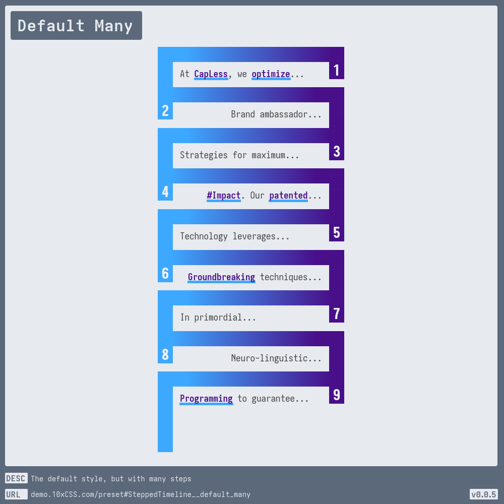

# [Stepped Timeline](https://demo.10xCSS.com/preset#SteppedTimeline)

> __`CID `__  SteppedTimeline  
> __`DESC`__  A stepped [border-image](https://developer.mozilla.org/en-US/docs/Web/CSS/border-image) timeline that packs incremental **IMPACT**! With its enchanting [linear-gradient](https://developer.mozilla.org/en-US/docs/Web/CSS/gradient/linear-gradient) borders and accentuated `.impact` underline styles, it will assuredly unshackle your sales funnel from earthly constraints so you and your fav five MySpace friends can visit the moon by next [syzygy](https://wikipedia.org/wiki/Syzygy_(astronomy)).  
> __`LINK`__  [demo.10xCSS.com/preset#SteppedTimeline](https://demo.10xCSS.com/preset#SteppedTimeline)  
> __`NOTE`__  none  
> __`VERS`__  1  

|Table                                      |of                                         |Contents                                   |                                           |                                           |
|:------------------------------------------|:------------------------------------------|:------------------------------------------|:------------------------------------------|:------------------------------------------|
|[Default](#default)                        |[Default StepLess](#default-stepless)      |[Default Custom Seed](#default-custom-seed)|[For Free](#for-free)                      |[Rain Maker](#rain-maker)                  |
|[Default Two](#default-two)                |[Default ImpactLess](#default-impactless)  |[Boxing In](#boxing-in)                    |[Inside Numbers](#inside-numbers)          |[Tabbed](#tabbed)                          |
|[Default Many](#default-many)              |[Default Align Left](#default-align-left)  |[Boxy Line](#boxy-line)                    |[Line Break](#line-break)                  |[Thinly Lined](#thinly-lined)              |
|[Default TextFull](#default-textfull)      |[Default Custom Text](#default-custom-text)|[Defeats The Purpose](#defeats-the-purpose)|[Number Down](#number-down)                |[Yellowin’ Inline](#yellowin-inline)       |
---

### _All-in-One_
_(todo-video-placeholder)_

### Default
> `desc`: A stepped [border-image](https://developer.mozilla.org/en-US/docs/Web/CSS/border-image) timeline that packs incremental **IMPACT**!  
> `link`: [demo.10xCSS.com/preset#SteppedTimeline__default](https://demo.10xCSS.com/dashboard/presets?cid=SteppedTimeline&uid=SteppedTimeline__default)  
> `time`: 2024-07-04 ⇒ 2024-08-07  
> `vers`: 1  

### Default Two
> `desc`: The default style, but with only two steps  
> `link`: [demo.10xCSS.com/preset#SteppedTimeline__default_two](https://demo.10xCSS.com/dashboard/presets?cid=SteppedTimeline&uid=SteppedTimeline__default_two)  
> `time`: 2024-07-04  
> `vers`: 1  

### Default Many
> `desc`: The default style, but with many steps  
> `link`: [demo.10xCSS.com/preset#SteppedTimeline__default_many](https://demo.10xCSS.com/dashboard/presets?cid=SteppedTimeline&uid=SteppedTimeline__default_many)  
> `time`: 2024-07-04  
> `vers`: 1  

### Default TextFull
> `desc`: The default style, but text-full, with 150+ words and 1000+ characters  
> `link`: [demo.10xCSS.com/preset#SteppedTimeline__default_textfull](https://demo.10xCSS.com/dashboard/presets?cid=SteppedTimeline&uid=SteppedTimeline__default_textfull)  
> `time`: 2024-07-04  
> `vers`: 1  

### Default StepLess
> `desc`: The default style, but without numbered timeline steps  
> `link`: [demo.10xCSS.com/preset#SteppedTimeline__default_stepless](https://demo.10xCSS.com/dashboard/presets?cid=SteppedTimeline&uid=SteppedTimeline__default_stepless)  
> `time`: 2024-07-04  
> `vers`: 1  

### Default ImpactLess
> `desc`: The default style, but without the underlined text impact styles  
> `link`: [demo.10xCSS.com/preset#SteppedTimeline__default_impactless](https://demo.10xCSS.com/dashboard/presets?cid=SteppedTimeline&uid=SteppedTimeline__default_impactless)  
> `time`: 2024-07-04  
> `vers`: 1  

### Default Align Left
> `desc`: The default style, but with the first step aligned on the left-side  
> `link`: [demo.10xCSS.com/preset#SteppedTimeline__default_align_left](https://demo.10xCSS.com/dashboard/presets?cid=SteppedTimeline&uid=SteppedTimeline__default_align_left)  
> `time`: 2024-07-04  
> `vers`: 1  

### Default Custom Text
> `desc`: The default style, but with custom text, an esteemed sponsor feature  
> `link`: [demo.10xCSS.com/preset#SteppedTimeline__default_custom_text](https://demo.10xCSS.com/dashboard/presets?cid=SteppedTimeline&uid=SteppedTimeline__default_custom_text)  
> `time`: 2024-07-04  
> `vers`: 1  

### Default Custom Seed
> `desc`: Default style, but with custom text via  seed, cuz sometimes I’m cheap too  
> `link`: [demo.10xCSS.com/preset#SteppedTimeline__default_custom_seed](https://demo.10xCSS.com/dashboard/presets?cid=SteppedTimeline&uid=SteppedTimeline__default_custom_seed)  
> `time`: 2024-07-04  
> `vers`: 1  

### Boxing In
> `desc`: Boxing in the content with mean numbers  
> `link`: [demo.10xCSS.com/preset#SteppedTimeline__boxing_in](https://demo.10xCSS.com/dashboard/presets?cid=SteppedTimeline&uid=SteppedTimeline__boxing_in)  
> `time`: 2024-07-04  
> `vers`: 1  

### Boxy Line
> `desc`: Thine timeline with independed boxed steps for boxy impact  
> `link`: [demo.10xCSS.com/preset#SteppedTimeline__boxy_line](https://demo.10xCSS.com/dashboard/presets?cid=SteppedTimeline&uid=SteppedTimeline__boxy_line)  
> `time`: 2024-07-04  
> `vers`: 1  

### Defeats The Purpose
> `desc`: But I'm not you're Mother so do as you please  
> `link`: [demo.10xCSS.com/preset#SteppedTimeline__defeats_the_purpose](https://demo.10xCSS.com/dashboard/presets?cid=SteppedTimeline&uid=SteppedTimeline__defeats_the_purpose)  
> `time`: 2024-07-04  
> `vers`: 1  

### For Free
> `desc`: A hot styled tea timeline that gets even hotter on hover  
> `link`: [demo.10xCSS.com/preset#SteppedTimeline__for_free](https://demo.10xCSS.com/dashboard/presets?cid=SteppedTimeline&uid=SteppedTimeline__for_free)  
> `time`: 2024-07-08 ⇒ 2024-08-07  
> `vers`: 1  

### Inside Numbers
> `desc`: A style that puts the numbers inside the inside  
> `link`: [demo.10xCSS.com/preset#SteppedTimeline__inside_numbers](https://demo.10xCSS.com/dashboard/presets?cid=SteppedTimeline&uid=SteppedTimeline__inside_numbers)  
> `time`: 2024-07-08 ⇒ 2024-08-07  
> `vers`: 1  

### Line Break
> `desc`: Throw a transform on this style and rotate(90deg), tada: a fancy line break  
> `link`: [demo.10xCSS.com/preset#SteppedTimeline__line_break](https://demo.10xCSS.com/dashboard/presets?cid=SteppedTimeline&uid=SteppedTimeline__line_break)  
> `time`: 2024-07-12  
> `vers`: 1  

### Number Down
> `desc`: A timeline with numbers down near the bottom of the box  
> `link`: [demo.10xCSS.com/preset#SteppedTimeline__number_down](https://demo.10xCSS.com/dashboard/presets?cid=SteppedTimeline&uid=SteppedTimeline__number_down)  
> `time`: 2024-07-04  
> `vers`: 1  

### Rain Maker
> `desc`: A blocky rain maker style that is sure to sell  
> `link`: [demo.10xCSS.com/preset#SteppedTimeline__rain_maker](https://demo.10xCSS.com/dashboard/presets?cid=SteppedTimeline&uid=SteppedTimeline__rain_maker)  
> `time`: 2024-07-04 ⇒ 2024-07-08  
> `vers`: 1  

### Tabbed
> `desc`: A tabbed timeline, that has unexpected potential  
> `link`: [demo.10xCSS.com/preset#SteppedTimeline__tabbed](https://demo.10xCSS.com/dashboard/presets?cid=SteppedTimeline&uid=SteppedTimeline__tabbed)  
> `time`: 2024-07-04  
> `vers`: 1  

### Thinly Lined
> `desc`: A thinly lined timeline style for precision impact  
> `link`: [demo.10xCSS.com/preset#SteppedTimeline__thinly_lined](https://demo.10xCSS.com/dashboard/presets?cid=SteppedTimeline&uid=SteppedTimeline__thinly_lined)  
> `time`: 2024-07-04  
> `vers`: 1  

### Yellowin’ Inline
> `desc`: Solid inlined timeline number steps for inlined impact  
> `link`: [demo.10xCSS.com/preset#SteppedTimeline__yellowin_inline](https://demo.10xCSS.com/dashboard/presets?cid=SteppedTimeline&uid=SteppedTimeline__yellowin_inline)  
> `time`: 2024-07-04  
> `vers`: 1  

