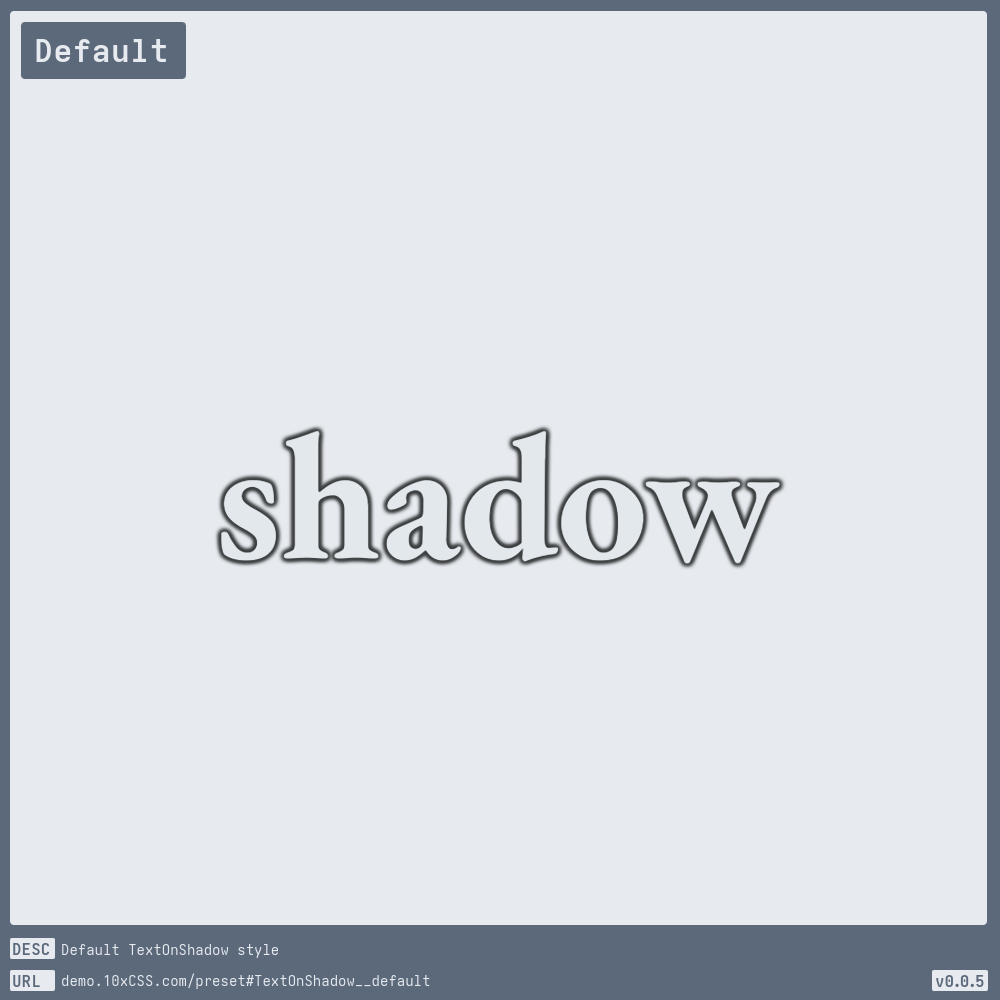
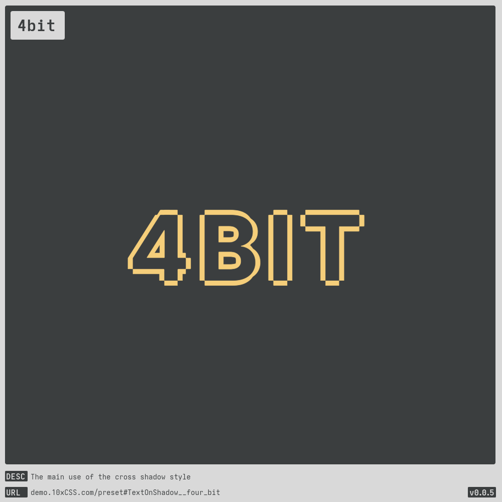
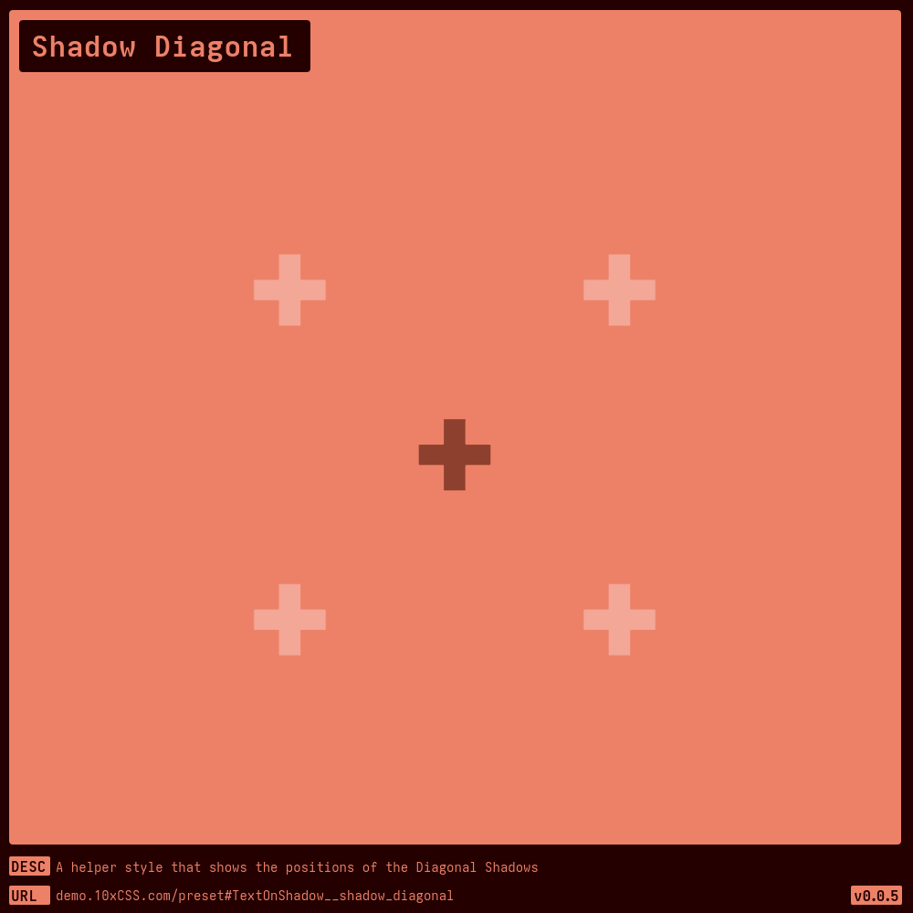
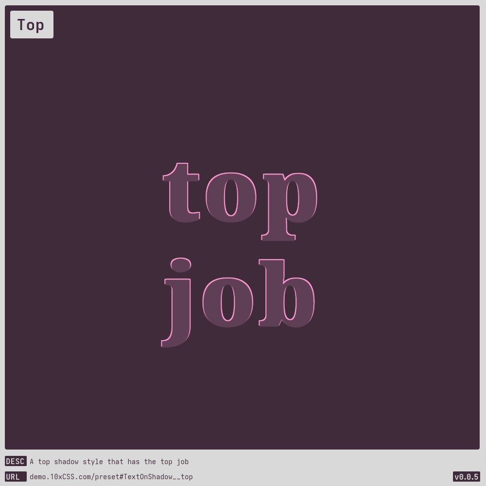

# [Text On Shadow](https://demo.10xCSS.com/preset#TextOnShadow)

> __`CID `__  TextOnShadow  
> __`DESC`__  This [text-shadow](https://developer.mozilla.org/en-US/docs/Web/CSS/text-shadow) style will refine your design, elevate your prose, and win you all the Awwwards. Well, perhaps not the latter, because that’s a pay-to-play scheme.  
> __`SPON`__  Just a heads-up, this style may vanish behind the Great Paywall of [Sponsorship](https://github.com/sponsors/10xCSS), so one day I can afford to [I]win[I] an Awwward.  
> __`LINK`__  [demo.10xCSS.com/preset#TextOnShadow](https://demo.10xCSS.com/preset#TextOnShadow)  
> __`NOTE`__  none  
> __`VERS`__  1  

|Table                                |of                                   |Contents                             |                                     |                                     |                                     |
|:------------------------------------|:------------------------------------|:------------------------------------|:------------------------------------|:------------------------------------|:------------------------------------|
|[Default](#default)                  |[Bottom Right](#bottom-right)        |[Funky](#funky)                      |[Neo New](#neo-new)                  |[Shadow Cross](#shadow-cross)        |[Top Left](#top-left)                |
|[Default Outline](#default-outline)  |[Erotic Myopic](#erotic-myopic)      |[Hot Cross Buns](#hot-cross-buns)    |[Neo Not](#neo-not)                  |[Shadow Diagonal](#shadow-diagonal)  |[Top Right](#top-right)              |
|[blurry](#blurry)                    |[fancy](#fancy)                      |[ICe](#ice)                          |[Porous](#porous)                    |[Showbiz](#showbiz)                  |[Top](#top)                          |
|[Bottom Left](#bottom-left)          |[4bit](#4bit)                        |[Is It Me](#is-it-me)                |[Shadow Both](#shadow-both)          |[Spooky](#spooky)                    |[x marks the spot](#x-marks-the-spot)|
---

### _All-in-One_
_(todo-video-placeholder)_

### Default
> `desc`: Default [TextOnShadow](https://10xCSS.com/dashboard/presets?cid=TextOnShadow&uid=TextOnShadow__default) style  
> `link`: [demo.10xCSS.com/preset#TextOnShadow__default](https://demo.10xCSS.com/dashboard/presets?cid=TextOnShadow&uid=TextOnShadow__default)  
> `time`: 2024-07-12  
> `vers`: 1  

### Default Outline
> `desc`: Default style, but without blur, also know as an outline  
> `link`: [demo.10xCSS.com/preset#TextOnShadow__default_outline](https://demo.10xCSS.com/dashboard/presets?cid=TextOnShadow&uid=TextOnShadow__default_outline)  
> `time`: 2024-07-12  
> `vers`: 1  

### blurry
> `desc`: A header style for optometrists worldwide  
> `link`: [demo.10xCSS.com/preset#TextOnShadow__blurry](https://demo.10xCSS.com/dashboard/presets?cid=TextOnShadow&uid=TextOnShadow__blurry)  
> `time`: 2024-07-12 ⇒ 2024-08-07  
> `vers`: 1  

### Bottom Left
> `desc`: A bottom-left shadow style that’s attested to be the best  
> `link`: [demo.10xCSS.com/preset#TextOnShadow__bottom_left](https://demo.10xCSS.com/dashboard/presets?cid=TextOnShadow&uid=TextOnShadow__bottom_left)  
> `time`: 2024-07-12 ⇒ 2024-08-07  
> `vers`: 1  

### Bottom Right
> `desc`: A bottom-right shadow style that has might to excite  
> `link`: [demo.10xCSS.com/preset#TextOnShadow__bottom_right](https://demo.10xCSS.com/dashboard/presets?cid=TextOnShadow&uid=TextOnShadow__bottom_right)  
> `time`: 2024-07-12 ⇒ 2024-08-07  
> `vers`: 1  

### Erotic Myopic
> `desc`: The name of my rock band  
> `link`: [demo.10xCSS.com/preset#TextOnShadow__erotic_myopic](https://demo.10xCSS.com/dashboard/presets?cid=TextOnShadow&uid=TextOnShadow__erotic_myopic)  
> `time`: 2024-08-12  
> `vers`: 1  

### fancy
> `desc`: i like fancy armoires  
> `link`: [demo.10xCSS.com/preset#TextOnShadow__fancy](https://demo.10xCSS.com/dashboard/presets?cid=TextOnShadow&uid=TextOnShadow__fancy)  
> `time`: 2024-08-12  
> `vers`: 1  

### 4bit
> `desc`: The main use of the cross shadow style  
> `link`: [demo.10xCSS.com/preset#TextOnShadow__four_bit](https://demo.10xCSS.com/dashboard/presets?cid=TextOnShadow&uid=TextOnShadow__four_bit)  
> `time`: 2024-07-12  
> `vers`: 1  

### Funky
> `desc`: It’s 70s dy-no-mite!  
> `link`: [demo.10xCSS.com/preset#TextOnShadow__funky](https://demo.10xCSS.com/dashboard/presets?cid=TextOnShadow&uid=TextOnShadow__funky)  
> `time`: 2024-07-18  
> `vers`: 1  

### Hot Cross Buns
> `desc`: A delicious style that uses the cross shadow style  
> `link`: [demo.10xCSS.com/preset#TextOnShadow__hot_cross_buns](https://demo.10xCSS.com/dashboard/presets?cid=TextOnShadow&uid=TextOnShadow__hot_cross_buns)  
> `time`: 2024-07-12 ⇒ 2024-08-07  
> `vers`: 1  

### ICe
> `desc`: You see what i did there  
> `link`: [demo.10xCSS.com/preset#TextOnShadow__ice](https://demo.10xCSS.com/dashboard/presets?cid=TextOnShadow&uid=TextOnShadow__ice)  
> `time`: 2024-07-12 ⇒ 2024-08-07  
> `vers`: 1  

### Is It Me
> `desc`: Or is it; 3D?  
> `link`: [demo.10xCSS.com/preset#TextOnShadow__is_it_me](https://demo.10xCSS.com/dashboard/presets?cid=TextOnShadow&uid=TextOnShadow__is_it_me)  
> `time`: 2024-08-12  
> `vers`: 1  

### Neo New
> `desc`: That new-new fashion look, cuz legibility is overrated  
> `link`: [demo.10xCSS.com/preset#TextOnShadow__neo_new](https://demo.10xCSS.com/dashboard/presets?cid=TextOnShadow&uid=TextOnShadow__neo_new)  
> `time`: 2024-07-12 ⇒ 2024-08-07  
> `vers`: 1  

### Neo Not
> `desc`: That not-neo fashion look, cuz legibility is underrated  
> `link`: [demo.10xCSS.com/preset#TextOnShadow__neo_not](https://demo.10xCSS.com/dashboard/presets?cid=TextOnShadow&uid=TextOnShadow__neo_not)  
> `time`: 2024-08-12  
> `vers`: 1  

### Porous
> `desc`: A porous text style you can see right through  
> `link`: [demo.10xCSS.com/preset#TextOnShadow__porous](https://demo.10xCSS.com/dashboard/presets?cid=TextOnShadow&uid=TextOnShadow__porous)  
> `time`: 2024-07-12  
> `vers`: 1  

### Shadow Both
> `desc`: A helper style that shows the positions of both Cross and Diagonal Shadows  
> `link`: [demo.10xCSS.com/preset#TextOnShadow__shadow_both](https://demo.10xCSS.com/dashboard/presets?cid=TextOnShadow&uid=TextOnShadow__shadow_both)  
> `time`: 2024-07-12  
> `vers`: 1  

### Shadow Cross
> `desc`: A helper style that shows the positions of the Cross Shadows  
> `link`: [demo.10xCSS.com/preset#TextOnShadow__shadow_cross](https://demo.10xCSS.com/dashboard/presets?cid=TextOnShadow&uid=TextOnShadow__shadow_cross)  
> `time`: 2024-07-12  
> `vers`: 1  

### Shadow Diagonal
> `desc`: A helper style that shows the positions of the Diagonal Shadows  
> `link`: [demo.10xCSS.com/preset#TextOnShadow__shadow_diagonal](https://demo.10xCSS.com/dashboard/presets?cid=TextOnShadow&uid=TextOnShadow__shadow_diagonal)  
> `time`: 2024-07-12  
> `vers`: 1  

### Showbiz
> `desc`: As they say in showbiz, the font makes the shadow  
> `link`: [demo.10xCSS.com/preset#TextOnShadow__showbiz](https://demo.10xCSS.com/dashboard/presets?cid=TextOnShadow&uid=TextOnShadow__showbiz)  
> `time`: 2024-07-18  
> `vers`: 1  

### Spooky
> `desc`: The halloween style  
> `link`: [demo.10xCSS.com/preset#TextOnShadow__spooky](https://demo.10xCSS.com/dashboard/presets?cid=TextOnShadow&uid=TextOnShadow__spooky)  
> `time`: 2024-07-18  
> `vers`: 1  

### Top Left
> `desc`: A top-left shadow style that makes hearts throb  
> `link`: [demo.10xCSS.com/preset#TextOnShadow__top_left](https://demo.10xCSS.com/dashboard/presets?cid=TextOnShadow&uid=TextOnShadow__top_left)  
> `time`: 2024-07-12 ⇒ 2024-08-07  
> `vers`: 1  

### Top Right
> `desc`: A top-right shadow style that’s quite alright  
> `link`: [demo.10xCSS.com/preset#TextOnShadow__top_right](https://demo.10xCSS.com/dashboard/presets?cid=TextOnShadow&uid=TextOnShadow__top_right)  
> `time`: 2024-07-12 ⇒ 2024-08-07  
> `vers`: 1  

### Top
> `desc`: A top shadow style that has the top job  
> `link`: [demo.10xCSS.com/preset#TextOnShadow__top](https://demo.10xCSS.com/dashboard/presets?cid=TextOnShadow&uid=TextOnShadow__top)  
> `time`: 2024-07-12 ⇒ 2024-08-07  
> `vers`: 1  

### x marks the spot
> `desc`: With gold and treasure abound  
> `link`: [demo.10xCSS.com/preset#TextOnShadow__x_marks_the_spot](https://demo.10xCSS.com/dashboard/presets?cid=TextOnShadow&uid=TextOnShadow__x_marks_the_spot)  
> `time`: 2024-07-12 ⇒ 2024-08-07  
> `vers`: 1  

