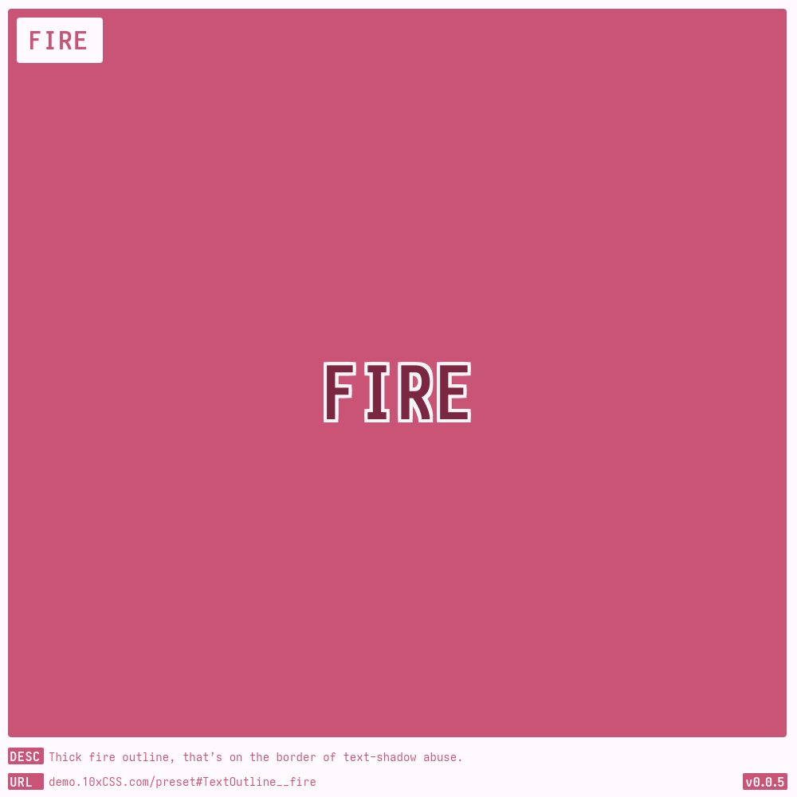
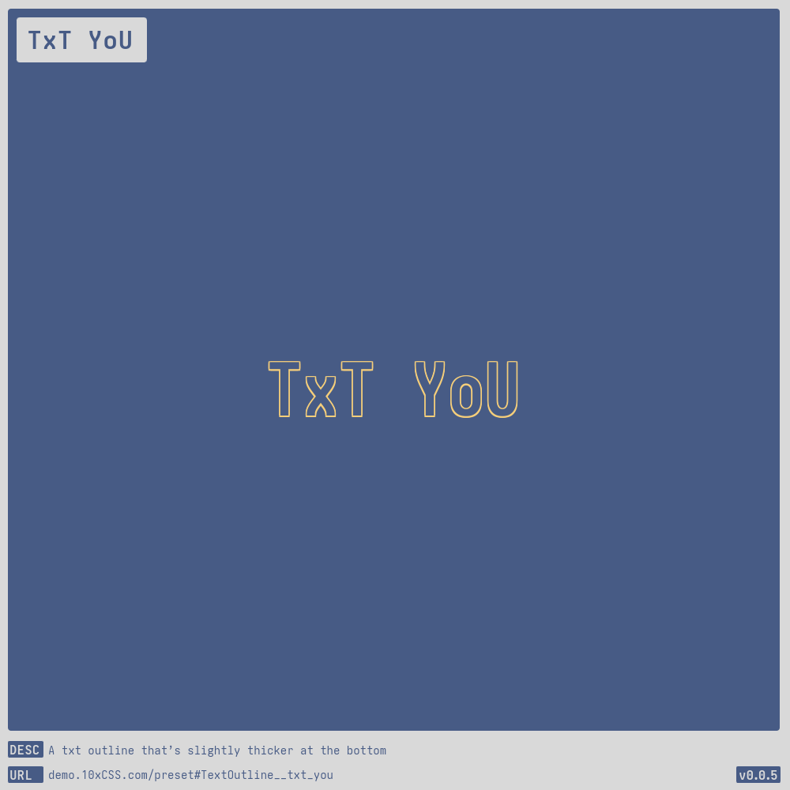

# [Text Outline](https://demo.10xCSS.com/preset#TextOutline)

> __`CID `__  TextOutline  
> __`DESC`__  In the shadows text comes to life.  
> __`LINK`__  [demo.10xCSS.com/preset#TextOutline](https://demo.10xCSS.com/preset#TextOutline)  
> __`NOTE`__  none  
> __`VERS`__  1  

|Table                |of                   |Contents             |
|:--------------------|:--------------------|:--------------------|
|[Default](#default)  |[TxT YoU](#txt-you)  |                     |
|[FIRE](#fire)        |[YOLO](#yolo)        |                     |
---

### _All-in-One_
_(todo-video-placeholder)_

### Default
> `desc`: Default [TextOutline](https://10xCSS.com/dashboard/presets?cid=TextOutline&uid=TextOutline__default) style  
> `link`: [demo.10xCSS.com/preset#TextOutline__default](https://demo.10xCSS.com/dashboard/presets?cid=TextOutline&uid=TextOutline__default)  
> `time`: 2023-12-26 ⇒ 2024-04-09  
> `vers`: 1  

### FIRE
> `desc`: Thick fire outline, that’s on the border of text-shadow abuse.  
> `link`: [demo.10xCSS.com/preset#TextOutline__fire](https://demo.10xCSS.com/dashboard/presets?cid=TextOutline&uid=TextOutline__fire)  
> `time`: 2023-12-26 ⇒ 2024-04-08  
> `vers`: 1  

### TxT YoU
> `desc`: A txt outline that’s slightly thicker at the bottom  
> `link`: [demo.10xCSS.com/preset#TextOutline__txt_you](https://demo.10xCSS.com/dashboard/presets?cid=TextOutline&uid=TextOutline__txt_you)  
> `time`: 2024-04-27 ⇒ 2024-04-29  
> `vers`: 1  

### YOLO
> `desc`: Unequivocally qualifies as text-shadow abuse in all major states.  
> `link`: [demo.10xCSS.com/preset#TextOutline__yolo](https://demo.10xCSS.com/dashboard/presets?cid=TextOutline&uid=TextOutline__yolo)  
> `time`: 2023-12-26 ⇒ 2024-04-08  
> `vers`: 1  

